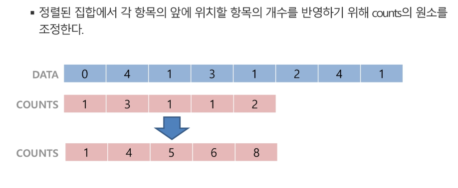

#  20200130

# Algorithm

### 문제를 해결하기 위한 `절차`, 논리적 사고.

> `절차화`  논리적인 구조 만들기. 주석을 만들고 차례대로 코드를 짜보기.

- 정확성
- 작업량
- 메모리 사용량
- 단순성- 알아보기 쉬운지.
- 최적성 -개선여지가 없을 때까지

#### Time Complexity시간복잡도

입력 대비 연산횟수.

#### big-o notation 빅오표기법

 최고차항의 계소는 생략하여 표시.. 충분히 큰 n에 대해서.

5n\**2+n 

=> o(n\**2)

## Array 배열1

일정한 자료형의 변수들을 하나의 이름으로 열거하여 사용하는 자료구조.

하나의 선언으로 둘 이상의 변수를 선언할 수 있음.


-  코딩 시작 전 배열의 크기, 인덱스를 정해놓고 시작하기.

```python
arr = [0]*10
```

c언어를 고려했을 때 문제의 제한조건:

배열의 크기 100만개 까지.

10억이내 c언의 int형에 저장하면 동작함......

#### Brute-force, generate and test 완전검색

시간을 단축하지 못하지만 모든 경우의 수를 나열해보고 확인하는 기법.

#### debuger

논리적인 오류를 찾는 과정. not 문법적 오류. 실행 결과가 원하는 최종 결과와 달랐을 때 실행.

#### Permutaion 순열

##### Greedy 탐욕 알고리즘

근시안적. 경우의 수를 고려해보아야 함. 

500,400,100,50

500,100,50

```python
arr = list(map(int, input().split()))

print(arr)

# 붙어서 들어오는 입력값 처리

```

#### Bubble sort 버블 정렬

두개를 비교하여 큰 것과 위치를 바꾼다.

1. 처음 인덱싱 n-1
2. 두번째 n-2 제일 큰 수가 위치한 인덱스[-1]의 자리를 제외한다.
3. 마지막은 2개가 남았을 때까지 진행.


- 범위를 지정

- 범위안의 원소를 지정

- 그 후 비교

#### Counting sort 카운팅 정렬

최대값과 최소값이 문제에 주어줘야함.

나오지 않는 값의 개수는 리스트에 나오지 않으므로 그 전 값의 개수와 동일.



1~n-1까지.

[0]은 자기자신

순차대로 왼쪽값과 자신의 값을 더한값을 자신의 값으로.


## tip

인터프리터 : 느린 속도 파이썬, 쉽다.

컴파일러 : 빠른속도.결과를 만들기까지 까다로움. 자바.

자주 내는 오류를 정리한 list를 만들기.