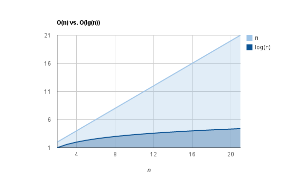
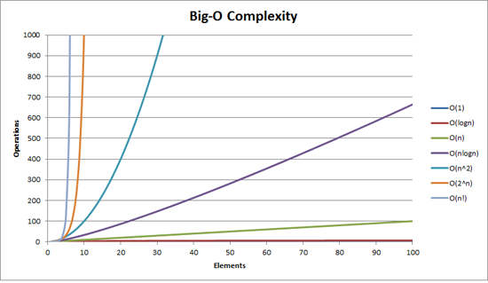

# 20200205_algorithm

### 문제풀이

#### 4836 color

```python
import sys

sys.stdin = open('input.txt')

# 1. 10 x 10  격자를 생성
# 2. input으로 주어진 조건에 따라 색칠
# - 왼쪽 상단 인덱스 & 오른쪽 하단 인덱스
# 3. 겹쳐진 구간의 개수 출력(cnt)

T = int(input())
for tc in range(1, T+1):
    N = int(input())
    cnt = 0
    #이중배열 초기화. [[0]*n]*n은 쓰지 않기. 값이 변하면 모두 복제됨.
    # 같은 색이 중복으로 될 경우 set으로 접근해보기.!!!!!!!!!!!!
    tile = [[0]*10 for _ in range(10)]

    for _ in range(N):
        r1, c1, r2, c2, color = map(int, input().split())
        #x축의 범위
        for i in range(r1, r2+1):
            #y축의 범위
            for j in range(c1, c2+1):
                tile[i][j] += color 
                if tile[i][j] == 3:
                    cnt +=1
    
    print('#{} {}'.format(tc, cnt))

```

#### 4839 sum of subset ★

재귀, bit, itertools...등등의 접근으로 할 수 있다. swea에서도 

####  - from itertools import combinations(부분집합 구하기 python)- 공집합은 포함 안됨. 전체개수를 구할 경우 +1해주자.

```python
def combinations(iterable, r):
    # combinations('ABCD', 2) --> AB AC AD BC BD CD
    # combinations(range(4), 3) --> 012 013 023 123
    pool = tuple(iterable)
    n = len(pool)
    if r > n:
        return
    indices = list(range(r))
    yield tuple(pool[i] for i in indices)
    while True:
        for i in reversed(range(r)):
            if indices[i] != i + n - r:
                break
        else:
            return
        indices[i] += 1
        for j in range(i+1, r):
            indices[j] = indices[j-1] + 1
        yield tuple(pool[i] for i in indices)
        
subsets1 = combinations(range(1,4), 2)
    print(list(subsets1))

[(1, 2), (1, 3), (2, 3)]
```

```
# cnt = 0

    # for i in subsets:
    #     if sum(i) == K:
    #         cnt +=1 

cnt = sum(1 for i in subsets if sum(i) == K)
같은 구조.
cnt=(1 for n in range(1,11) if n %2)
print(type(cnt))
<class 'generator'>
[1, 1, 1, 1, 1]
```

```python
import sys
sys.stdin = open("input.txt")
from itertools import combinations

T = int(input())
for tc in range(1, T+1):
    N, K = map(int, input().split())
    # 12까지의 원소 중  N개가 포함된 부분집합 
    subsets = combinations(range(1,13), N)
    
    # cnt = 0

    # for i in subsets:
    #     if sum(i) == K:
    #         cnt +=1 

    cnt = sum(1 for i in subsets if sum(i) == K)
    print('#{} {}'.format(tc, cnt))
```

#### 4839 binarysearch

complexity 를 줄이기

divideconquer- > binary search.

재귀 접근 가능.log(n)






```python
def find(total, target):
    cnt = 1
    start = 1
    end = total
    # middle = int(end + start / 2) == end + start // 2
    middle = int(end + start / 2)
    # 1~9까지의 숫자 중 target이 3일 경우
    # m :5
    #target = 3
    while (target != middle):
        if target > middle:
            start = middle
        else:
            end = middle
        middle= start + end // 2
        cnt +=1

    return cnt

T = int(input())
for tc in range(1, T+1):
    #P: 전체페이지  A, B : 찾아야 할 페이지
    P, A, B = map(int, input().split())
    a = find(P, A)
    b = find(P, B)
    result = '0'
    if a > b:
        result = 'B'
    elif a < b:
        result = 'A'    
        
    print('#{} {}'.format(tc, result))
```

#### 4843 special sort

```py
T = int(input())
for tc in range(1, T+1):
    N = int(input())
    d = sorted(list(map(int, input().split())))
    # r = reversed(d[::5]) == d[-5:][::-1]
    r = d[-5:][::-1]
    
    
    print('#{}'.format(tc),end=' ')
    for i, j in zip(r, d[:6]):
        print(i, end = ' ')
        print(j, end = ' ')
    print()
```

#### 1259 metal stick

```py
#대전제 : 남는 나사가 없다. 모두 짝이 있음.
import sys

sys.stdin = open('input.txt')

T = int(input())
for tc in range( 1, T+1):
    N = int(input())
    d = list(map(int,input().split()))

    #pipes [[d[i],d[i+1]] for i in range(0, N*2, 2)]
    pipes = []
    for i in range(0, N*2, 2):
        pipes.append([d[i],d[i+1]])

    connected = pipes.pop()

    while pipes:
        for i in range(len(pipes)):
            if pipes[i][0] == connected[-1]:
                connected += pipes.pop(i)
                break
            if pipes[i][-1] == connected[0]:
                connected = pipes.pop(i) + connected
                break
    
    map(str, connected)
    print('#{} {}'.format(tc, ' '.join(map(str, connected))))
```


# tip

complexity 를 줄이기

divideconquer- > binary search.

