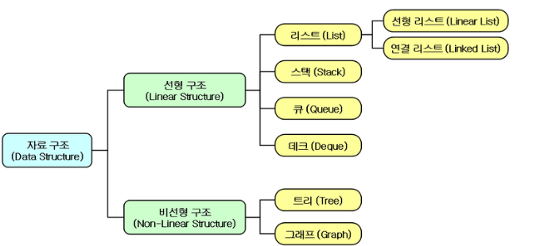
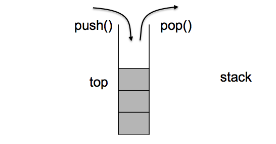
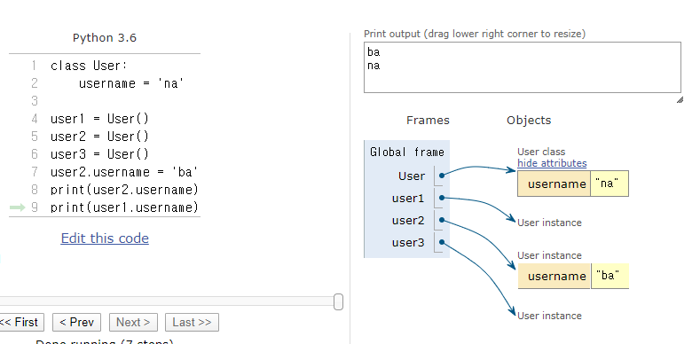
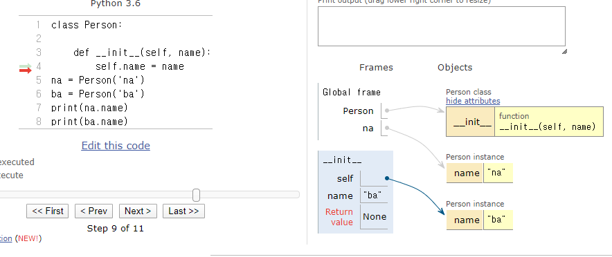

# 20200213

## Algorithm - stack

### 프로그램 = 자료구조 + 알고리즘(구현 & 완전탐색)

`자료구조 접근 방식`

1. 자료구조의 정의
2. 활용
3. 구현
4. 관련문제


> **구현 & 완전탐색** 
>
> - 패러다임(접근방식)
>   - **Brute force(짐승의 힘...ㅋㅋ)**
>   - DP(재귀에 메모를 하는 것과 비슷하다. 
>   - Greedy(local maxcimum 을 빠르게 찾을 때.)
>   - 동전바꾸기

시간, 공간적 제약안에서 패러다임과 테크닉을 구현해서 최적의 방법을 찾아간다.

데이터를 조작할 통 또한 최적화가 필요하다. 



##### List(선형적)

##### Linked List(선형적)

##### stack(선형적)

##### queue(선형적)

선형적이지 않은 비선형 자료를 만들어 내기 시작.

##### graph(1:n or m:n) (비선형적)

 `tree`는 graph의 subset에 불과하다..

`자료구조 접근 방식`

1. 자료구조의 정의
2. 활용
3. 구현
4. 관련문제

### **1.정의**

### Stack(`한방향`)-**입력되는 순서대로 쌓고, 나중에 들어온 것부터 먼저 사용**하는 자료구조 LIFO



**후입선출(LIFO, Last In First Out)** <->queue는 FIFO

편리하게 풀기위해 불편함(제약)을 만들어 놓음.

특정한 형태에 최적화 하기 위한 제약이 존재.

`중간 요소에 접근해야 할 경우는 stack이 아니다!!`

가장 위(`top`)에 있는 데이터만 볼 수 있음

### **2. 활용**

하나의 쌍을 이용할 때.

쇠막대기

인덱스의 상승->하강패턴의 문제(농작물 수확)

SW - 함수호출. 

```python
def a():
    def b():
        c()
a()
```

### **3.구현**- oop개념을 익히고.!!! 다시

## python

#### OOP (Object-Oriented Programming)

`사람이 읽기 쉬운 코드로 만들까???` 로 시작.

S + V predicate.논리학. 

`Duck.run()`의 형태로 사람이 인식하는 주어와 서술부로 나누어서 인식이 가능할 수 있을까?

class는 객체를 더 큰 추상화(객체)로 만들어내는(묶어내는) 하나의 수단(문법)일 뿐이다. oop는 class로 설명되지 않는다.

```
Duck.run()
turkey
goose
등등을 묶을 수 공통점이 있는 것이 존재하는가? - >class로 묶어냄.
```

- Class(instance를 공통점(attribute와 method)으로 묶을 수 있는 문법.)
  - instance
    - attribute(속성,값, data)
    - method(메서드, function,행동) - 괄호를 붙일 수 있다.

##### 클래스 및 인스턴스, attribute

파이썬에서 클래스 만드는 것 조차 객체이다.


객체(instance, class)들의 값 attribute들은 각각 독립적이다. 공유되는 것 처럼 보이는 것일 뿐이다. (lookup process때문에 혼란.)

> - 클래스 변수
>   - 클래스의 모든 인스턴스에서 공유되는 어트리뷰트와 메서드를 위한 것
>   - 모든 인스턴스가 공유 (변수 lookup process를 통해 인스턴스의 변수가 정의되어있지 않을 때 클래스 변수가 호출되는 것)
>
> - 인스턴스 변수
>   - 인스턴스별 데이터를 위한 것
>   - 각 인스턴스들의 고유 변수


attribute를 찾을 때 접근 방식.

name lookup:**인스턴스(instance) => 클래스(class) => 전역(global) 순으로 탐색**

> ## 클래스-인스턴스간의 이름공간 각각의 이름공간은 `독립`적이다.
>
> - 클래스를 정의하면, 클래스 객체가 생성되고 해당되는 이름 공간이 생성된다.
>
> - 인스턴스를 만들게 되면, 인스턴스 객체가 생성되고 해당되는 이름 공간이 생성된다.
>
> - 인스턴스의 어트리뷰트가 변경되면, 변경된 데이터를 인스턴스 객체 이름 공간에 저장한다.
>
> - 즉, 인스턴스에서 특정한 어트리뷰트에 접근하게 되면 **인스턴스 => 클래스** 순으로 탐색을 한다


> 별개의 개념!!!!!!!!!!!!!!!!!!!!...
>
> #### 이름공간(namespace)  scope: 중2병걸린 히키코모리 막내동생. 나만 가능해.넌안돼.
>
> - `L`ocal scope: 정의된 함수
>
> - `E`nclosed scope: 상위 함수
>
> - `G`lobal scope: 함수 밖의 변수 혹은 import된 모듈
>
> - `B`uilt-in scope: 파이썬안에 내장되어 있는 함수 또는 속성
>
> Built-in scope 은 모든 scope에 없을 때 궁극적으로 도달하는 범위.


instance의 값이 있을 경우 나의 값을 출력.

instance(user1)의 값이 없을 경우  실제 instance의 값이 없으므로 class의 값(username)을 출력.

```py
class User:
    username = 'na'
user1 = User()
user2 = User()
user3 = User()
print(user2.username)
print(user1.username)
print(user3.username)
user2.username = 'ba'
print(user2.username)
print(user1.username)
print('-----------')
user3.name = '22'
print(user3.username)
print(user3.name)
print('------------')

user.say = lambda x:print(x)
user.say('I am ba')
========================================
na
na
na
ba
na
-----------
na
22
------------
I am ba
```

인스턴스 객체와 클래스 객체는 서로 다른 이름 공간을 가지고 있다. -> 개별 인스턴스의 값attribute을 조작, 변경등이 쉬워진다.




```py
class Person:
    name = 'ssafy'
    population = 0    
    #둥둥둥 떠다닌다. instance의 값(attribute)들은 각각 독립적. 공유되는 것 처럼 보이는 것일 뿐이다. (lookup process때문에 혼란.)
    def __init__(self, name='samsung'):
        self.name = name
        Person.population +=1
        
na = Person('naname')   
ba = Person('ba')
ssafy = Person()
print(na.name)
print(ba.name)
print(ssafy.name)
print(Person.name)
na.name = 'change na'
print(na.name)
Person.name = 'change class name'
print(Person.name)
print(Person.population)

---------------------------------------
naname
ba
samsung
ssafy
change na
change class name
3
```

instance 조작해보기 del

```python
class Person:
    name = 'ssafy'
    population = 0
    def __init__(self, name='samsung'):
        self.name = name
        Person.population +=1
    
    def __del__(self):
        print(f'{self.name}이 죽었습니다.')
        Person.population -=1
na = Person('naname')
ba = Person('ba')
ssafy = Person()
del ssafy
print(Person.population)


```

#### python 출력의 비밀 **str** 과 **repr**

- 특정 객체를 print() 할 때 보이는 값
- 그냥 객체 자체가 보여주는 값
- 그리고 우리는 위의 두 값을 모두 우리가 원하는 방식으로 수정할 수 있습니다.

```py
class User:
    username = ''
    password = ''
            
    #print()함수 안에 쓸 때 스트링 형변환이 가능한 값을 출력하도록 한다.
    def __str__(self):
        return 'print 안에 넣으면 이렇게 나오고'
    
    
    
    def __repr__(self):
        return '그냥 객체만 놔두면 이게 나오지요'
```

##### 인스턴스와 객체

- 인스턴스와 객체는 같은 것을 의미한다.
- 보통 객체만 지칭할 때는 단순히 객체(object)라고 부른다.
- 하지만 클래스와 연관지어서 말할 때는 인스턴스(instance)라고 부른다.

```py
a = int(10)

# a 가 int 의 인스턴스인지 확인해봅시다.
isinstance(a, int)
```

```py
#instanciate

na = Person('na')
print(na.greeting())

print(Person.greeting(na))
```

#### `self` : 인스턴스 객체 자기자신 - 단순 positional argument 

위치가 중요함. !!

* 메서드는 인스턴스 객체가 함수의 첫번째 인자로 전달되도록 되어있다.

### Encapsulation -  은닉화

서로 공개하지 않은 상태에서 프로그래밍이 돌아갈 때 에러처리(디버깅)이 수월. 


#### `collections.deque`를 활용하기

```python
from collections import deque

#deque
#오른쪽
# 1. append
# 2. pop
#왼쪽
# 3. appendleft
# 4. popleft
stack = deque()

stack.append(1)
stack.append(2)
stack.append(3)
stack.append(4)
stack.append(5)

stack
-----------------------
deque([1, 2, 3, 4, 5])
```


구조화는 결국 증명을 위한 것

## tip

low level 책 추천.

art of computer programming

concrete mathematics - 구조화 증명에 도움.


python time complexcity - O(n)....

https://wiki.python.org/moin/TimeComplexity


게임 : 엄청 큰 while문이 돈다는 생각으로 초단위로 while문을 돌리면서 변화를 감지해서 화면을 나타내는 느낌 틱?


