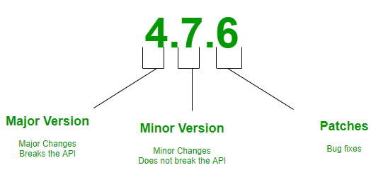

# 20200217

## 05_Module

.py로 만든다.

```pytho
import fibo

print(fibo)

<module 'fibo' from 'C:\\Users\\multicampus\\python\\fibo.py'>
```

pip install bs4 -

모듈은 폴더로 구분된 파이썬 파일의 묶음에 불과하다.

## package

모듈의 묶음  `.` 으로 구분된 모듈 이름공간을 구조화 하는 방법.

구조화 되어있는 디렉토리를 `.`으로 구분시켜 나타내 사용한다.


`__init__.py` 깃발의 역할. 시작점을 만들어준다. 


```python
myPackage/
    __init__.py
    math/
        __init__.py
        formula.py
    web/
        __init__.py
        url.py
```


```py
from MyPackage.web import url
print(web.url)

정확한 위치를 알려줘야한다. 
__init__.py에 추가적으로 설정을 해주면 단순하게 쓸 수 있음.
```

``from` *모듈명* `import` *``해당하는 모듈 내의 모든 객체(변수, 함수, 클래스)를 가져옵니다.

```py
from MyPackage.web import url

key = '키값넣기'
targetDt = '20200216'
print(url.my_url(key=key, targetDt = targetDt))
#print(url.my_url({'key' : key, 'targetDt' : targetDt}))
# {'key' : key, 'targetDt' : targetDt}
```

#### `from` *모듈명* `import` *어트리뷰트* `as`

```py
import module
import pakage1.module1, pakage2.module2
from module import var
from module import function
from module import Class

#공간은 항상 제한되어있다. 변수중첩이 일어날 수 있다. 비추!! 선택으로 가져오기.
#bulitin보다 나중에 선언된 import 모듈이 적용됨.
from module import * 

from pakage.module import var, function, Class
```

#### math

|                함수 |                            비고 |
| ------------------: | ------------------------------: |
|        math.ceil(x) |                     소수점 올림 |
|       math.floor(x) |                     소수점 내림 |
|       math.trunc(x) |                     소수점 버림 |
| math.copysign(x, y) |        y의 부호를 x에 적용한 값 |
|        math.fabs(x) | float 절대값 - 복소수 오류 발생 |
|   math.factorial(x) |                팩토리얼 계산 값 |
|     math.fmod(x, y) |               float 나머지 계산 |
| math.fsum(iterable) |                        float 합 |
|        math.modf(x) |              소수부 정수부 분리 |

##### 내림과 버림은 음수에서 처리가 다르다.

math.floor(x)  소수점 내림

 math.trunc(x)  소수점 버림


random.randint(1,5) -> 두번째 인자까지 포함.


`random.shuffle(name)`   

 return  값이 없고 원본을 변경시킴.

```python
name = ['kim','lim','na']

random.shuffle(name)
print(name)
['lim', 'kim', 'na']
```

### seed
* 경우에 따라서(보통 디버깅 등을 위해 ) 동일한 순서로 난수를 발생시켜야 할 경우가 있다. 
* 난수 발생을 위해서는 적절한 시드(seed)를 난수발생기에 주어야 한다. 
* 만약 시드가 같다면 동일한 난수를 발생시키게 된다. 
* 시드 설정을 하지 않으면 **현재 시간**을 기반으로 만든다.!!!!!!!!!!!!!

시드값을 설정하면 일정한 패턴을 가진다.(control가능.)

```python
random.seed() # **현재 시간**을 기반 시간은 매순간 변하므로 완전난수와 가까움.
random.seed(1) # 시드값을 설정하면 일정한 패턴을 가진다.(control가능.)
```

#### 날짜 관련 모듈(datetime

`from datetime import datetime`  

```pyth
datetime.now()은 객체이다. dir확인 가능.
datetime.today()
2020-02-17 11:26:10.972364

print(datetime.utcnow())
2020-02-17 02:27:33.553830

now
datetime.datetime(2020, 2, 17, 11, 29, 2, 219723)

now.strftime('%Y년 %m월 %d일 %A'.encode('unicode-escape').decode()).encode().decode('unicode-escape')
'2020년 02월 17일 Monday'


now.strftime('%Y, %m, %d, %A')
'2020, 02, 17, Monday'
```

```py
def print_time(seconds):
#     if seconds < 0:
#         sign = '전'
        
#     else:
#         sign = '후'
        
    sign = '전' if seconds < 0 else '후'
    
    s = abs(int(seconds))
    d, s = divmod(s, 60*60*24)
    h, s = divmod(s, 60*60)
    m, s = divmod(s, 60)
    
    if d > 0:
        return f'{d}일 {h}시간 {m}분 {s}초 {sign}'
    elif h > 0:
        return f'{h}시간 {m}분 {s}초 {sign}'
    elif m > 0:
        return f'{m}분 {s}초 {sign}'
    elif s > 0:
        return f'{s}초 {sign}'
        
예시 출력)
'10일 1시간 18분 51초 전'
```


## 06_Errors and Exceptions


#### Syntax Error - 에러핸들링(예외처리)

순서, 기호, 확실하게 오류 => 실행종료.

```py
print('#{} {}'.format()
SyntaxError: unexpected EOF(end of file) while parsing
EOF(end of file)

print('
        ')
        ^
SyntaxError: EOL while scanning string literal
EOL(end of line)

    if n == 0
             ^
SyntaxError: invalid synta
```


#### 예외 (Exceptions)

Exception을 상속받아 이뤄진다

문법이나 표현식이 바르게 되어있지만, 실행시 발생하는 에러다.

```py
 print(2/0)
 1 # 0으로 나눌수는 없습니다.
----> 2 print(2/0)

ZeroDivisionError: division by zero

NameError: name 'name' is not defined

TypeError: unsupported operand type(s) for +: 'int' and 'str'

# 함수 호출과정에서 TypeError도 발생하게 됩니다. 확인해봅시다.
round('3.5')
TypeError: type str doesn't define __round__ method

import random

random.sample([1,2,3])
TypeError: sample() missing 1 required positional argument: 'k'

random.choice([1,2,3],2)
TypeError: choice() takes 2 positional arguments but 3 were given
Signature: random.choice(seq)
Docstring: Choose a random element from a non-empty sequence.
```

```
1 # 값이 적절하지 않은 경우(값이 없는데 찾으려고함)
      2 numbers = [1,2,3]
----> 3 numbers.index(4)

ValueError: 4 is not in list
```

```
      1 numbers = [1,2,3]
----> 2 numbers[4]

IndexError: list index out of range
```

#### 예외 처리 -  **에러가 순차적으로 수행됨**

가장 작은 범주부터 시작

#### 기본 - `try` `except`

except (ValueError, ZeroDivisionError):  괄호 꼭 쓰기. 	

​	

```
try:
 #사용자가 어떤 값을 입력할 지 모름(예측할 수 없는 입력값)
    n = input('100으로 나눌 값을 입력하세요:')
    print(100/int(n))
except ZeroDivisionError:
    print('0은 안돼!!!')
except KeyError as err:
    print(f'{err}, 오류가 발생했습니다.')
except:
    print('뭔지 모르지만 네잘못')

else:
    print(n * 100)
finally:
    print('이것은 끝났다.')
```

#### `else` - 잘 되었을 때 실행

- 에러가 발생하지 않는 경우 수행되는 문장은 `else`를 이용한다.
- 모든 except 절 뒤에와야 한다.
- try 절이 예외를 일으키지 않을 때 실행되어야만 하는 코드에 적절하다.
  - for/else와 비슷하다.


#### `finally`[¶](http://localhost:8888/notebooks/06_errors.ipynb#finally) - `try`문을 떠날 때 에러여부와 관계없이 반드시 실행한다.

- 반드시 수행해야하는 문장은 `finally`를 활용한다.
- 즉, 모든 상황에 실행되어야만 하는 코드를 정의하는데 활용한다.
- 예외의 발생 여부과 관계없이 try 문을 떠날 때 항상 실행한다.


#### `raise`  예외 발생시키기.

```
raise ValueError('5개 이상 데이터는 조회가 불가')

ValueError: 5개 이상 데이터는 조회가 불가
```


#### 디버깅 - 라인바이라인으로 찾기.

##### - static sementic Error 의미상 오류.

```
1 + '1'
```


실행은 되지만 결과가 이상함.잡기 힘든 오류. debugging is all about~

##### - sementic Error 


python version

`3`.7.3

맨 앞 버전 : symentic version(major version Breaks the API)  : 의미가 있는 버전.다른 버전과 호환성이 파괴된다.




## tip

haruair : 호주 -> 미국  김용균 님 비전공자.

이상한모임 : 해외개발자 모임 많음.


- full remote

  gitlab : full remote 회사 사무실 없이 리모트근무.

  gitlab culture : 스카이프티타임.

  wordpress 블로그소프트웨어

  basecamp : 회사가 주로 쓰는....dhh - 직원 60명 2000억 매출. 

  책 `remote` dhh 데이비드 하이네마이어 루비온레일스 만든 사람. 유연한 웹프레임웍


