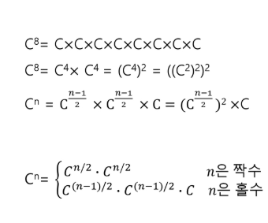

# 20200219 

## Algo -Stack 

### Stack 1-2

>  계산기 만들기

- 중위표기법 -> 후위표기법

  토큰 : 한 글자(최소단위로 잘라낸 것.)

> 종이붙이기

- f(0)을 이용하여 접근.  f(n) = f(n-1) + 2*f(n-2)

#### 배열과 재귀호출

재귀 : 진행단계, 목표치 인자두개를 만든다는 생각으로 접근하기. stack 영역을 이용(마지막 호출된 함수부터 return, 사라짐.)

f(n, k)

저장시간, 복귀시간 이 오래걸린다.주소를 건너뛰는 동작(함수호출, for문등등)은 파이프라이닝을 깨뜨리는 행위이다. 

> **파이프라이닝** 이란 마치 조립 라인처럼 어떤 명령어가 중첩되어 실행되는 구현기술입니다.

```pyt
 N!을 1000000007로 나눈 나머지를 구하는 경우 long fact [N];
fact[0] = 1; fact[1] = 1; for i : 2 -> N fact[i] = i*fact[i-1] % 1000000007;


```

> 부분집합 구하기 - 재귀, 혹은 트리로도 접근 가능.(가능한 경우를 0,1로 나누고 ....)

```
def f(n, k):
    if n == k:
        for i in range(k):
            if L[i] == 1:
                print(A[i], end = ' ')
        print(L)
    else:
        L[n] = 0
        f(n+1,k)
        L[n] = 1
        f(n + 1, k)

A = [1, 2, 3]

L = [0]*len(A)

f(0,len(A))
----------------------------
[0, 0, 0]
3 [0, 0, 1]
2 [0, 1, 0]
2 3 [0, 1, 1]
1 [1, 0, 0]
1 3 [1, 0, 1]
1 2 [1, 1, 0]
1 2 3 [1, 1, 1]

```

#### 백트래킹

pruning 가지치기. 유망하지 않은 노드의 경우는 자식노드 탐색을 제외한다.

**CSP(Constrain Satisfaction Problems)**

**Constraint satisfaction problems** (**CSPs**) are mathematical questions defined as a set of objects whose state must satisfy a number of constraints or limitations.”

>  N queen문제 https://bumbums.tistory.com/3

#### 분할정복O(log2n)



#### Quicksort

기본 전제 : `L`과 `R`이 만나기 전까지

### Graph

##### DFS

방향우선 탐색.

- 재귀를 사용한 DFS

  ```python
  def dfs1(n, V):
      visited[n] = 1
      print(n, end = ' ')
      for i in range(1, V+1): #다른 노드 i에 대해
          if adj[n][i] and visited[i]==0:  #인접노드이고, 방문하지 않았다면
              dfs1(i, V)  #i노드로 이동
  ```

  

- 반복구조 - stack의 크기를 node의 크기만큼 정해놓고 구현해보기.갈수있는 인접노드를 스택에 저장하는 방식. 지나온 인접노드를 저장하는 방식과 다름.

  ```py
  def dfs2(n,V):
      s = []
      s.append(n) #시작점
      visited[n] = 1
      while s: #인접노드가 남아있을때까지 갈 수 있는 목록을 저장하는 방식. 
          n = s.pop()
          print(n, end = ' ')
          for i in range(1, V+1):
              if adj[n][i] == 1 and visited[i] == 0:
                  s.append(i)
                  visited[i] = 1
  ```

> 9587 그래프 문제

```py
def dfs1(n, V, y): # 좀 더 간결하게 짜보기. 
    s = []
    s.append(n)
    visited[n] = 1
    while s:
        n = s.pop()
        if n == y:
            return 1
        for i in range(1, V+1):
            if adj[n][i] == 1 and visited[i] == 0:
                s.append(i)
                visited[i] = 1
    return 0
    

def dfs2(n, V, t):
    if n == t: #목적지에 방문한 경우
        return 1
    else:
        visited[n] = 1
         # 인접노드가 남아있을때까지 갈 수 있는 목록을 저장하는 방식.
        for i in range(1, V + 1):
            if adj[n][i] == 1 and visited[i] == 0:
                if dfs2(i, V, t) == 1:
                    return 1
        return 0    
```


