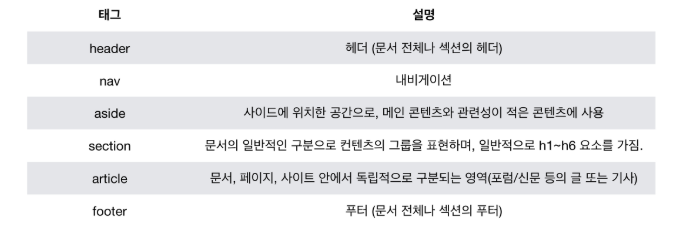
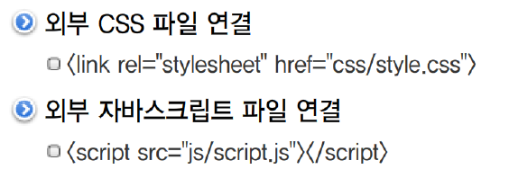

# 20200306

## HTML

W3C + WHATWG: 웹 연구에서 20190528 대 통합 웹표준 

HTML : hyper text markup language -구조!!!!!!!!!!!!!!!!

웹페이지를 작성하기위한(구조를 잡기위한)언어

- open Graph Protocol : facebook에서 만듦 

html head tag "og:title"등등

- 메타 데이터는 검색에 유리하다.

- 시맨틱 태그 - 컨텐츠의 의미를 설명하는 태그로 새롭게 추가

  

  검색엔진최적화(SEO)를 위하여도 마크업을 효과적으로 할 수 있게.

  의미 + 구조 

  표현적 마크업의 기능은 css로 분리.

- 

- 텍스트 관련 요소
  - <b>:사용하지않기 vs <strong> :의미 = 강조
  -  <em>: 의미 = 이태리강조 vs <i>:사용하지않기 : 

  <table>
  
  </table>

  <tabel><thead><tbody><tfoot>:직관적임.

  <tfoot>: 순서를 바꿔도 항상 아래로.

  <tr> <!--table row-->

   <th> <!--table head-->

   <td><!--table data--> 

## tip

MDN사이트 참고. 

