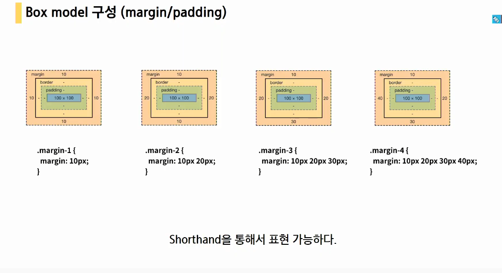
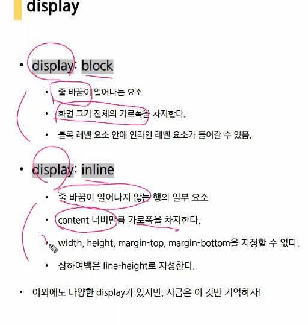
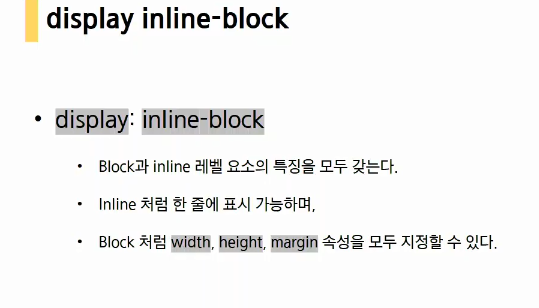
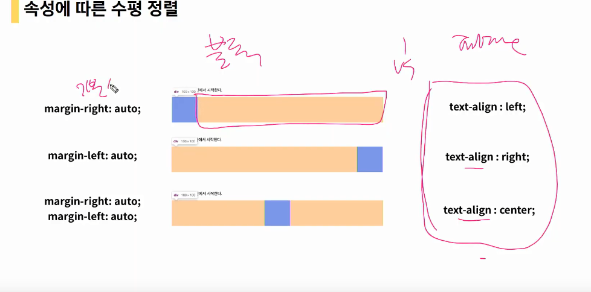

# 20200310

CSS

되는것 vs 하면안되는것.

- Why?

  cascading style sheet : 스타일(디자인요소)

  html: 구조화

- 정의방법

  외부참조!

  내부참조 :  중복이 발생(비추)

### selector :star2: 특정요소 선택하여 스타일링할 시 필요함.

반드시 선택자가 필요하다.

기초선택자 > 고급선택자 > 의사클래스

`#` : id선택자

`.`:class선택자

- id의 경우 문서에서 1개만 지정해야함.

### 상속 - MDN에서 확인하기.

상속을 통해 부모요소의 속성을 자식에게 상속한다. 모두는 아님!!

속성(프로퍼티)는 두가지 요소로 분류.

- 상속되는 것 : text styling과 관련된 요소들.

- 되지 않는 것 : box, position,margin

### 적용 우선순위 :star2:

> important>인라인> id(문서에서 하나!!!)> class> 요소선택자

- 중요도 !important

금은동 중 금의 개수 기준으로 표현하듯이.

- 우선순위(specificity)

  인라인/id선택자/

- 소스코드의 순서(같은 우선순위인 경우 소스코드 자체의 순서에 따라 나중에 정의된 속성값으로 바뀜. )

  - HTML 코드가 작성된 순서가 아니라, CSS 코드 상에 작성된 순서대로 적용된다고 생각하시면 되겠습니다 

    현재 같은 클래스 선택자로 선언이 되었고, CSS 코드 상으로 가장 마지막에 해석(늦게 작성한)되는 선언이 우선합니다.

### 크기단위(상대)

기본브라우저는 16px

- px
- %
- em : 배수단위(본인만 적용)
- rem : `root`기준.(어디에 적용되도 같은 값)
- Viewport -can i use에서 확인해보기.

### 문서표현(하)

- 텍스트 <strong> , <em> 으로 html 강조의미

<b> <i>는 html에서 css를 적용하려는 것으로 쓰지 않기로 한다.

### Box model

네모네모네모세상

네개를 썼을 경우 시계방향 상,우,하,좌

세개: 상, 좌우, 하

두개: 상하, 좌우

### width 너비

- Box-sizing : content-box 기본요소.
- Box-sizing: border-box 보더박스를 너비로 보겠다는 의미. 많이 활용된다.

### 마진상쇄

클 경우 큰 값으로..

block:

너비를 가질 수 없다면 margin을 자동으로 모두 주기떄문에 줄바꿈이 일어난다.

## tip

- HTML 요소 참고서

https://developer.mozilla.org/ko/docs/Web/HTML/Element

- 콘텐츠 카테고리

https://developer.mozilla.org/ko/docs/Web/Guide/HTML/Content_categories 

- 상속

https://developer.mozilla.org/ko/docs/Web/CSS/inheritance

- margin

https://developer.mozilla.org/ko/docs/Web/CSS/margin

- 계단식 및 상속

https://developer.mozilla.org/ko/docs/Learn/CSS/Building_blocks/Cascade_and_inheritance

- 블록 레벨 요소

https://developer.mozilla.org/ko/docs/Web/HTML/Block-level_elements

- 인라인요소

https://developer.mozilla.org/ko/docs/Web/HTML/Inline_elements