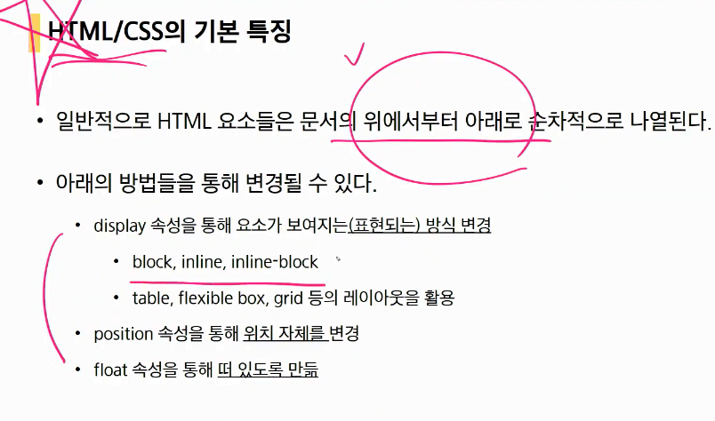

# 20200311

##  CSS

#### 어제 정리

- 적용 우선수위

중요도(importance) - 사용시 주의

!important

우선순위

- 인라인 / id선택자/class선택자/요소선택자

소스순서(css파일 정의 순서 후순위 우선. -> 선순위 적용 후 후순위속성 적용되므로 나중에 후순위)

박스모델

box-sizing : content-box(기본)

box-sizing : border-box로 설정하기. -> width와 동일.

- inline ->  width, height, margin속성 지정 x
- block
- inline-block!!!!! : 인라인처럼 한줄표시가능, 블록처럼 width, height, margin속성 모두 지정

## CSS 고급기능

### 다단레이아웃

공간이 비면 왼쪽/위로 배치된다(올라간다).

- position

  - relative

  - static : 기본위치(왼쪽 맨위모서리.)

  - absolute:부모/조상요소중에 `static`이 아닌 것. ->집을 나갔다. 본인의 위치를 지우고 움직인다.(relative와 비교해보기.) 조심히 사용하기

    - 네모 위에 무엇을 중복시켜놓고 싶을 때!!!

    

  - fixed : 브라우저 기준으로 고정위치.

- display

- float

  float-right, float-left

  - nomalflow에서 벗어나도록 하는 속성 중 하나. 3d처럼 둥둥떠있다. 자신의 영역에 한해서 둥둥떠있다.
  - css는 모든것을 네모네모로!!,왼쪽 위로 모두 배치된다.
  - 그러나 테트리스처럼 배치가 가능하게 된다. 
  - display : block으로 자동 계산(이미지의 경우 display는 inline이지만 바꾼다.)
  - 영향을 지울 때 `clear` 를 사용!!!(margin이 제대로 적용되지 않는다.)
  - 부모영역의 높이가 사라지는 문제.!!!!!!!!!!!!!!
    - 문제 해결 방안
    - 가상요소선택자 활용.(sudo element)::after사용.content:"";

### HTML/CSS 기본 특징

## tip

