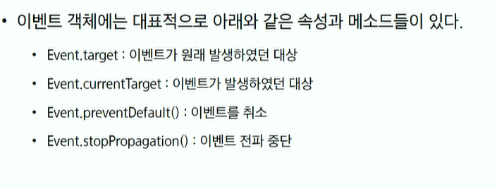
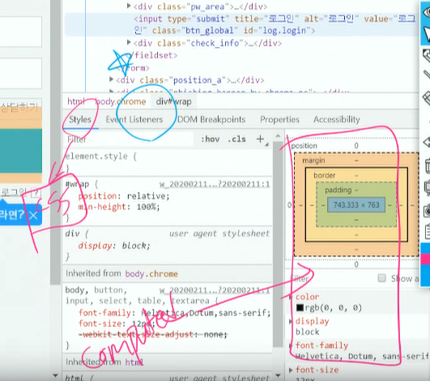
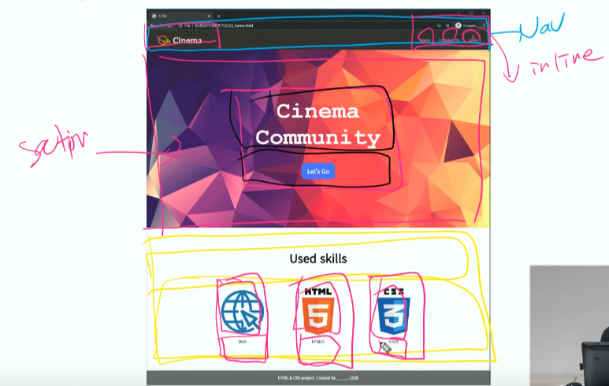

# 20200316

## JS-DOM 조작, 이벤트

### 지난 시간내용, 질문

- 객체 생성 방법
  - 객체는 key와 value로 구성된 속성(property)의 모임
- 순회-배열또한 오브젝트이므로 순회가능. 
  - for
  - for...of
  - forEach
  - for....in:조심!! : a.name='숫자배열'의 경우에도 출력한다.

- 배열메서드
  - splice:원본자체를 바꾼다, slice:원본그대로, 리턴,의 차이점 정리해보기. 
  - 수정도 가능하다
- 함수선언
  - 함수선언문
  - 함수표현식
  - 즉시실행함수
- 화살표함수(ES6):`=>`많이 쓰일 예정

## JS-DOM 조작, 이벤트

### 중요

### DOM 조작

> 문서의 구조화된 표현을 제공한다. `노드`와 `오브젝트`로 문서를 표현 DOM 
>
> - window : DOM문서를 표현하는 창. 가장 최상위 객체
> - document:DOM조작파트에서 많이 쓰임.
> - navigator,location:지금 있는 url주소자체가나옴.,history:뒤로가기버튼을 누른것과 동일한 효과 발생.,screen

- window 객체 - 전역객체 함수, 이름공간, 객체등이 포함.

  - 모든 변수들의 이름공간을 가지고 있는 역할을 한다.

    > var test = 'test'
    >
    > `window.test`로 접근가능.

- DOM접근 - 중요!!!!!!!!!!!!!!!!!!!!!!!!!!!!!!!!!!!!!!!!!

  

  - 단일 Node

    - document.querySelector(selector)

  - HTMLCollection : 모두 love collection이며 활용시 주의.(클래스네임,태그네임으로 선택시 조작과정에서 원하는만큼의 반복문을 수행하지못할 수 있다. 쓰지 않기. )

  - NodeList(`non-live`collection-경우에따라 love collection일 수 있다.) - 

    - document.querySelectorAll(selector)

    

- DOM 조작 - 도큐먼트와 엘리먼트 기준으로 조작가능.

  - Node 생성.

    document.createElement(tagName):특정 태그를 생성.

  - innerHTML, insertAdjacentHTML

    - 보안적 취약점이 있지만. 위 두개 위주로 사용.

      > eliment. insertAdjacentHTML(position, text) - 무적!! 위치까지 조작가능.
      >
      > position : beforebegin, afterbegin, beforeend, afterend 특정위치로 넣을 수 있음.

###  이벤트

- 이벤트
  - load, copy, mouseover, addEventListener(type,listener:이벤트가 발생했을 때 실행할 콜백함수(핸들러),[,useCApture]:트루일경우 하위노드로 전파(캡쳐링-기본값은 false(버블링)));
- 이벤트 전파-항상 캡처링부터 시작하여 버블링으로 종료.
  - 기본적으로 버블링(false가 기본값)
  - 캡처링:위에서아래
  - 버블링:아래에서위로
- 이벤트 객체 & this
  - 커런트타겟 == this(현재 전파되고 있는 태그.)
  - 

### 이벤트 실습

개발자도구에서 모든 이벤트들을 `remove`로 지워볼 수 도 있다.

### 주말과제 복습

1. 내부를 쪼개는 연습.
2. 네모의 특정한 영역들로 나뉘어져있다고 생각해보기.
3. 
4. 그룹핑을 해보기.(가상의 선들을 해보고.차곡차곡 쌓기)

- nav

  - 네비게이션바의 고정위치에 하는 것 : position:fixed; or sticky;

  - <header>
        헤더자리
    </header>: 헤더자리 margintop:에 nav높이px를 준다.

    

## tip

python - snake_case

Js: camalcase or Camalcase로 변수 이름을 정의.

livecode에서 꼭 강의내용을 정리한 것 보면서 해보기.

**HTML Collection MDN** https://developer.mozilla.org/ko/docs/Web/API/HTMLCollection

**NodeList MDN** https://developer.mozilla.org/ko/docs/Web/API/NodeList

**이벤트 참조 MDN** https://developer.mozilla.org/ko/docs/Web/Events

**DOM-Level-3-Events W3** https://www.w3.org/TR/DOM-Level-3-Events/

**Event(이벤트 객체) MDN** https://developer.mozilla.org/ko/docs/Web/API/Event