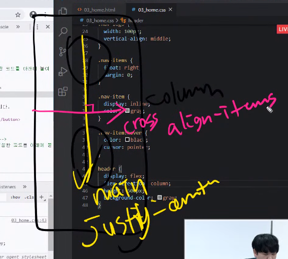

# 20200317

## JS - 함수 고급 기능 Review

### 복습

- DOM조작
  - 주요객체들 접근.
  - live - 실시간 반영 x, non-live-반복문 실행시 나의 의도로 조작 가능 높다.
    - document.querySelector(selector) - 단일 Node
    - document.querySelectorAll(selector) - NodeList(non-live)
  - Node생성
    - creadteElement(tagName): 하나하나씩 돔을 만들어서 붙여나가는 형식으로 진행될것.
    - `뷰`를 통해 조금 더 편하게 조작할 방법을 학습할 예정.

## 함수 고급 기능 Review

- ### 함수정의

  - `함수선언`문 vs `함수표현식(익명함수)` - 차이점 중요!!!!!!!!!!!

  - ##### 함수 표현식의 장점

    ‘함수 표현식이 호이스팅에 영향을 받지 않는다’ 는 특징 이외에도 함수 선언식보다 유용하게 쓰이는 경우는 다음과 같다.
    
    - 클로져로 사용
    - 콜백으로 사용 (다른 함수의 인자로 넘길 수 있음)
    
    > 1. 변수할당
    > 2. 호이스팅이되는지안되는지

- 함수도 호이스팅 된다. 호잇!! (`모든 선언`을 올린다.끌어올리다)-주의해야하는 개념.

- 호이스팅을 막기 위해 `let`, `const`가 만들어졌다.

- `함수선언`은 모든 선언이 호이스팅 된다. 선언, 초기화, 할당이 모두 이뤄진다.

- `함수표현식`은 변수 호이스팅이 발생하여 undefined(실행불가)-js초기화

- 호이스팅을 이용한 방식은 놉! 코딩순서대로 위에서 아래로 진행방식이 에러잡기,메모리효율적, 의도대로 코드를 흘러가게 할 수 있다. 

- Array helper methods
  - JS특징 arguments : 함수객체
  - 함수의 선언부이다.

- ### Closure - 클로저 :함수와 함수가 선언된 어휘적 환경(Lexical scoping, environment)의 조합.

- #### 클로저 스코프 체인

  모든 클로저에는 세가지 스코프(범위)가 있다:-

  - 지역 범위 (Local Scope, Own scope)
  - 외부 함수 범위 (Outer Functions Scope)
  - 전역 범위 (Global Scope)

- 같이 기록을 하고 있고 기억하고있다. 

  > - 클로저의 핵심은 반환되어진 내부함수는 자신이 선언됐을 때의 환경인 scope(유효범위)를 기억하고 있는 것입니다.
  >
  > - 따라서 자신이 선언됐을 때의 환경(scope) 밖에서 호출되더라도 해당 환경으로 접근하게 됩니다.
  >
  > - 이때 변수값을 완벽히 복사해서 가져오는 것이 아니라, 변수 참조에 접근합니다. questionNum에 5에 대한 값이 남아있는데, 밑에선 0~4에 대한 값을 달라고 하기 때문에 undefined를 반환하고 있습니다.
  >
  > - 현재 상황에도 배열에 대한 값은 가져오고 있지만, 클로저의 특성 때문에 5에 대한 값이 남아있는 questionNum이라는 변수를 계속 참조하게 될 것입니다.
  >
  > - 일반적으로 함수 안에 있는 지역 변수들은 그 함수가 처리되는 동안에만 살아있다가 함수 실행이 끝나면 사라진다고 알고 계실 겁니다.
  >
  >   자바스크립트에서는 리턴할 때 클로저라는 친구가 생성되고, 클로저는 자기 자신이 선언됐을 때의 환경을 기억하고 있다는 특징을 가지기 때문에 이런 상황이 발생하게 됩니다.
  >
  > - questionNum이 복사되어서 들어간 게 아니라, questionNum을 변수 참조가 들어간 것이므로 questionNum에 들어있는 마지막 인덱스값이 남아있다고 생각하시면 될 것같습니다.
  > - 따라서 밑에서 maker로 만든 배열의 요소를 뽑아내는 건 문제가 없지만, questionNum에서 클로저의 특성이 나타나서 최종적인 값이 저렇게 출력된다라고 이해하시면 될 것 같아요.

  - First class fuction

    - 자바스크립트 함수의 특징 - 일급객체의 조건.(first class citizen)

      - 모든 원시타입은 일급객체이다. JS는 `함수`도 가능한것이 특징.

      1. 함수를 인자로 전달 가능함
      2. 함수를 반환할 수 있음
      3. 변수에 함수를 할당 가능함.

  - newfunction:하지말기!!!!!!!!!!!!!!!

### 주말 과제 실습

```
height
line-height - 콘텐츠자체의 중간
vertical align: middle

position : sticky
fixed + margin

정렬
display : flex #부모는 container, 자식은 flex- item
```




## tip

Array Helper Methods(forEach) MDN https://developer.mozilla.org/ko/docs/Web/JavaScript/Reference/Global_Objects/Array/forEach

First Class Function MDN https://developer.mozilla.org/ko/docs/Glossary/First-class_Function

Closure https://developer.mozilla.org/ko/docs/Web/JavaScript/Guide/Closures

Closure 예시(python) → Live Programming Mode를 눌러 실행해주세요 https://bit.do/py-closure-ex

https://bit.do/py-closure

Closure 예시(js) → Live Programming Mode를 눌러 실행해주세요 http://bit.do/js-closure


namescope -LEGB

- **L** Local: 함수 내 정의된 지역 변구

- 
- **E** Enclosing Function Local: 함수를 내포하는 또다른 함수 영역

- - 
  - 파이썬은 다른 언어와 다르게 함수 내부에 또 다른 함수를 정의 할 수 있다.(내포된 함수)

- **G** Global: 함수 영역에 포함되지 않는 모듈 영역

- 
- **B** Built-in: 내장 영역