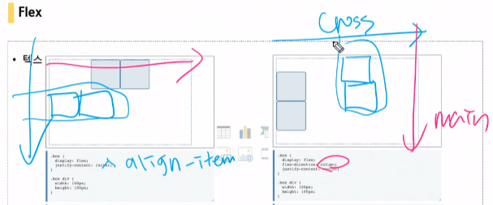

# 20200319

## login 실습

### 레이아웃 배치

- Box model

  > absoulte, 상위:relative
  >
  > 하단부분 고정 :  fixed
  >
  > 왼쪽 : ul>li, float:right

- Position absolute

  > 위로 하나하나씩 쌓아간다.
  >
  > float:left,right

- Flex :정렬 수직,수평으로 정렬하기 위해 만들어진 것.

  > 부모요소9container : display:flex, 자식요소: item
  >
  > main axis : justify-content
  >
  > cross axis:align-items

  item 의 경우 inline,block속성이 적용안됨.  

  

  

### 카드만들기 실습

- cardfooter 

  > 엡솔루트이용하기.
  >
  > position: absolute;  #문제점 : 추후 수정시 이상할 수 있음.
  >
  > bottom:1rem;

  >  card : position:rerative

  > 플렉싀용하기.
  >
  > card : 
  >
  > display: flex;
  >
  > flex-direction: column;
  >
  > justify-content:space-between; : 균등하게  플렉스 화면 배치.

### form - login 실습

- label : `for를 통해서 input 의 id값과 동일하게 정의` for == input id와 같을 시에 입력이 가능하게 한다. 개행처리.
- input : required:창이 비어있을경우 브라우저에서 입력하기 화면조정. , autofocus autocomplete="username":자동완성
- 1rem = 16px, 0.5rem = 8px;
- 마진 순서(개수, 꼭 외워두기.)

객관식 ,단답:어제 정리, 오늘앞부분 서술2개 라이브강의 중심. : 정리위주.

객관식, 단답형, 서술형 2문제(어떤 상황이 주어지고 어떻게 해결하겠다는 것을 이야기-라이브 강의에서 정말 자주 언급을 했던 것이 있음 그부분 중식으로 정리하면 될듯) 객관식 단답형은 정말 기본적인 것 어제 내용과 오늘 앞부분에 정말 많은 내용을 담고 있음 이러닝 파트보다는 라이브 강의 중심으로 했음.