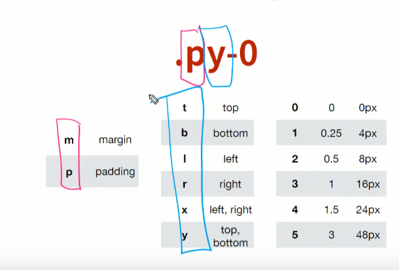
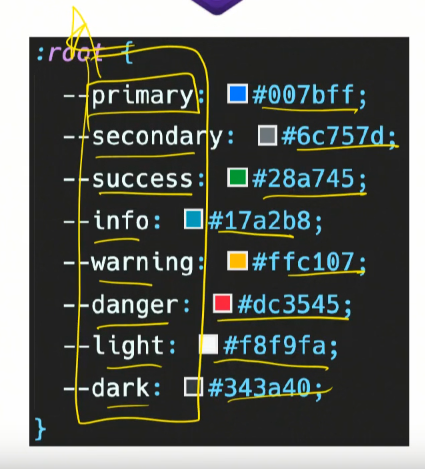

# 20200323-24 부트스트랩

CDN을 가져오기.(CSS-head, JS-body닫는태그 바로위(성능상으로 스크립트가 아래에 있는 것이 좋다.모두 렌더 후 작동하기.어느곳에 위치하든지 상관은 없다.).)

클래스를 주는 형식으로 CSS적용 가능.

front-end-componentliblary

html+css+js

ver 4.4 - flex개념 적용가능. IE11이상만 지원

### pure-html vs bootstrap

> 작성되는 형태가 다르다.
>
> 브라우저마다 기본적인 속성값이 다르다.
>
> 부트스트랩 이전 : reset css vs nomalize css : 브라우저마다 값이 다를 때 표준화시키자.

- CDN : 요청이 들어왔을 경우 세계각지역 중 가장 가까운 곳에서 요청을 보내줌. 특정한 소스코드 혹은 파일들을 편하게 온라인 상에서 가져다 쓸 수 있는 네트워크 시스템

  ### bootstrap

  1. #### spacing

     `.m-0`: margin: 0 !important;(우선순위1등.)

     `.mr-0`

     `.mx-0`:left,right = 0(x축)

     `.py-0` :padding-top,bottom 0

     `.mt-1`:margin-top:0.25rem(4px)

     `.mx-auto`

     (마진만 가능함)음수값도 가능하고 0부터5까지숫자이다.

     패딩은 양수만.

  

2. #### color

   `.bg-primary`

   

- #### Text

​	`.text-success` - color

​	`.alert-warning`

   `.btn-secondary`

`.navbar-dark`

3. #### border

   spacing을 활용하면 box-model끝.

   `.border`, `.border-success` 둘다 같이 써주어야함.

   `.rounded`

####  4. Display

​	`.d-block`

`.d-sm-none`:sm min-width보다 크면 나타나지않음.

`.position-fixed`

`.text-align-center`

`.font-weight-bold`

## tip

부트스트랩 wappalyzer : 부트스트랩 확인가능.