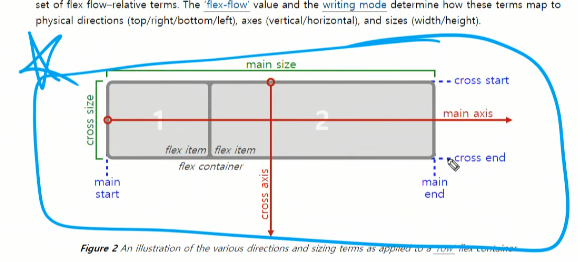
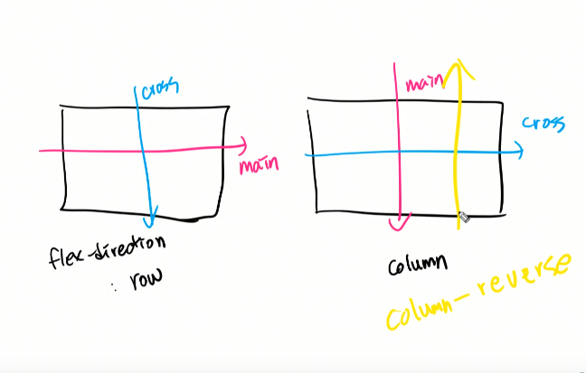
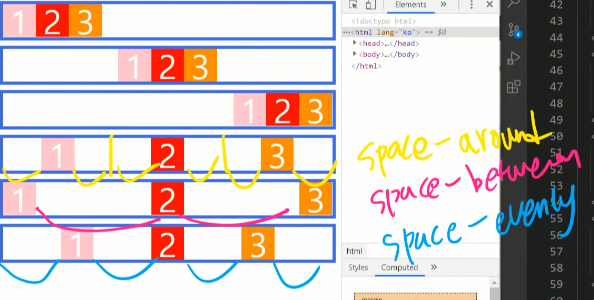

# 20200323

배치핵심



html/css

- 기본 : 왼쪽 위에 쌓인다. - 블록:전체너비, 인라인:컨텐츠너비

- float:

- position:absolute,fixed(브라우저기준)

수직정렬의 어려움

### Flex- 정렬의 어려움을 해결하기위해 

> 종적인 컨텐츠의 컨트롤을 가능하게 하기 위하여.-align-items로 구현가능.

1. #### container, item

   ```html
   <div class="container">
       <div class="item"></div>
       
   </div>
   ```

   

2. #### main axis, cross axis - 정렬이 가능한 유연한 박스다.

3. #### flex지정
   1. row를 기준으로 배치(`flex-direction:row`)

   2. main축의 처음부터 배치

   3. 컨텐츠 크기/너비만큼 영역(더 작을 수 도있음.)-아이템전체너비의합보다 컨테이너의합이 작을 때.

   4. 모든 영역은 cross axis 채움. 

      ​	align-items : stretch(기본값)

   

4. #### flex속성

- ##### `flex-grow` : 기본값은 0, 남은 너비((컨텐츠너비 - 모든아이템의너비)의 남은 마진)를 각각 비율로 나눠서 가져감!

- #### justify-content !!!!!!! - main축을 기준으로 정렬한다.

  - flex-start,flex-end, center

  - space-around : 남은 마진을 각각 아이템양옆으로 나눠가짐.

  - space-evenly:아이템들양옆

  - space-between:아이템과아이템사이를 공동으로.

    >around랑 evenly가 어떤 상황에 쓰이는지 궁금합니다. 비슷해보여서;;;
    >
    >
    >
    >space-around → 균등 좌우 정렬 (내부 요소 여백은 외곽 여백의 2배)
    >
    >
    >
    >space-evenly → 균등 정렬 (내부 요소 여백과 외각 여백 모두 동일)
    >
    >



- #### align-item : coss축을 기준으로 정렬.

  - align-items : stretch(기본값)
  - flex-start
  - flex-end
  - center
  - base-line:폰트사이즈가 다를 때 밑에 정렬을 맞춰준다.

- #### order - item의 순서를 정의할 수 있다.

  - 기본값은 0이다.
  - 음수값도 가질 수 있다.

- #### align-self - 아이템에 직접 align을 지정할 수 있다.- 

- margin-top : auto가 가능하다.

- flex-flow: 두가지 모두 가능. column-reverse wrap-reverse;

- align-content : 횡으로 정렬.


## tip

https://css-tricks.com/snippets/css/a-guide-to-flexbox/

