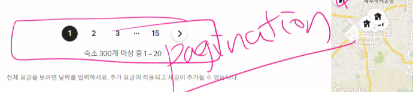
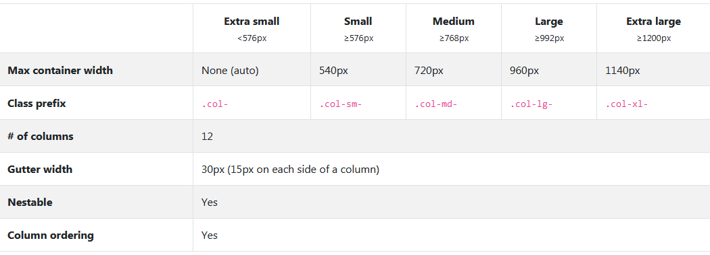

# 20200324-Grid & 반응형(layout)

### 복습

### html 

- 왼쪽 상단에 박스모델로 

- display : 인라인이나 블록레벨로 구성된 요소들이 순차적으로 쌓인다.

- 배치 (흐름) :1.float, 2.position
- Flex : 웹이 복잡해지면서 
  - container, item, main-axics, cross-axics

### Bootstrap 

>  모바일펄스트프로젝트로 반응형이가능하다.
>
>  html,css,js코드들로 구성.
>
>  CDN으로 사용. 혹은 다운받아서 씀.(장고프로젝트시)
>
>  css:헤드에 넣는다.
>
>  js : 클로징바디태그전에 넣는다.(위치는 모두 사용 가능하다. 하지만 성능상) 자바스크립트는 돔조작에 관한 것들. 헤드에 넣는 경우 html이 그려지지 않은 상태에서 작동하는 것을 바지.
>
>  fix-bottom vs sticky-top : scroll viewpoint에 따라옴.

#### compoment - 어떤것이 있는지, 적용되는 형태

- alerts : 경고, 워닝, 댄져  

  - ex)github 색상적용 , alert + alert-primary 두개 쓰기. 보더와 같은 속성.

- badge:쇼핑몰 특가, 세일, 이벤트 강조시 사용.

  - 태그에 활용.

- bradcrumb : 사이트 이동경로

  -  빵가루. 탐색진행에 연결되는 링크가 추가되는 경로. 

- btn :

  - hoover : transition,filter로도 구현가능.

- card:이미지, 타이틀, 내용, 하단부

  - horizontal

- #### carosel!!!!!!!!! 중요 - 슬라이드가 넘어감. 회전목마라는 뜻.

  - js가 없으면 동작하지가 않는다. active라는 속성이 실시간으로 변하는 모습.(이미지 변화)
  - class는 반드시 스타일로 필요하다
  - id의 경우 바꿀 수 있다. 하지만 맞춰서 바꿔야한다.아이디선택자까지 바꿔주기.
  - ariahidden:사용자편리성
  - sr-only:screen reader only : 웹접근성에 대한 부분

- #### Form!!!!!!!!!!!!!!

  - inline form : class, display:flex
  - form
  - lavel for === input id : 클릭하면 포커싱이 가는 것.

- modal -JS와 같이 됨.Addeventlisner
  - modal창 display-none => 클릭시 display:block으로 바꿔서 표현됨.
  - 클릭을 하는 순간 작은 경고창이 뜰 때.
  - ex)로그인 작은창(입력가능창)
- navbar
  - 왼쪽과 오른쪽으로 나뉨.
  - display:flex
  - hambuger animations
- pagenation
- 

### 기억하기!!

#### carousel id-좌우 연결

#### modal id- data-target === id가 정확히 일치해야한다.

이미지가 아닌 태그의 장점:

스타일링이 가능하다. 크기, 색깔의 경우 이미지보다 표현용이하다.

### deploy

- github pages
- 기술블로그 :  githubpages jekyll, gatsby

# 오후 - Grid 반응형

#### 격자식 레이아웃(균일한 레이아웃)

- container : 전체영역 항상 감싸줘야한다. - 마진영역존재

- container-fluid - width100%

- 하나의 row에 12col까지 가능.`.col-4` - 4씩의 너비를 가진다.

  > 12를 기준으로 나누기. 12는 1, 2, 3, 4, 6, 12 등등 나누기 용이한 숫자이기때문에.

#### 반응형

breakpoint의 특정한 픽셀값이 존재한다.

12칸 기준으로, 12칸 넘어가는걸 wrap 된다.

4, 3, 6 이면 4,3 한줄 6 한줄 

- gutter : ==padding 항목과 항목 사이의 공백영역

> row 위에는 항상 container가 있게 조작하기.
>
> row 하나가 flex!!!!!!!!!!!!!!!!!!!! container가 된다. wrap
>
> vertical alignment가능.
>
> class="align-items-center"

- order class 또한 flex이기에 가능한 내용.

- Offset

> 공백 레이아웃
>
> 

## tip

index.html : 다른 선언이 없을 경우 바로 보여질 페이지

min.css : 작은 용량. 로밍시간을 줄리기 위해 minified css 코드경량화 과정.

