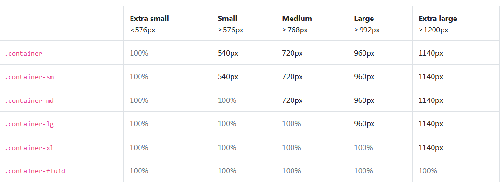
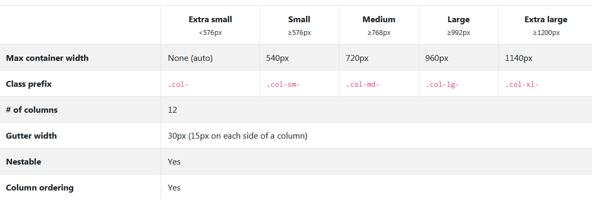

# 20200325 WEB PJT

## 평점 기반의 회원제 커뮤니티 사이트 구현

### 명세서기반

프로젝트를 통해 복습, 실습

- 직접문제해결능력
- 별도의 통합 해설이 없으며 질문보다는 직접 해결하는 것을 원칙.

## 복습

## bootstrap

> 부트스트랩은 html,css,js로 구성된 오픈소스 라이브러리
>
> 반응형, 모바일 대응을 위한 프론트엔드 컴포넌트!!!

### Utilities

- 박스모델을 기준으로 안에서 하나하나씩 들어와보도록 한다.
- position
- display
- spacing - margin, padding정의
- border
- color
- flex

### Component

- alerts - 깃헙
- badge - 쇼핑몰
- breadcrumb - 히스토리변화
- card
- carousel - 회전목마 양쪽 끝 버튼이 id로 연결이 되어있어야한다.
  - JS
- Form/input
- modal - 새로운창 포커스되는 느낌
  - JS
- Navbar
  - JS
- pagination

## Grid

> 그리드 시스템은 균형감 있는 레이아웃을 구성하기 위한 방법이며, 부트스트랩에서는 반응형으로 레이아웃을 자유롭게 구성할 수 있다.
>
> 

- container
  - 항상 bootstrap의 grid system을 사용하려면, 상위에 컨테이너가 존재해야합니다.
  - `.container`
  - `.container-fluid` - for a full width container, spanning the entire width of the viewport.
- `row`
  - 12개의 컬럼으로 구성.
  - `col-{breakpoint}-{numbber}`
  - 
- offset : marginleft가 들어가있다고 생각하기.

## media query-반응형

```css
// Extra small devices (portrait phones, less than 576px)
@media (max-width: 575.98px) { ... }

// Small devices (landscape phones, 576px and up)
@media (min-width: 576px) and (max-width: 767.98px) { ... }

// Medium devices (tablets, 768px and up)
@media (min-width: 768px) and (max-width: 991.98px) { ... }

// Large devices (desktops, 992px and up)
@media (min-width: 992px) and (max-width: 1199.98px) { ... }

// Extra large devices (large desktops, 1200px and up)
@media (min-width: 1200px) { ... }
```


## tip

CDN을 꼮 하기!! or 파일을 다운받아 가지고 오기

animate.css

google-font

