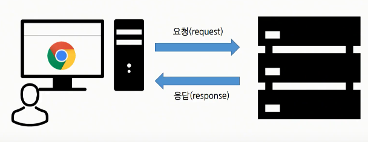
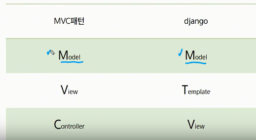
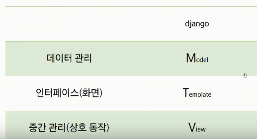
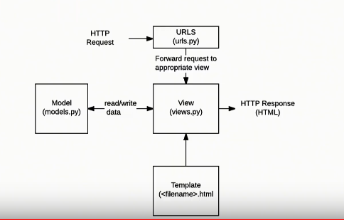
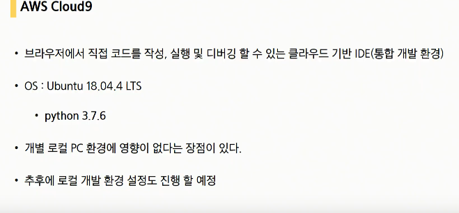
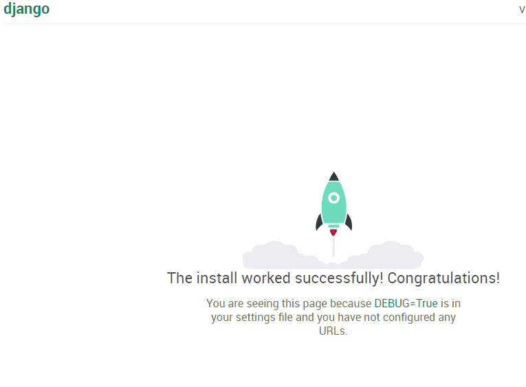
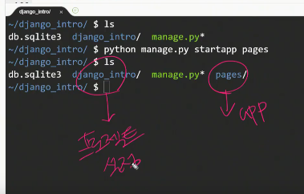
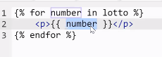
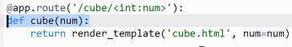
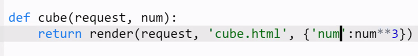

# 20200326 WEb+Django

## Django

> flask보다 훨씬 강력한 프레임워크이다.
>
> 많은 사람들이 쓰는 프레임워크.

파이썬 기반의 WEb framework : 웹페이지를 개발하는 과정에서 겪는 어려움을 줄이는 것이 주 목적.

프레임워크는 라이브러리들의 집합이다.

데이타베이스연동

템플릿형태의표준,세션관리,코드재사용

프렌차이즈 === 프레임워크




MVC(model view controller) : 소프트웨어 디자인 패턴 - 설계하는 방법과 관련.











## django 실습

```bash
pip install django==2.1.15
django-admin startproject django_intro
~/ $ cd django_intro/
~/django_intro/ $ 
~/django_intro/ $ python manage.py runserver 8080

#파이썬 셋팅파일 28줄 별 추가.
ALLOWED_HOSTS = ['*'] -> 로켓

# 아래는 언어 locale 설정
LANGUAGE_CODE = 'ko-KR'

#manage.py* 가 있는 지 꼭 확인!
~/django_intro/ $ ls
db.sqlite3  django_intro/  manage.py*

#app 만들기
~/django_intro/ $ python manage.py startapp pages
~/django_intro/ $ ls
db.sqlite3  django_intro/  manage.py*  pages/
# 주민등록
INSTALLED_APPS = [
    'pages',
    
#MTV 구조 확인.
~/django_intro/ $ cd pages/
~/django_intro/pages/ $ ls
__init__.py  admin.py  apps.py  migrations/  models.py  tests.py  views.py
~/django_intro/pages/ $ 
```




## 리눅스 명령어

```bash
#폴더이동
cd (change directory)

# 현재 디렉토리 파일 목록
ls
ls -al


```




## 오후실습

1. 경로(url)

   > 경로를 만들 때 항상 /로 닫는다.
   >
   > index로 들어오면 views의 index함수를 실행시키겠다.

2. 함수(views.py)

   > 뷰에서 함수 정의시 항상 첫번째 인자를 `request`로 정의한다.
   >
   > ```
   >  def lotto(request):
   >     import random
   >     pick = random.sample(range(1,46),6)
   >     context = {
   >         'pick': pick
   >     }
   >     return render(request,'lotto.html', context)
   >  딕셔너리(context의 키값을 불러와 벨류를 프린트함.)
   >  <h1>{{ pick }}</h1>
   > ```
   >
   > 

3. html(templates dir/index.html....)

```
killall python

```







### inversion of control : 통제를 넘긴다.

함수의 호출권한은 프레임워크로.


## tip

프레임워크 배우기순서추천
레일즈 -laravel, sails
장고
익스프레스 + node.js
스프링부트
스프링

