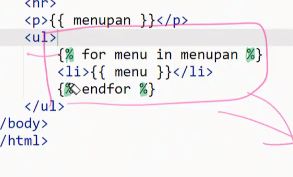
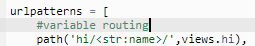
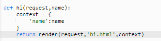

# 20200327 Django

## 복습

### M: model T : Templates V :view 패턴

일반적으로는 MVC

## project

1. settings.py

   > allowed_host, locale설정을 해야함
   >
   > installed_apps : app 추가

```python
# 개발모드
DEBUG = True 

# '*' 모든 호스트 접근 가능. 
ALLOWED_HOSTS = ['f7a4342c70b8411cb3fe56c578cbdac9.vfs.cloud9.us-west-2.amazonaws.com']

#app 등록 - `python manage.py startapp`
# Application definition

INSTALLED_APPS = [
    'pages',#app 등록!
    'django.contrib.admin',
    'django.contrib.auth',
    'django.contrib.contenttypes',
    'django.contrib.sessions',
    'django.contrib.messages',
    'django.contrib.staticfiles',
]

# Internationalization
LANGUAGE_CODE = 'ko-kr'#'en-us'

TIME_ZONE = 'Asia/Seoul'#'UTC'
#인터네셔널라이제이션
USE_I18N = True 
# 로컬라이제이션 
USE_L10N = True 
#timezone을 의미
USE_TZ = True


```

2. urls.py

   ```py
   """django_intro URL Configuration
   
   The `urlpatterns` list routes URLs to views. For more information please see:
       https://docs.djangoproject.com/en/2.1/topics/http/urls/
   Examples:
   Function views
       1. Add an import:  from my_app import views
       2. Add a URL to urlpatterns:  path('', views.home, name='home')
   Class-based views
       1. Add an import:  from other_app.views import Home
       2. Add a URL to urlpatterns:  path('', Home.as_view(), name='home')
   Including another URLconf
       1. Import the include() function: from django.urls import include, path
       2. Add a URL to urlpatterns:  path('blog/', include('blog.urls'))
   """
   from django.contrib import admin
   from django.urls import path
   from pages import views
   
   urlpatterns = [
       path('iam/',views.iam),
       path('lotto/', views.lotto),
       path('hello/', views.hello),
       path('index/', views.index),
       path('admin/', admin.site.urls),
   ]
   
   ```

   

3. wsgi.py

   > web server gateway interface (웹 서버 게이트웨이 인터페이스)

4. manage.py

   > 명령어 지정 파일 수정 하지말기.

   ```py
   #!/usr/bin/env python
   import os
   import sys
   
   if __name__ == '__main__':
       os.environ.setdefault('DJANGO_SETTINGS_MODULE', 'django_intro.settings')
       try:
           from django.core.management import execute_from_command_line
       except ImportError as exc:
           raise ImportError(
               "Couldn't import Django. Are you sure it's installed and "
               "available on your PYTHONPATH environment variable? Did you "
               "forget to activate a virtual environment?"
           ) from exc
       execute_from_command_line(sys.argv)
   ```

### apps

1. test.py -테스트코드
2. model
3. admin 관리자
4. apps.py:app설정

------

### variable routing








name : 변수명과 같아아됨. - keyword argument.

## 핵심정리

1. 웹 서버는 요청과 응답을 처리한다.
2. 응답을 처리할 때 url이 정의되고 어떠한 view함수를 실행하고 뷰함수내에서 파이썬코드동작.
3. 템플릿에서 html파일을 화면에 그린다.
4. 템플릿에 변수를 넘겨주기위해서는 뷰함수에서 context라는 딕셔너리로 넘겨준다.
5. 조건문과 같은 다양한 문법을 {{}}로 html에서 사용할 수 있다.


## tip

octotree : 깃 디렉토리트리로 보기 크롬익스텐션

