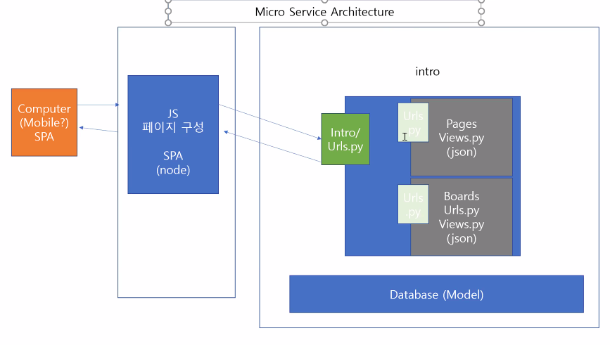

# 20200330 Template

# 

### DLT : Django template language :star2:[¶](https://docs.djangoproject.com/en/3.0/ref/templates/language/#the-django-template-language)

## `render()`[¶](https://docs.djangoproject.com/en/3.0/topics/http/shortcuts/#render):star2:

- `render`(*request*, *template_name*, *context=None*, *content_type=None*, *status=None*, *using=None*)[¶](https://docs.djangoproject.com/en/3.0/topics/http/shortcuts/#django.shortcuts.render)

  Combines a given template with a given context dictionary and returns an [`HttpResponse`](https://docs.djangoproject.com/en/3.0/ref/request-response/#django.http.HttpResponse) object with that rendered text.Django does not provide a shortcut function which returns a [`TemplateResponse`](https://docs.djangoproject.com/en/3.0/ref/template-response/#django.template.response.TemplateResponse) because the constructor of [`TemplateResponse`](https://docs.djangoproject.com/en/3.0/ref/template-response/#django.template.response.TemplateResponse) offers the same level of convenience as [`render()`](https://docs.djangoproject.com/en/3.0/topics/http/shortcuts/#django.shortcuts.render).


### Required arguments[¶](https://docs.djangoproject.com/en/3.0/topics/http/shortcuts/#required-arguments)

- `request`

  The request object used to generate this response.

- `template_name`

  The full name of a template to use or sequence of template names. If a sequence is given, the first template that exists will be used. See the [template loading documentation](https://docs.djangoproject.com/en/3.0/topics/templates/#template-loading) for more information on how templates are found.

  


{# 주석 #}

<!--html주석-->


```
git remote set-url origin https://lab.ssafy.com/dmdekf/online-lecture.git
```





```

 forloop counter


```


.env 
decouple

## tip

https://docs.djangoproject.com/en/3.0/topics/http/shortcuts/

unsplashapi:전문가사진.

