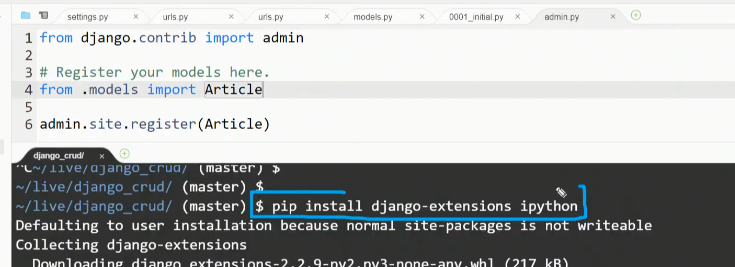
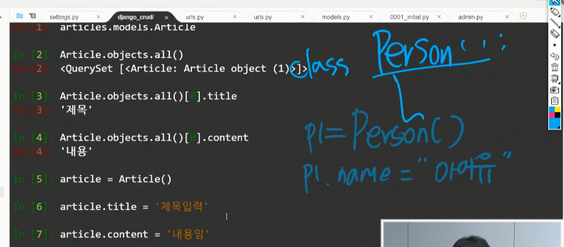

# 20200331 Model

### 복습

장고는 mtv패턴


urls.py : 이정표를 담당한다. 각각의 뷰들에 대응되는 함수에 대한 이정표.

Template : DTL 로직을 수행하려하지 말고 화면작성에만 이용. `{{}}` ` `

장고는 하나의 프로젝트가 복수의 app을 가지는 구조로 되어있다.

각각의 app또한 MTV패턴을 가지고 있다. (templates, views.py, url.py)

### urls.py 설정 - include를 통해서. 


### Templates 폴더구조


### settings.py

##### APP_DIRS : 앱의 templates

##### DIRS : 앱 외의 templates를 탐색할 때 지정.

##### BASE_DIR : 최상단 디렉토리를 뜻한다.

>  같은 디렉토리안에서 파일을 불러올 때
>
> `from . import views`
>
> 다른 디렉토리에서 파일 불러올 때
>
> `from pages import views`

### 사용자 정보처리 (Form로직)

1. url을 항상 두개를 만들어 놓는다.

   > 로그인 로직을 만들 때 
   >
   > 1. url/login
   >
   > 2. view def login
   >
   > 3. template .html
   >
   >    	<form action="/login/"> --> 잘못됨.새로운 url을 만들어야 한다.
   >
   > 4. url /login/complete/ 
   >
   >     #폼을 보여주는 작업을 독립적으로 보여주는 뷰함수, 폼을 받아서 처리하는 로직에 관련된 뷰함수 하나를 만들어야 한다. url을 작성해야한다.
   >
   > 5. view def complete

2. request를 통해 폼에 입력한 데이터를 받아온다.


-----

1. 기본요청

   1. url
   2. view
   3. html(T)

2. form 양식 & 처리

   1. 사용자 정보를 받기 위해 (from을 만들어준다.)

      url.py path('ping/',views.ping),

   2. view.py def ping 정의

   3. ping.html

      ```html
      <form action="boards/pong">
          <input type="text" name="message">
          <input type="submit">
      </form>
      
      ```

   4. 정보처리

      1. 받은 정보를 표현할 url 만든다.

      2. 또다른 함수를 만든다.

         ```
         def pong(request):
         message = request.GET.get('message') 
         ㅊ
         ```

         :star: 'message'를 쓸 수 있는 것은 input의 name값.

         


view 

- url(request요청관련정보)
- return render()

Template - render을 수행하기 위해.

- html DTL 반복, 조건 가능 필터, 등으로 효과적으로 문자열을 자를 수 있는 것들을 한다.

----

## Model - DB

modeling

DB : 서비스에 대한 모델.

커뮤니티 

-  게시글
- 사용자

### DB?

#### Schema 스키마 :  각각의 colunm 들의 data type을 정의한다. 

> 이름 : 문자열
>
> 나이 : 숫자
>
> 전화번호 : 형식지정

### Table

db에는 여러개의 table이 존재하게 된다.

> 행row - 레코드
>
> 열colunm - 필드,속성

#### DB 조작 언어 : SQL(Structured Query Languages)

#### ORM(Object relational mapper)을 활용하여 DB 조작.

> 객체(파이썬코드)로 관계형 DB를 조작한다.


### 모델링 시작 - ORM객체, 구조화

1. class 정의 - DB모델링

```pyt
models.py
# class의 경우 속성(멤버변수, 멤버메서드)를 기억하고 어떻게 만들어질지 생각해보기.
class Article(models.Model):
# 각각의속성과 타입을 지정한다.
  title = models.CharField(max_length=140)
  content = models.TextField()
  created_at = models.DateTimeField(auto_now_add=True)
  updated_at = models.DateTimeField(auto_now=True)

```

2. 터미널에서 명령어입력. - 객체조작

```bash
# 내가 모델링 한 것을 DB에 반영할 준비 - DB에 전달할 메시지를 지정하는것. migrations디렉토리 생성됨
python manage.py makemigrations
#migrate라는 명령어로 최종적으로 DB에 반영.
python manage.py migrate

```

3. 실제 DB에 반영이 되어있는지 살펴보기

```py
admin.py

from .models import Article
admin.site.register(Article)
```

```bash
python manage.py createsuperuser
admin
password지정.
```

### 관리자페이지가 장고에서 편하게 제공한다~!



```bash
django-extensions ipython
app추가하기.
```


관련된 모델들을 모두 import를 해준다. shell_plus를 통해서.

### object를 통해서 관리해보기.


DB에 저장된 데이터들을 오브젝트 형식으로 접근하여 조작가능.




### 객체조작으로 DB를 조작하고 있다는 것을 생각하기. 

### CRUD - DB를 조작하는 가장 기본적인 것.

1. create생성

2. read조회

> Article.objects.all()
>
> **`개별` 레코드들에 대한 id,pk값들은 고유한 값을 가지고 있어서 절대 중복되지 않는다.** 장고는 데이터가 생성될 때마다 자동으로 생성한다.
>
> Article.objects.get(id=2)
>
> :star: id!! or primarykey!!!

3. update수정


4. delete삭제


- 튜플리턴.되며 삭제됨.

-----

### 정리  : 탁희샘 정리보기.


makemigrations : 소원쪽지같은느낌

migrate : db에 반영

# 오브젝트조작으로 데이터베이스를 조작할수 있고 그것이 orm이다.

# 그리고 class조작이 많아질 예정.

# tip

장고 프로젝트의 경우 `Article`이 hello world.... 신문사에 만들어서?

장고는 자체적인 orm 을 가지고 있다.

Flast - SQL알케미 ....