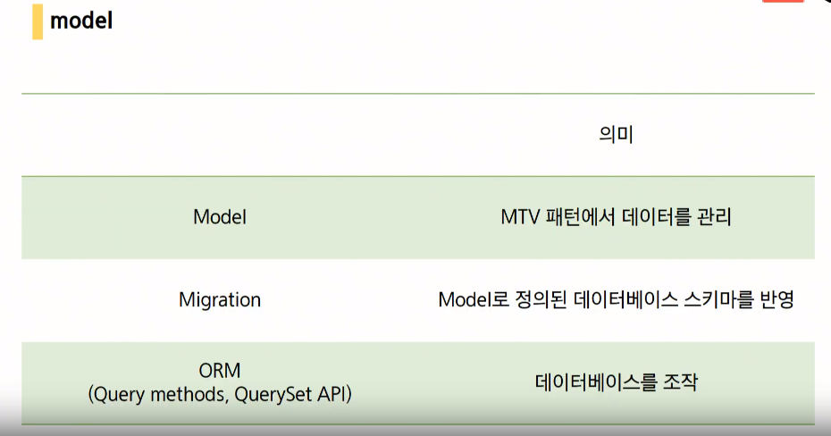
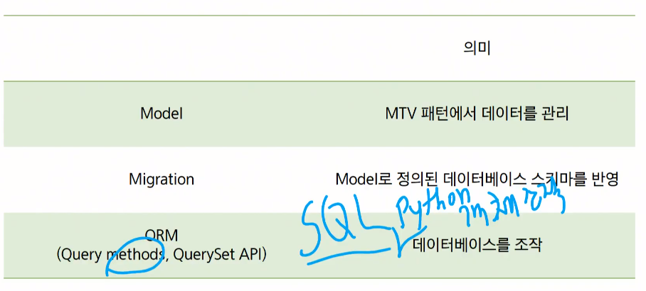
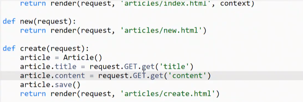
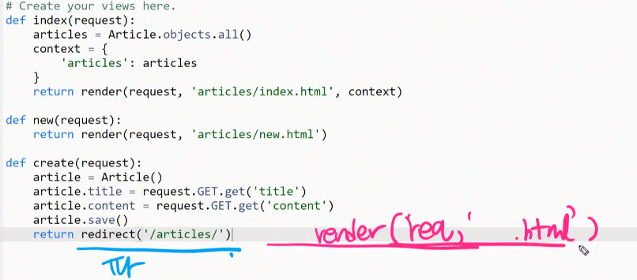
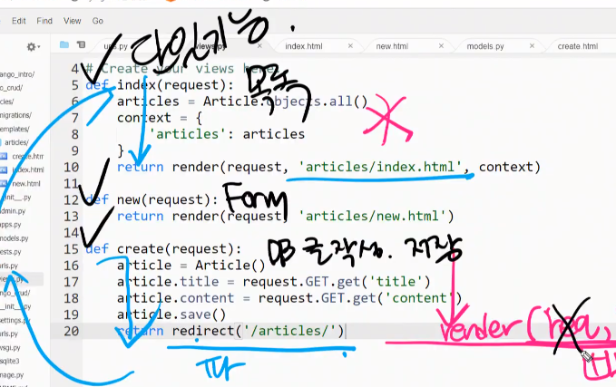
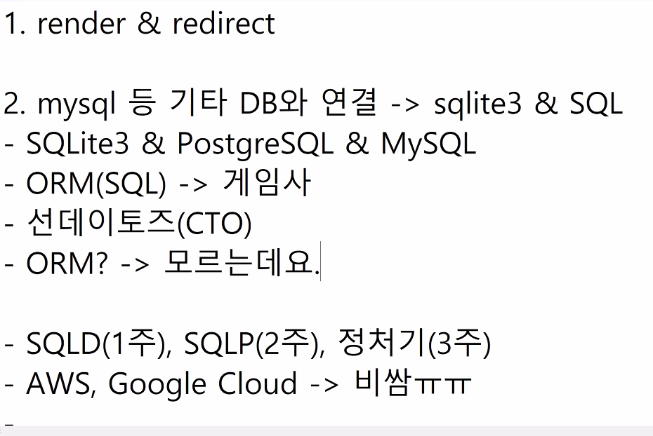
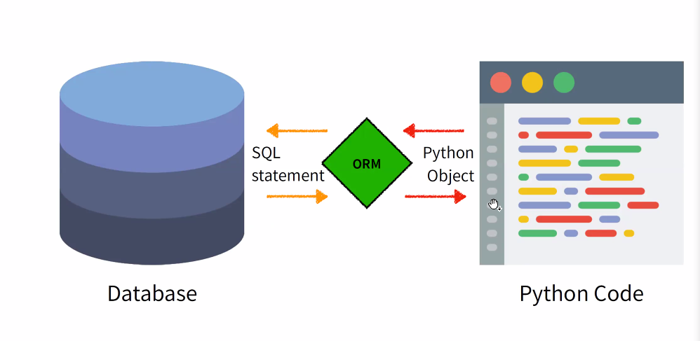
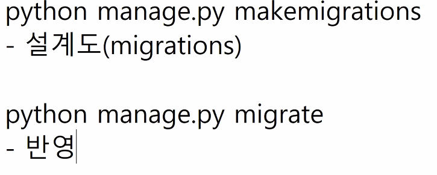

# 20200331 모델2

DB설계, 기능을 정리

데이터에 대한 단일 정보 소스.

체계화되어있다.

ORM : 테이블화 되어있는 데이터를 객체로 매핑시켜 반환시켜준다.

각각의 뷰함수들은 단일기능만을 수행해야한다.

최정원/articles/ -> com/articles articles/ -> com/articles/create/articles 로 동작 하던데 앞에 /를 붙이는게 url을 com부터 시작하는걸로 초기화 한다고 생각해도 되나요?

최정원/articles/ -> com/articles

change edu@최정원 네 맞습니다 action속성에 시작부분에 /기호를 넣지 않으면 현재페이지를 기준으로 요청으로 보내게 되고 /기호를 넣게 되면 서버주소를 기준으로 요청을 보내게 됩니다.

ORM(RDBMS)를 바꾸는 것은 쉽다.

모델링 내용을 DB에 반영할 준비를 함 & 반영함

데이터베이스 스키마를 위한 버전관리시스템으로 생각하면 됨

# tip

- DB수업추천

유튜브 검색 : database berkeley course 1, 2

udacity