# 20200406 Static_django

## 복습

MTV 

>  데이터관리
>
> 인터페이스
>
> 중간관리(상호동작)

urls.py : paht('_',view.index): 각각의 url패턴이 있고 거기에 대응되는 view가 있다.

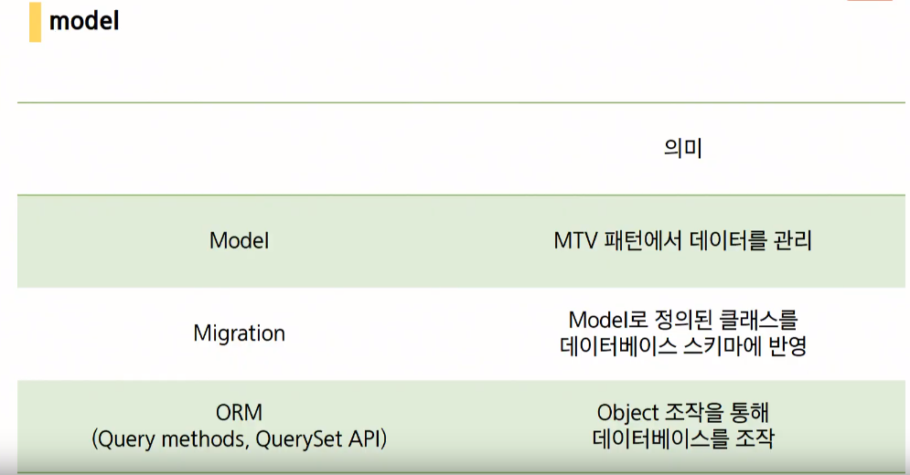

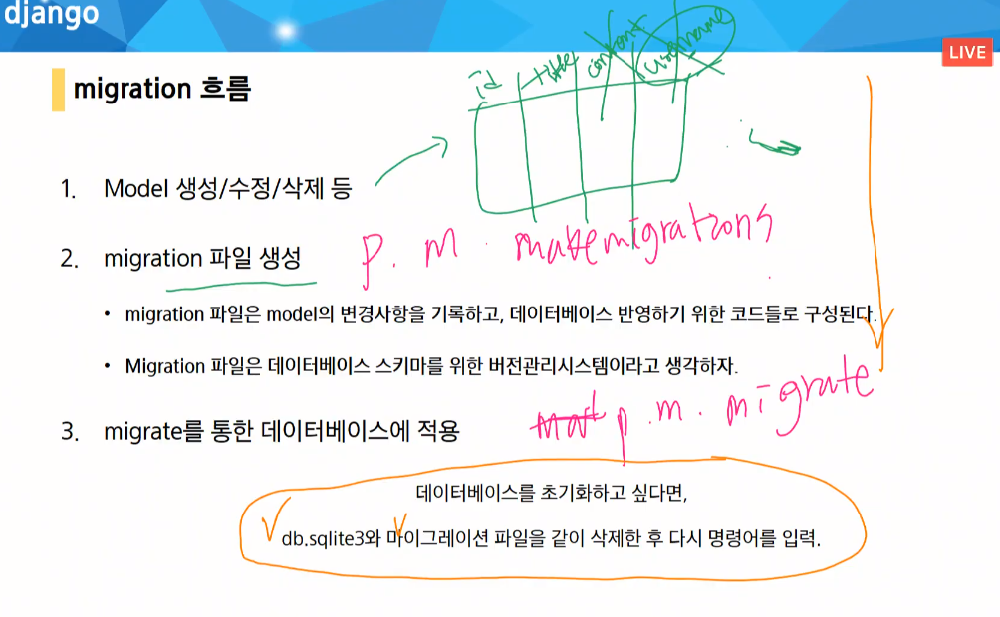

----

### model -CRUD


- model형식 자체가 잘못 되었을 경우 삭제.

- ```
  python manage.py showmigrations : articles(no migration)를 확인하여 리셋 .
  migration이 DB에 반영이 되어있을 경우 
  [x] 로 상태반영.
  python manage.py sqlmigrate articles(app이름) 0001(마이그레이션 파일) : 실제 대응되는 SPL문이 등장. 
  
  ```

  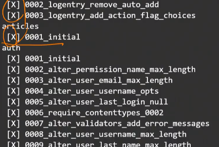

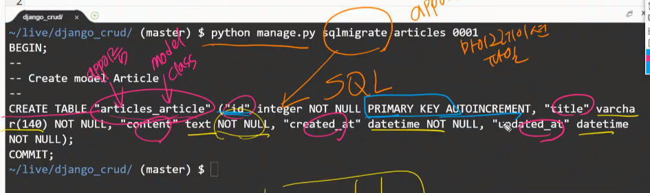

지금 변경된 테이블은 SQL에서 만들어진 테이블의 이름이기 때문에 대소문자가 상관없는 SQL에서 전부 소문자로 표현됩니다.

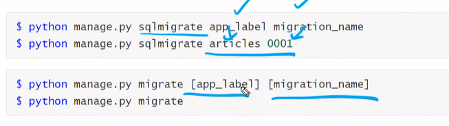

splmigrate : 옵션 x

[](대괄호 표시)일 경우는 옵셔널.

models.Model

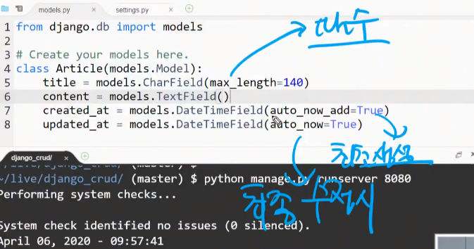


### Form - action, input:name중요.

```
url :  /articles/create/?title=title&content=content
```


link

url

view

#### variable routing

variable routing을 통해서 url을 만들어 줘야 한다.

view에서 variableouting을 함수의 인자, get으로 받아 쓰기.


Eric Lee@JS Park 네 delete 메서드만 호출하면 삭제가 됩니다. 세이브 메서드는 따로 호출할 필요가 없습니다.


Kang John@JS Park 네 save 하지 않으셔도 됩니다

@하이얀구름 저장하고자 하는 모델에 비밀번호를 저장할 칼럼을 만들어 저장을 하고 삭제 과정에서 검증을 하면 가능합니다. 추후 저희가 로그인기능을 구현하고 나서 작성한 사람만 삭제 가능하게 구현도 가능합니다.


김나연만약 id=3인 게시글을 삭제하면 id가 4, 5인 글들의 id 값은 3, 4 로 변하나요? 아니면 그냥 id3번 자리만 비워지나요?


김원호redirect 는 사용자가 URL로 요청을 보낸것과 똑같이 행동하나요?


change edu@김나연 비어있는 아이디가 존재하게 됩니다.


Kang John@김나연 3번자리만 비워집니다. pk는 변하지 않습니다


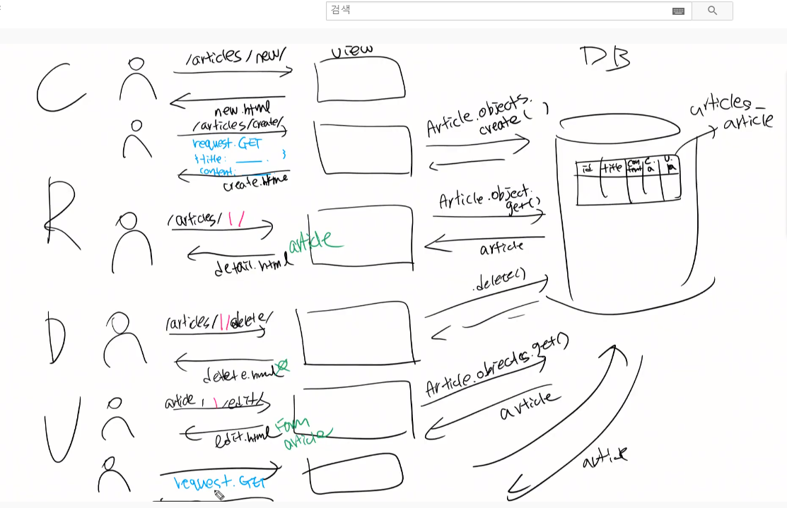

핵심 :  흐름을 잊지 말자.

CRDU 순서로 적용해보기.

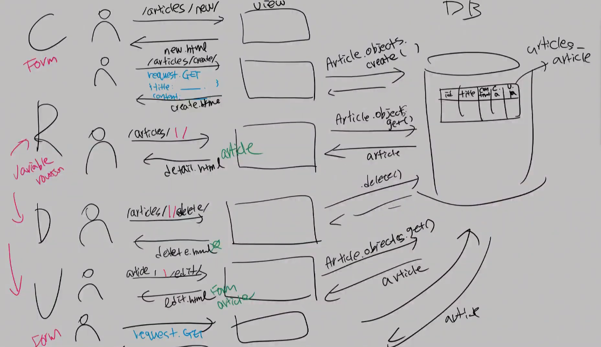

### GET VS POST

URL 에는 길이제한이 있다.

GET : 정보 가져오기

 POST : DB값 저장.

>  CSRF 토큰 : 요청 변조(위조) 방지. 새로고침을 할 때마다 각 값들을 가리키는 변수값이 재생성.
>
> FROM태그 안에 type="hidden" 히든값으로 토큰값을 넣어놓고 검증하기.

장고는 둘 다 적용하고 있음.


## HTTP

### 요청 request

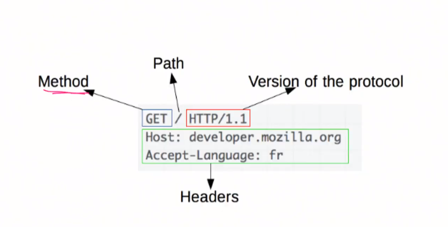


> Methond
>
> 일반적으로 클라이언트는 리소스를 가져올 때 는 `GET`오직 데이터를 받기만 한다. 특정 리소스의 표시를 요청, 특정 리소스에 엔티티를 제출할 때 `POST`서버 상태의 변화

### 응답 response

문서 한 장

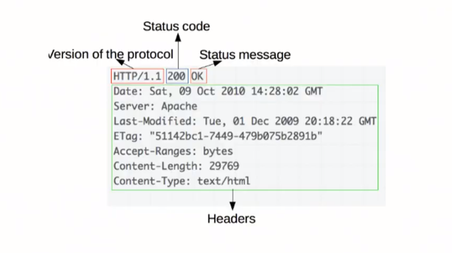

### 1. url


url 변수화.



get_object_or_404


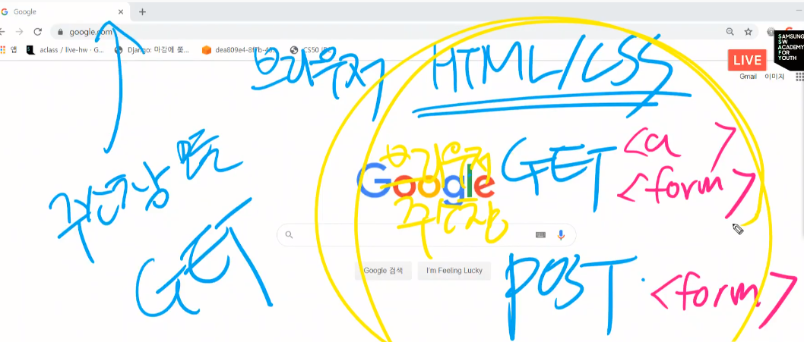


## static - 정적 파일 관리

```

```


1. css stylesheets
2. js
3. images

> namespace : template파일들과 같이 동작한다.
>
> 따라서 파일 폴더구조
>
> app/static/appname/images....


# tip

명령어 :  복수형(여러가지를 관리할 때.)

