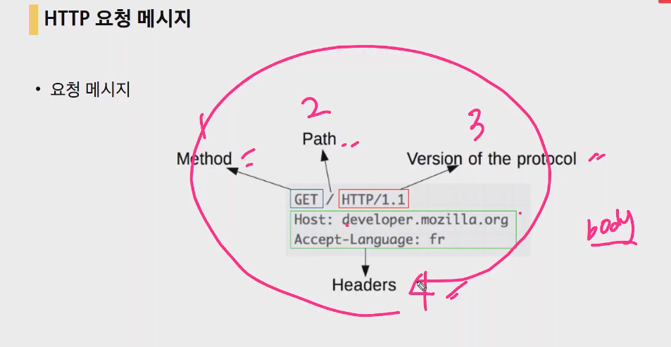
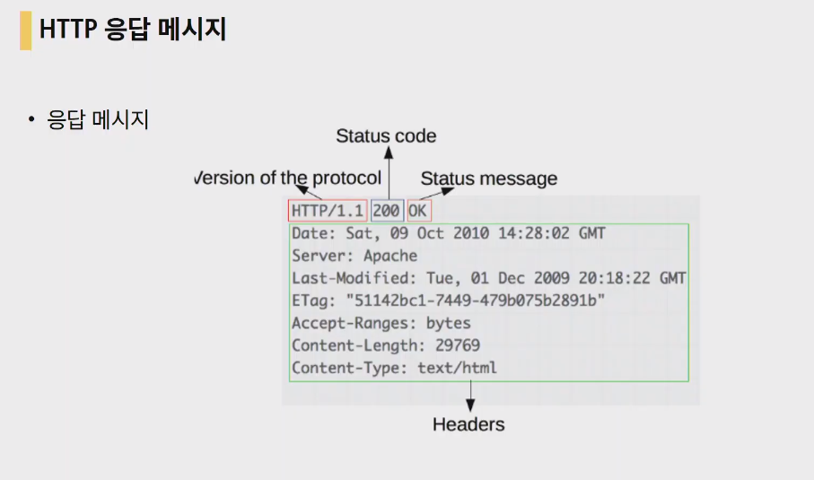
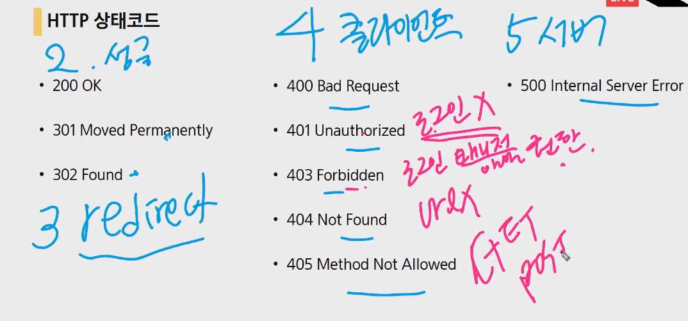
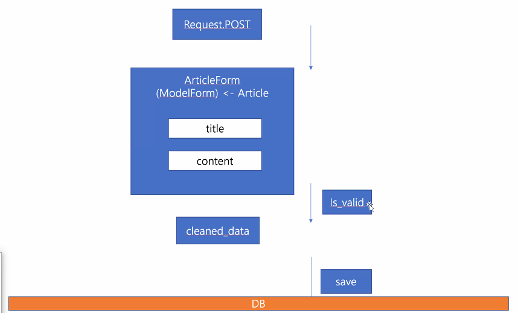
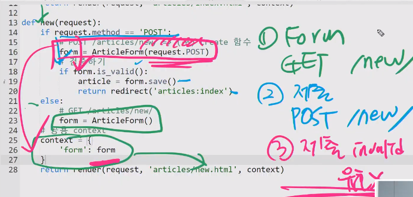
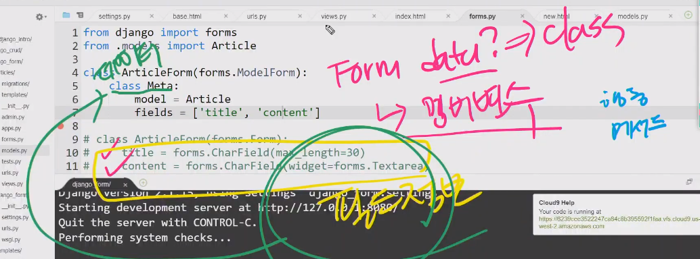
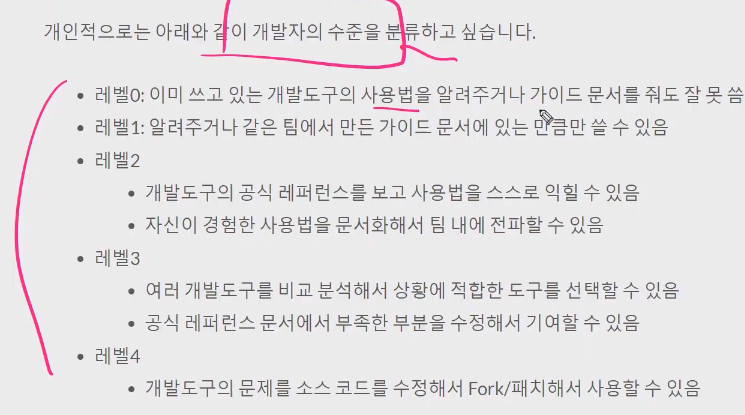

# 20200407 Model-form,Static

url 구조

> 절대경로
>
> 상대경로

http프로토콜

프로토콜://도메인: 포트/ 경로(path)/ ?파라미터#앵커



### HTTP메서드-의미에 맟춰서 쓰는 것이 일반적.

- GET

  > 특정 리소스의 표시
  >
  > a,form,브라우저에서 주소창을 보내는 요청.
  >
  > GET의 경우 URL을 활용(크기제한, 보안이슈)

- POST

  > 특정 리소스에 제출(서버 상태변화-db...)
  >
  > HTML Form을 통해 서버에 전송.
  >
  > HTTP요청 메시지의 body에 데이터 전송.
  >
  > EX)게시글, 로그인, 회원가입

모든 FORM을 특정 메서드로 보내야 하나?? NO!!!!!!!!

검색창의 FORM의 경우 GET



상태코드가 반드시 존재해야한다!!!



암기하기. 번호, 상태코드영어...

## Model Form

##  - model대응 from만들어줌

## - data를 검증한다.

> model과 form을 연계할 수 있다.
>
> 양식 검증!!!!!!! 비어있어도 안됨, 
>
> ```bash
> form.is_vaile()
> 
> form.errors
> 
> dir(form)
> 
> form.cleande_data(): 깨끗한지 검사를 해준 뒤에 생성이 됨.
> 
> 
> ```
>
> views.py에서 하나로 합친 이유
>
> 필수항목으로 검증작업을 해준다.
>






앱 이름은 일반적으로 복수형!

- admin 등록.

  ```python
  admin.py
  
  
  
  class ArticleAdmin(admin.ModelAdmin): list_display=['title','content','created_at','updated_at']
      
      admin.site.register(Article,ArticleAdmin)
  
  ```

  




## REST API(representational state transfer)

- 자원 uri

- 행위 http method
- 표현
- import requests

----

> http 요청, 응답

trello api :  card만드는 crud


get : 200statecode

post:405statecode

------

## ModelForm


# tip

