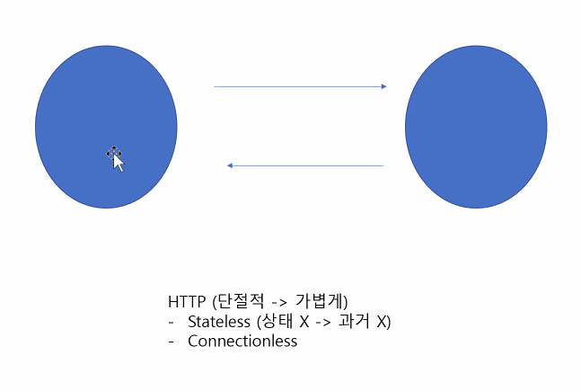
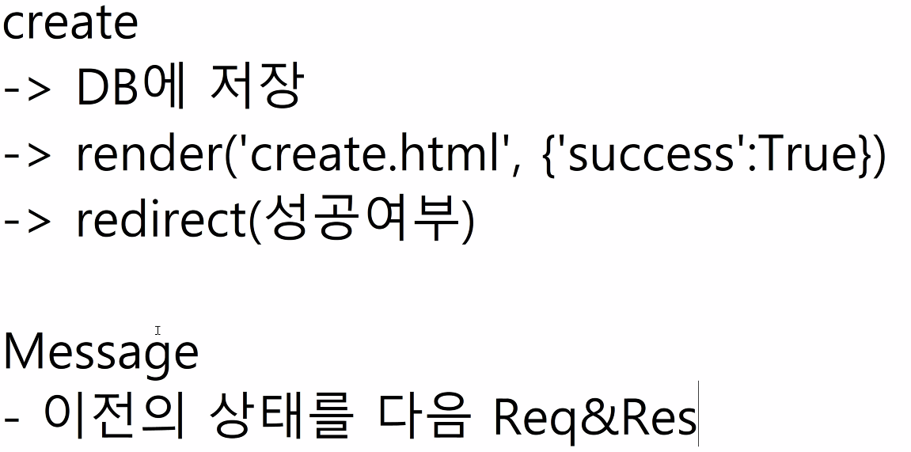

# 20200413 django-사용자인증관리

## instagram

### 1.단계 초기설정

```bash
git init
git ignore
djoango settings
```

프로젝트

```
settings.py
host
language
time
runserver
migrate

```

### 2.단계 app

app 만들기

-----

이름 예시 - 앱 이름은 반드시 복수형. 모델은 단수형. !!!!!

모델 : Post

app : posts

-----

Board

boards

----

앱설정

```
seetings.py
app등록
```

### 3.단계 model설정

>  fields, list_display 튜플로도 가능.

model 구조

```python
class Post(models.Model):
    title = models.CharField(max_length=100)
    content = models.TextField()
    created_at = models.DataTimeField(auto_now_add=True)
    Updated_at = models.DateTimeField(auto_now=True)
```

```bash
python manage.py makemigrations
python manage.py showmigrations #확인
python manage.py migrate
```

admin 설정

```python
admin.py

from .models import `modelname`

class ArticleAdmin(admin.ModelAdmin):
    list_display = ['id','title','created_at','updated_at'] #고급
    list_display_link = ['title']
    list_filter = ['created_at']

admin.site.register(Article, ArticleAdmin) #class 같이 넘기기~!!!!

```

```bash
python manage.py createsuperuser
```

- django admin site 설정들도 가능.....시간나면 해보기.

### 4단계 form,url

```python
forms.py

from django import forms
from .modes import Article

class ArticleForm(forms.ModelForm):
    class Meta:
        model = Article
        fields = '__all__'
```

url

```python
project
form django.urls import include

path('articles',include('articles.urls'))

app
form django.urls import path

urlpatterns = [
    
]
```

### 5단계 url지정,views,html

```python
app
urls.py
form django.urls import path
from . import views

app_name = 'articles'
urlpatterns = [
    path('', views.index, name = 'index'),
]

vies.py

from .models import Article

def index(request):
    articles = Article.objects.order_by('-pk')
    context = {
        'articles' = articles
    }
    return render(request, 'articles/index.html', context)

/templates/articles/index.html
html작성
------------
settings.py
os.path.join(BASE_DIR,'templates')
/templates/base.html

```

```html
/templates/base.html







```

```html
/templates/articles/index.html








```

### 6. create - forms.html,alert!!

>  사용하는 이유 
>
> HTTP : stateless & connectionless
>
> - 무상태성, 무연결성.
>
> message, login

---

> django message framwork
>
> - alert :` flashmassage` - one-time notification message,cookie or sessiontbased messaging
> - message를 쓰기 위한 모든 것들은 이미 모두 포함되어있다.

```python
views.py
from django.shortcuts import request,redirect, get_object_or_404
form django.contrib import message
form .forms import ArticleForm

def create(request):
    if request.method == 'POST':
        form = ArticleForm(request.POST)
        if form.is_vaild():
            article = form.save()
            return redirect('articles:index')
    else:
    form = ArticleForm()
    context = {
        'form':form
    }
    return render(request, 'articles/forms.html', context)
```

```html
forms.html






	<form action="" method="POST">
        
        {{ form.as_p }}
        <button>
            
        </button>
        
	</form>


```

```html
base.html
에 작성하는 것이 좋음.
settings.py 설정 c9.
MESSAGE_STORAGE = 'django.contrib.messages.storage.session.SessionStorage'
```


### 7. detail

```python
def detail(request,pk):
    article = Article.objectes.get(pk=pk)
```

-------

## HTTP : stateless & connectionless

- 무상태성, 무연결성.

- message, login






### Login

User - CRUD

> username, password

Article - CRUD

> title, content, created_at, updated_at

-------------

# login 구현

```python
urls.py

path('signup/',views.signup)

views.py
from django.contrib.auth.forms import UserCreationForm

def signup(request):
    form = UserCreationForm()
    context = {
        'form' : form
    }
    return render(request,'accounts/signup',context)

User.objects.create_user()로 해야 password 암호화 . 장고에서 제공.
```


## tip

각 단계별로 커밋을 남겨서 하기.


import 순서

1. python 내장

2. django

3. 내가 만든 것.


과제 선택과제 : 

user crud

app_name : 'users'

class User(models.Model):

username = CharField

password = CharField

created_at

updated_at


