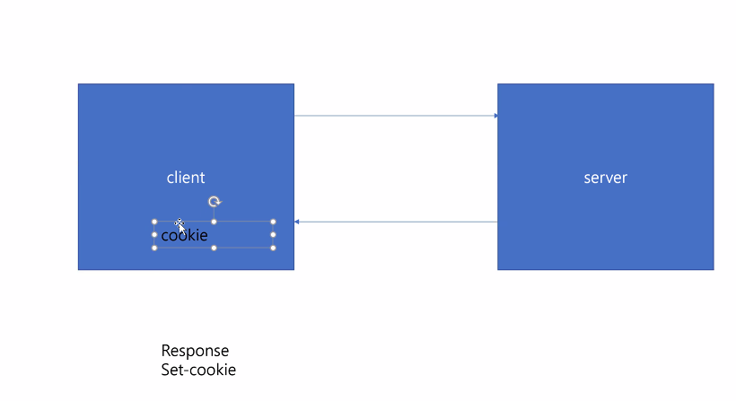
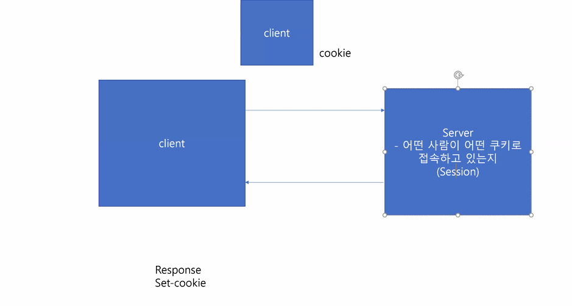
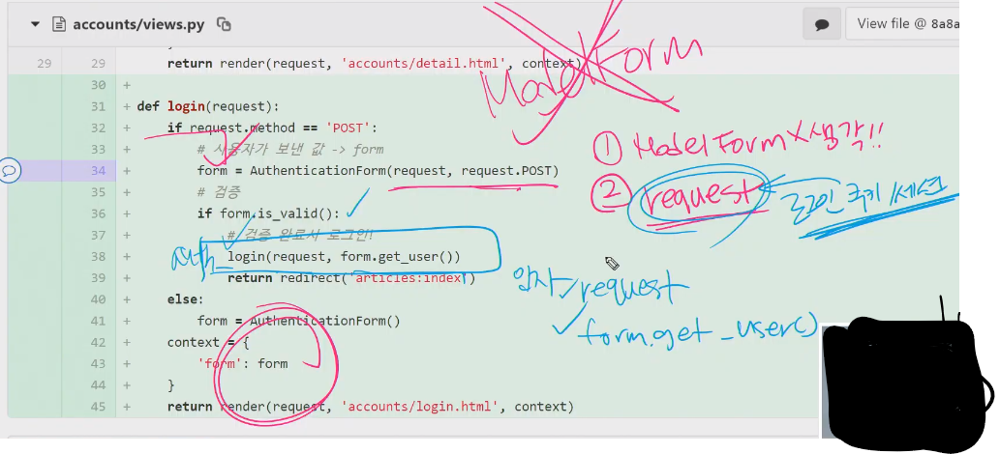
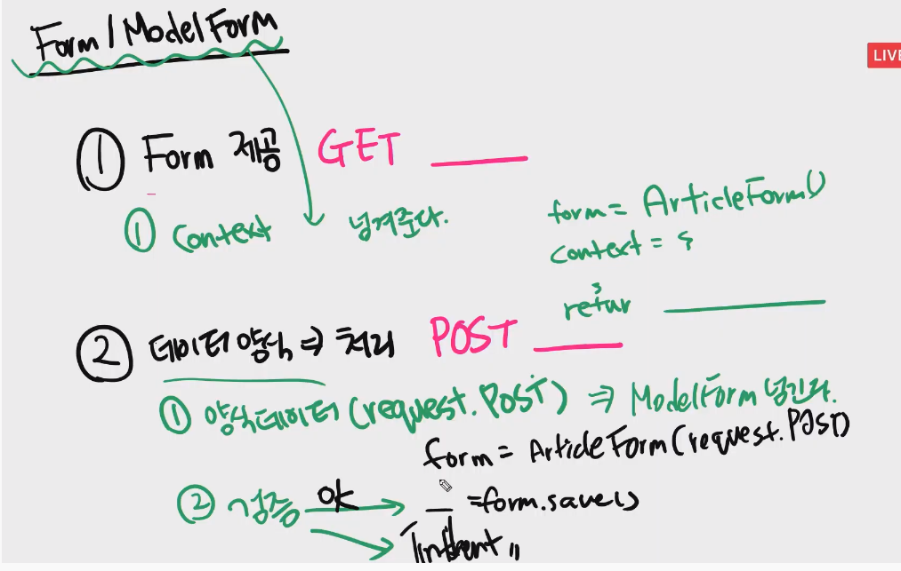
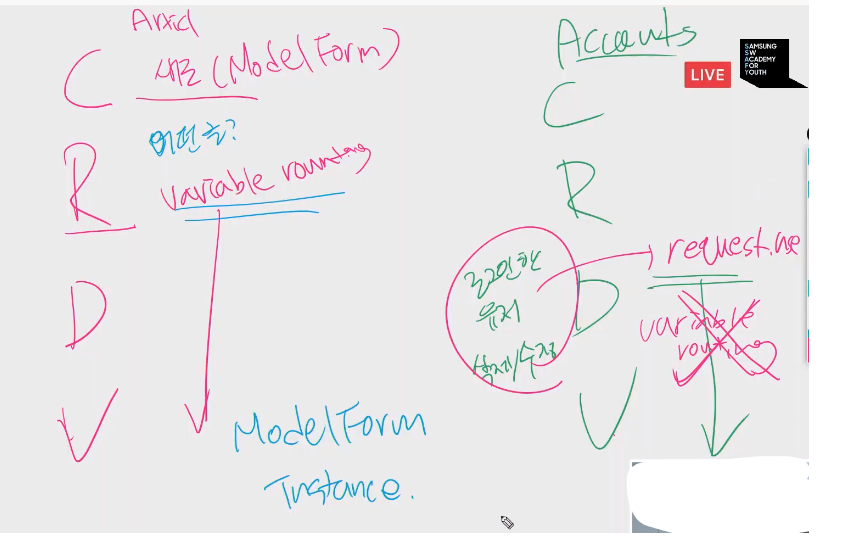
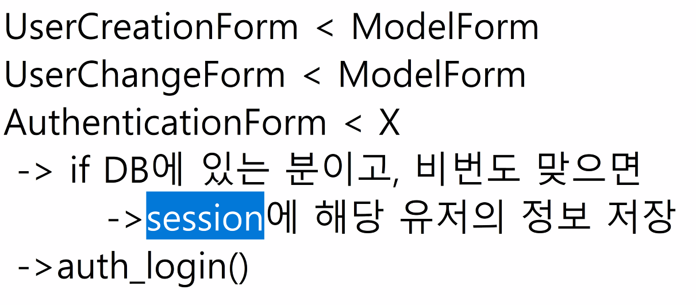

# 20200414 auth login

이예은 쿠키와는 다르지만 브라우저에는 서버에서 보내준 정보를 임시적으로 저장해놓는 경우가 있습니다. 이를 캐싱이라고 하는데, 간혹 캐싱된 데이터 때문에 우리가 코드를 수정해도 화면이 바뀌지 않는 경우가 있습니다. 이런 문제를 해결하기 위해 쿠키와 캐시등을 삭제해보라고 말씀하신 것 같습니다.

change edu@이예은 쿠키 뿐만아니라 캐싱된 데이터를 지움으로써 이전에 불러왔던 정보를 삭제한다고 생각하면 됩니다.

mmm lee백엔드에서 한번 더 검증과정을 거치는거군요 ㄷㄷ

하이얀구름그러면 둘 다 임시로 저장하는 건데 쿠키는 클라이언트 측에 세션은 서버측에 저장하는 거로 이해하면 되는 건가요?

ogin 함수에서 로그인할때 비밀번호가 일치하는지 검증해주는건가요.?

Eric Lee@mmm lee 해당 부분은 AuthenticationForm에서 is_valid() 함수를 호출할 때 내부에 있는 authenticate라는 함수가 처리해줍니다.

mmm lee아 그러면 login 함수는 비밀번호가 일치하면 로그인상태로 유지해주기 위한 함수인건가요? 네

김동욱base.html 에서 user 정보는 어디서 받아오는 건가요? context 로 user 정보를 넘겨줬었나요??

김준호@김동욱 원래 request.user인데 강의처럼 생략할 수 있습니다.

서버 세션에 AutenticationForm을 게시글 생성하듯 하나씩 만드는 건가요?yes

디비 저장해야되는거는 모델폼?!

.코드의 간결성
\2. REST API 대응 - 현재 저희는 GET & POST만 대응하고 있는데 이후에 RESTful 하게 메소드 구성할 경우 GET/POST/PUT/DELETE 여러개의 메소드가 오게 되고 GET method가 마지막에에 핸들링되는 형태가 가장 간결한 코드 구성이 가능해요

