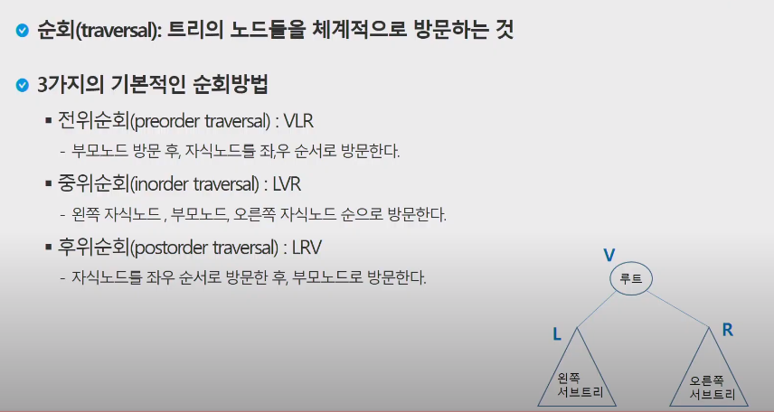

# 20200416 ALGO - TREE

노드수 = 간선+1 :  트리이다. 사이클이 없다.

노트수 < =간선 :  그래프, 사이클이 생긴다.

포화이진트리 

완전이진트리 : 배열로 구현할 수 있다.

## 이진트리

트리는 부모에서 자식방향으로 탐색.

유향그래프처럼 볼 수 있다. 사이크링 없으므로 방문표시는 할 필요가 없다.

그럴 경우 단말노드시에 끊어주면 된다.

