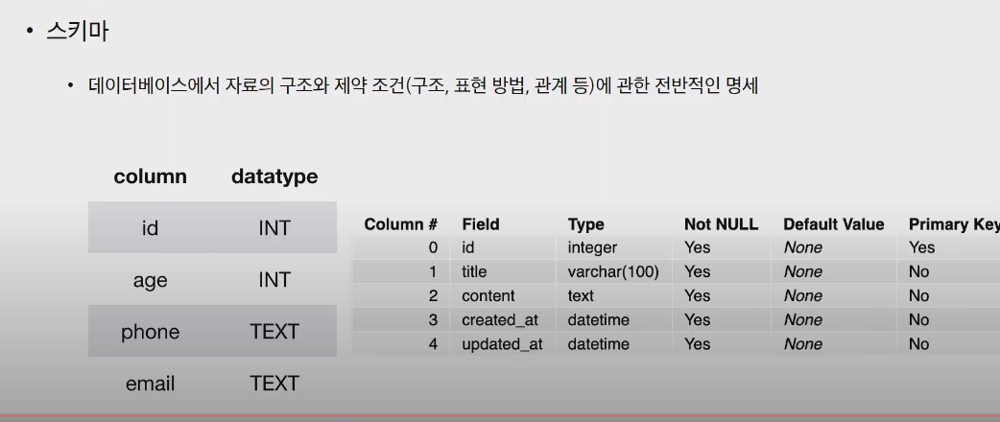
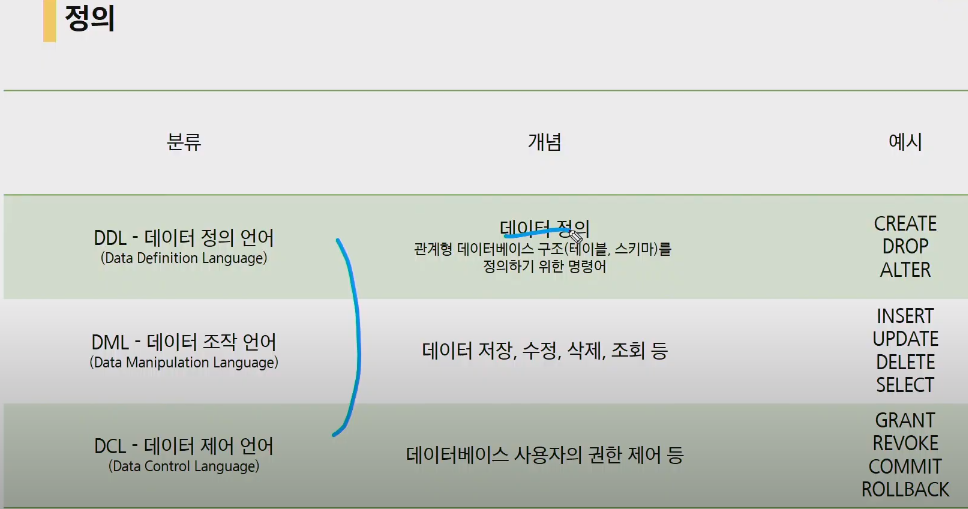
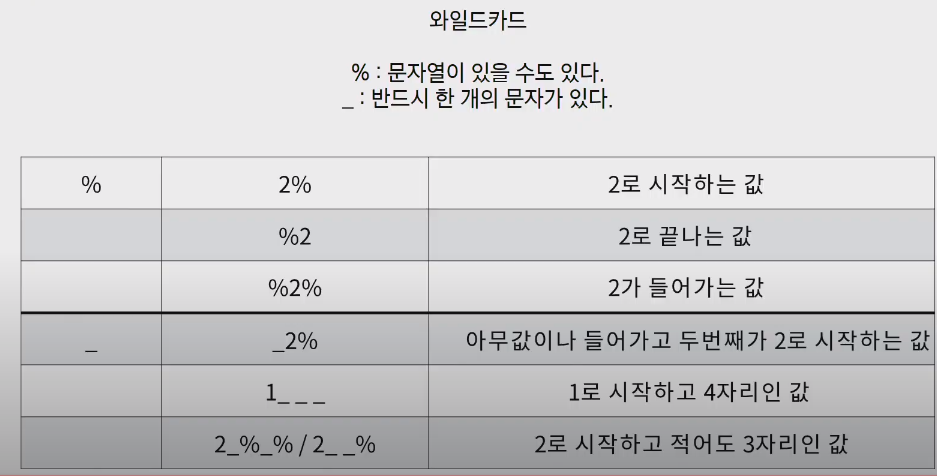
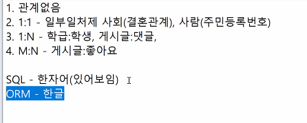

# 20200420 DB-SQL

### DB :  여러사람이 공유하여 사용할 목적으로 체계화해 통합, 관리하는 데이터의 집합.

#### RDBMS(관계형 DB)

- 스키마 : 데이터베이스에서 자료의 구조, 제약조건에관한 전반적인 명세
  - 
- 테이블 : 열과 행의 관계로 조직된 데이터 요소들의 집합
- colmun(열, 속성, 필드) : 각 열에는 고유한 데이터 형식이 있다.
- row(레코드, 행): 테이블의 데이터는 행으로 저장된다.
- PK : 각 행의 고유값으로 저장된 레코드를 고유하게 식별할 수 있는 값

### SQL




- 문법 :  데이터베이스를 관리하기 위해 질문을 던지는 언어다.

```bahs
`.`의 경우 spl문이 아니다. 조작이 편하게
spl문은 `;`로 끝난다.
```


대소문자 구분은 하지 않는다. !!!!!!! 하지만 키워드는 대문자로 사용하는 것을 추천.

### SQL문법:star:

> INSERT INTO
>
> SELECT FROM
>
> UPDATE  SET WHERE
>
> DELETE FROM WHERE
>
> DROP TABLE

```bash
# 테이블 생성
CREATE TABLE table(
	column1 datatype [constraints],
)
# data type
 - INTEGER - TINYINT<SMALLINT<UMSIGNED BIG INT(+,-),INT,MEDIUMINT
 - TEXT - CHARACTER, VARCHAR, TEXT
 - REAL - FLOAT
 - NUMBERIC - BOOLEAN, DATA, DATATIME, NUMERIC
 - BLOB

#테이블 삭제
DROP TABLE

#CRUD 모든 열의 경우에는 컬럼을 지정할 필요 없이 순서대로 넣으면 된다.
INSERT INTO table (clunm1,...)
	VALUES (value1, ....);
	
	
```


```bash
# 조회
SELECT : 특정 테이블을 반환한다.
SELECT * FROM table WHERE condition;
```


```bash
# 삭제
DELETE FROM table WHERE condition
```


```bash
#수정
UPDATA table SET colunm1=value1, WHERE conditon;
```


#### WHERE


```bash
# 중복 없이
SELECT DISTINCT name FROM table;
SELECT COUNT(column) FROM table;(MAX,SUM,AVE,MIN.....)
```


#### LIKE 와일드카드

`%` : or

`_ ` : 반드시 한개의 문자가 있다.




ASC(오름차순(디폴트)), DESC

LIMIT1 OFFSET2 : 3번째를 가져온다.

GROUP BY


## exercise



```sqlite
sqlite3 exercise.sqlite3
SQLite version 3.22.0 2018-01-22 18:45:57
Enter ".help" for usage hints.
sqlite> .tables
sqlite> CREATE TABLE flights (
   ...> id INTEGER PRIMARY KEY AUTOINCREMENT,
   ...> flight_num TEXT NOT NULL,
   ...> departure TEXT NOT NULL,                                                                                                                                                                                        
   ...> waypoint TEXT NOT NULL,
   ...> arrival TEXT NOT NULL,
   ...> price INTEGER NOT NULL
   ...> );
   sqlite> .headers on
sqlite> .mode column
sqlite> SELECT * FROM flights;
id          flight_num  departure   waypoint    arrival     price     
----------  ----------  ----------  ----------  ----------  ----------
1           RT9122      Madrid      Beijing     Incheon     200       
sqlite> INSERT INTO flights VALUES ('XZ0352', 'LA', 'Moscouw', 'Inchoen', 800);
Error: table flights has 6 columns but 5 values were supplied
sqlite> INSERT INTO flights (flight_num, departure, waypoint, arrival, price) VALUES ('SQ0972', 'London', 'Beijing', 'Sydney', 500);
sqlite> SELECT * FROM flights;
id          flight_num  departure   waypoint    arrival     price     
----------  ----------  ----------  ----------  ----------  ----------
1           RT9122      Madrid      Beijing     Incheon     200       
2           XZ0352      LA          Moscouw     Inchoen     800       
3           SQ0972      London      Beijing     Sydney      500   

sqlite> SELECT waypoint FROM flights;                                                                                                                                                                                   
waypoint  
----------
Beijing   
Moscouw   
Beijing   

sqlite> SELECT id, flight_num  FROM flights WHERE price<600;                                                                                                                                                        
id          flight_num
----------  ----------
1           RT9122    
3           SQ0972    

sqlite> SELECT departure FROM flights WHERE arrival='Inchoen' and  price>=500;                                                                                                                                          
departure 
----------
LA        

sqlite> SELECT id, flight_num FROM flights WHERE waypoint='Moscouw' AND flight_num LIKE '__0__2' '__0%2';
id          flight_num
----------  ----------
2           XZ0352   
sqlite> UPDATE flights SET waypoint='Tokyo' WHERE flight_num='SQ0972';
sqlite> DELETE from flights where flight_num='RT9122';
sqlite> SELECT * FROM flights;
id          flight_num  departure   waypoint    arrival     price     
----------  ----------  ----------  ----------  ----------  ----------
2           XZ0352      LA          Moscow      Incheon     800       
3           SQ0972      London      Tokyo       Sydney      500 

sqlite> SELECT * FROM flights;
sqlite> DROP TABLE flights;
sqlite> .tables
sqlite> 
```


ORM

```django
Flight.objects.all()
flight = Flight.objects.get(pk=1)
flight.waypoint = 'Tokyo'
flight.save()

```


## 오후세션


## tip


SQLD SQLP

오라클 성능 고도화 원리

regular expression :휘발적.. .답이 너무 많다. 가장 기본적인것 부터 기억해보기.간단한 것. 