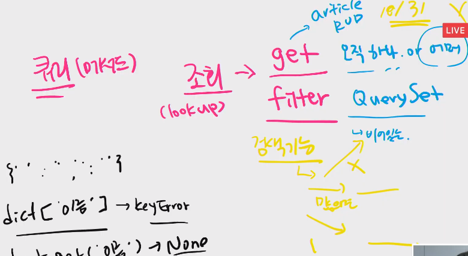
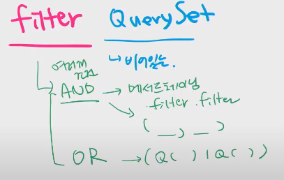
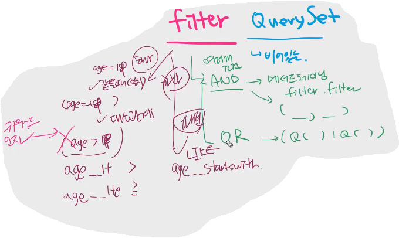
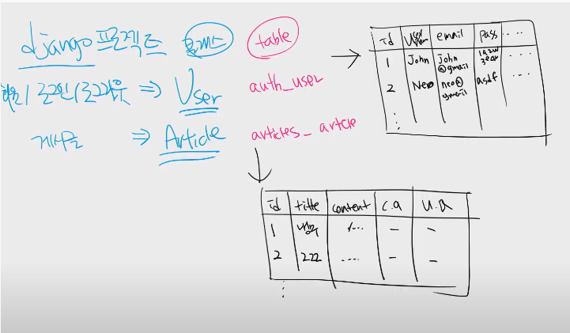
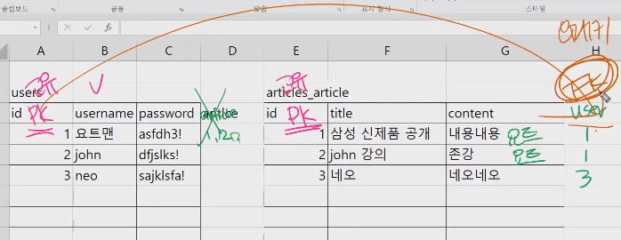
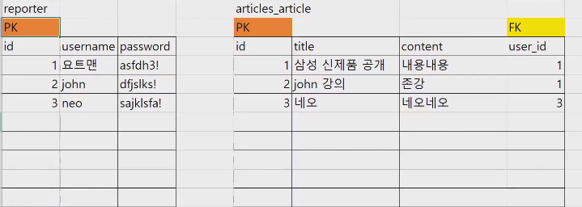
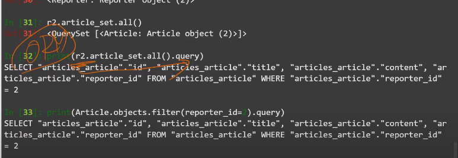
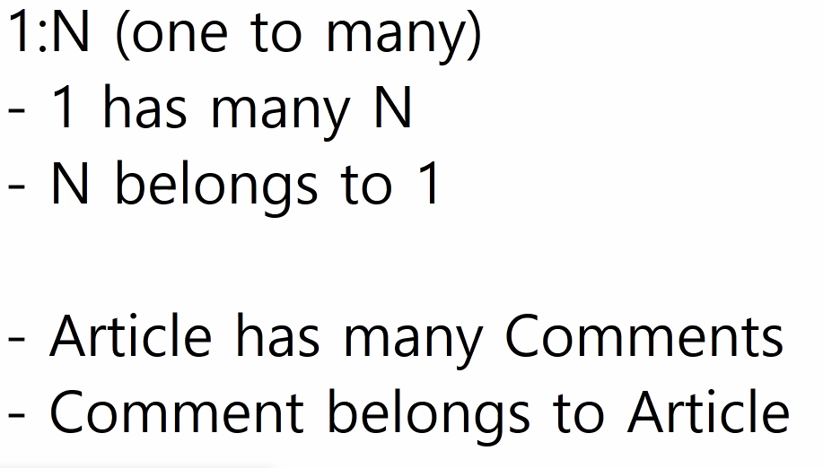
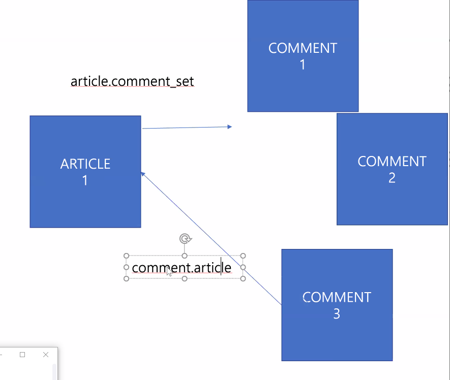

# 20200421 sql n:1

## 복습

30 이거나 김씨일 때 수를 나타내시오 = orm or 연산

```django
#orm
from django.db.models import Q encapsulation
User.objects.filter(Q(age=30) | Q(last_name='김')).count()
24

#sql
SELECT COUNT(*) FROM 
WHERE age = 30 OR last_name = '김'

```

filter 와 queryset(objects)를 사용 하는 이유

User.objects.all() : query의 결과가 queryset인 objects.

filter는 mthod


sqlite

`LIKE` : 패턴을 찾을 때. `%`,`_`를 사용한다. 

`AND` : `=`을 때 사용.


get : 하나가 아니면 error

filter : 빈 딕셔너리도 쿼리셋으로 반환. error x








,U,D : individual
  >
  > sumarizing `collection` of objects == Queryset의 요약본이 필요할 때

  ```django
  from django.db.models import Avg
  User.objects.aggregate(Avg('age'))
  ```

  

- annotation 

  > 개별 col에 추가 조건을 추가한 새로운 col을 보여준다.

------


## DB 1 : N





pk : 각 레코드의 고유한 값은 존재한다.








------------

## Zoom

### 1: N

> 학급(1) : 학생(N)
>
> 우리가 우리의 이름을 표시해두고 몇반인지 알게 한다. (학번을 학생들에게....)
>
> 교복 색깔로 구분들도 한다.






comment.article

article.comment_set.all()

shell plus --print-sqlite-
폴인키에서 id대신 pk는 안됨!!!!!!

```python
class Comment(models.Model):
    content = models.TextField()
    article = models.ForeignKey(Article, on_delete=models.CASCADE, related_name='contents')
related_name, cascade : 마이그레이션을 하지 않아도 된다.
```

```
sqlite3 db.sqlite3

python manage.py dbshell
```

data seeding - data headerdata의 경우 사람을 위해 있는 경우가 많다.

csv -> db

```
sqlite> .mode csv
sqlite> .import user.csv users_user
```

```sql
sqlite> .headers on
sqlite> SELECT * FROM users_user LIMIT 10;
id,first_name,last_name,age,country,phone,balance
1,"정호","유",40,"전라북도",016-7280-2855,370
2,"경희","이",36,"경상남도",011-9854-5133,5900
3,"정자","구",37,"전라남도",011-4177-8170,3100
4,"미경","장",40,"충청남도",011-9079-4419,250000
5,"영환","차",30,"충청북도",011-2921-4284,220
6,"서준","이",26,"충청북도",02-8601-7361,530
7,"주원","민",18,"경기도",011-2525-1976,390
8,"예진","김",33,"충청북도",010-5123-9107,3700
9,"서현","김",23,"제주특별자치도",016-6839-1106,43000
10,"서윤","오",22,"충청남도",011-9693-6452,4900
```

----------------

## 오후 

get()하면 쿼리나오고
filter하면 무조건 쿼리셋...?

filter 쓰고 aggregate안쓸때 queryset

# tip

