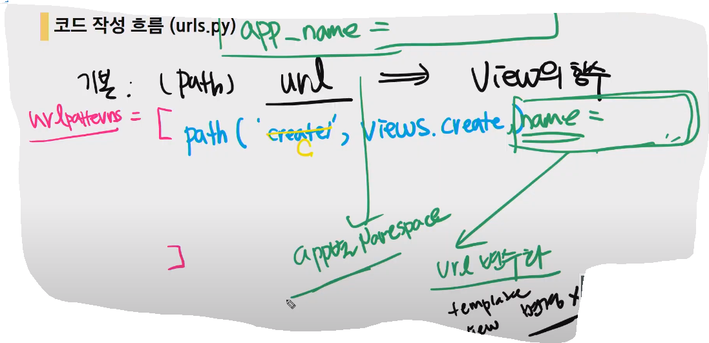
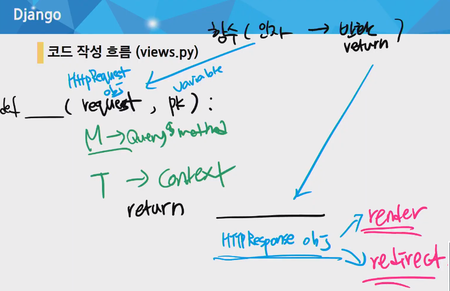
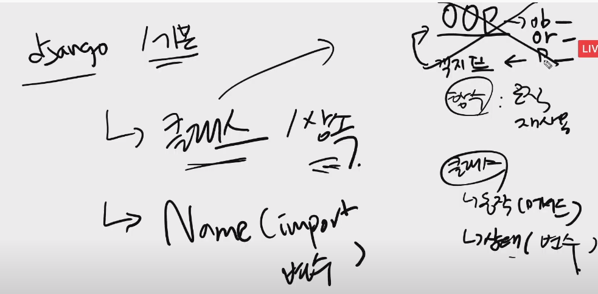
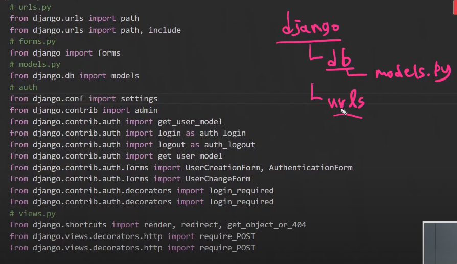
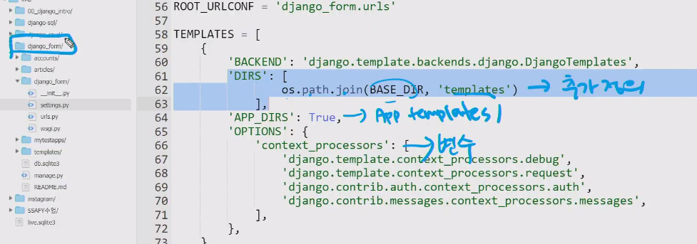
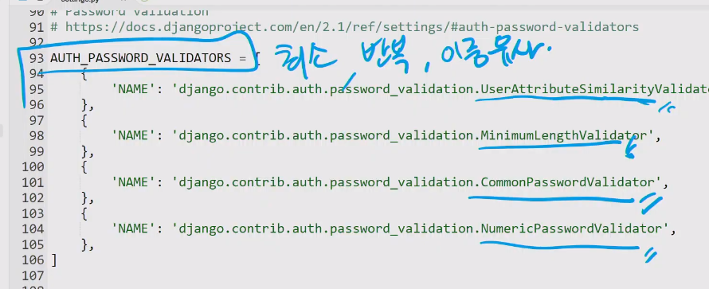
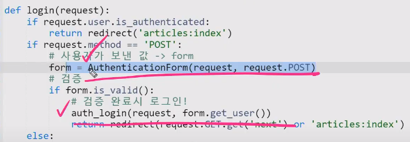
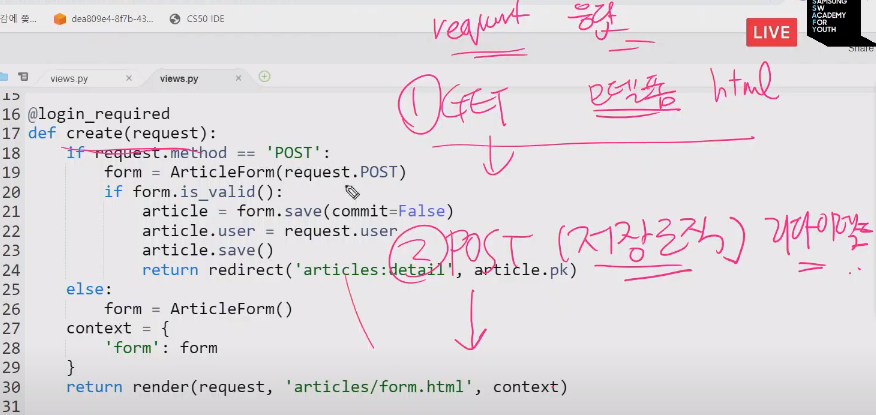
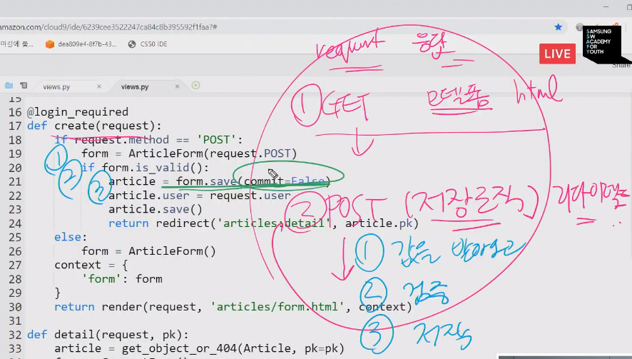

# 20200422 PJT04


### 기본 환경설정

### model정의

### ModelForm :  중복을 방지하기 위하여 사용한다.

1. 모델의 변경을 자연스럽게 반영하기 위해.
2. valid검증, htmlcode생성.


### 코드작성 흐름 - url - view -template






## django _ python



S 주어 : 상태 변수  V 동사 : 동작(메서드)


### import : 폴더구조다. 장고폴더 안에서 가져오는 것들. 

```python
from django import form
from django.contrib
from django.db
from django.auth
from django.auth.forms
from django.auth.decorators
from django.view.decorators.http
from django.shortcuts 
```



class : CamelCase

변수, 메서드, 함수 : snake_case

sttings.py : 대문자_SNAKE

app : 복수

model : 단수

[]리스트 : 복수들.





------

## Auth- 회원가입, 로그인


로그인은 request!!!!!!!!!!!!!!!!!!!!!, 

form.get_user()





로그아웃에도 리퀘스트를 넘겨준다.

로그아웃에는 로그인 필수.








-------------

## ERD - 개체 관계 다이어그램

까마귀발(crows'feet) : 관계차수, 카디널리티

논리적 관계.

1:1

1:N

N:N

옵셔널리티 관계선택사항 - 필수(mandatory),선택(Optional)

필수 :  직선

옵션 : O로 표현

> 게시글은 댓글을 가지지 않을 수도 있다. 
>
> 댓글은 게시글이 반드시 필수적이다.

# tip

