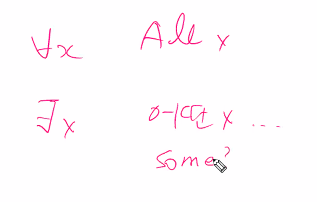

# 20200423 컴퓨팅사고력

논리적으로 정확하게 확인하는 과정에 대한 연습이 필요하다.

프로그램을 짜기 전에, 1. 정확한 결과, 2.얼마나 빠르게 를 미리 생각해볼 시간이 필요하다.

#### 프로그래밍의 어려운 점 두가지.

- 언어문법/라이브러리 사용

- 논리(hard logic)

inclusive or : 둘 중 하나만 만족하면된다., exclusive or : 둘 중 하나만 취할 수 있다.

v : or  모두 거짓일때만 거짓이 되는 명제. - 하나라도 참이면 참.

xor 하나만 참일 때 참이 되는 명제. 하나일때만!!! 둘 다 트루나 펄스면 펄스.(동그라미플러스.)

연산자 우선순위는 존재한다. 

not > and, or > 명제.

주어진 조건명제의 진릿값 == 대우 진리값

a: all E: exist

대우를 활용하기 -  n 이 홀수일 때.

3의 배수가 아닌 경우

3k+1,3k+2 

--------

진리표, 수식들 알기.

------------

1.

2.

----------

## 집합과 조합론

k는 0과 자연수일 때 . 0이상인 정수. a가 b의 부분집합,b가 a의 부분집합

# tip

시험의 경우 증명의 결과를 활용하는 것.

증명 자체를 하는 것은 x.

증명

-참고사이트

https://mungto.tistory.com/73?category=736942

