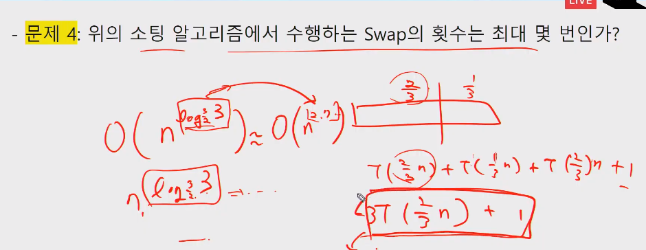
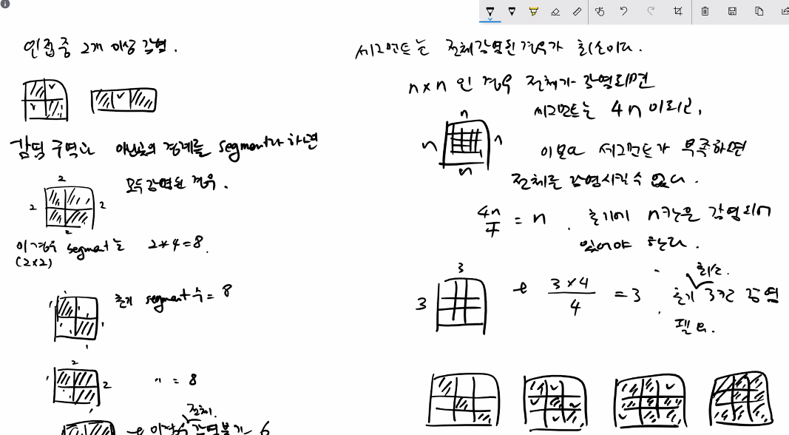

# 20200424 알고리즘-시간복잡도

1-5문제 어떻게 거쳐서 문제가 나오는지 알아보기.

트리형태로 풀어보기.

n은 실행회수를 나타낸다.- n(n+1)/2

- <=O(nlogn)

O(n)

O(nlogn)

2T

merge sort

머지소트

소팅알고리즘

dp, 재귀, 반복

동적계획법이 가장 빠르다.

ex: 피보나치의경우 dp : O(n)으로 가장 빠름.

--------

체스 알고문제

-----------

## master crm

