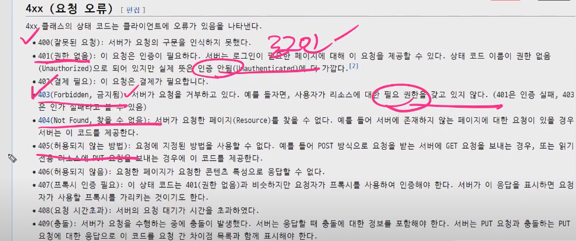

# 20200427 DB - 1:N

## 복습 & 정리

- update - 권한

>  메세지 프레임워크 활용. messages.success(request,'메세지')
>
> 세션, 쿠키를 활용한다,base.html에 넣어 놓으면 해당되는 글에 모두 넣지 않아도 된다.
>
> 세션 과 쿠키를 이용하는 메서드는 request를 첫 번째 인자로 사용한다.
>
> 

403 page

```
from django.http import HttpResponseForbidden
return HttpResponseForbidden()
```





comment_create - 댓글 로그인 안할 경우.

- next타고 들어간게 get요청으로 가서.
  - login_required 데코레이터를 떼주고 함수내에서 사용
  - http 401사용.


 - http 401

----------

### 내부를 component형식으로관리해보기.

- 모두 쪼개서 파일로 관리하기.

  - templates/_nav.html

    ```
    'base.html'
     
    ```

    


# tip

