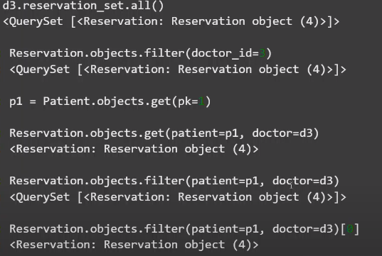

# 20200428  DB M:N

- manytomany filde
- manytomany filde 외에 설정값이 있다면 중개모델 따로 필요함.
- M:N의 경우 중간 역할이 동사의 역할을 한다.


# Django model relationship

## 1:N (one to many)

### 준비

> `onetomany`  app 생성

```python
# models.py
class User(models.Model):
    username = models.CharField(max_length=10)
    
class Article(models.Model):
    title = models.CharField(max_length=100)
    content = models.TextField()
    user = models.ForeignKey(User, on_delete=models.CASCADE)

class Comment(models.Model):
    content = models.TextField()
    article = models.ForeignKey(Article, on_delete=models.CASCADE)
    user = models.ForeignKey(User, on_delete=models.CASCADE)
```


```python
from onetomany.models import User, Article, Comment

# objects
u1 = User.objects.create(username='Kim')
u2 = User.objects.create(username='Lee')

a1 = Article.objects.create(title='1글', user=u1)
a2 = Article.objects.create(title='2글', user=u2)
a3 = Article.objects.create(title='3글', user=u2)
a4 = Article.objects.create(title='4글', user=u2)

c1 = Comment.objects.create(content='1글1댓', article=a1, user=u2)
c2 = Comment.objects.create(content='1글2댓', article=a1, user=u2)
c3 = Comment.objects.create(content='2글1댓', article=a2, user=u1)
c4 = Comment.objects.create(content='4글1댓', article=a4, user=u1)
c5 = Comment.objects.create(content='3글1댓', article=a3, user=u2)
c6 = Comment.objects.create(content='3글2댓', article=a3, user=u1)
```

### 문제

1. 1번 유저가 작성한 글들

   ```python
   u1.article_set.all()
   ```

2. 2번 유저가 작성한 댓글의 내용을 모두 출력

   ```python
   for comment in u2.comment_set.all():
       print(comment.content)
   ```

3. 3번 글의 작성된 댓글의 내용을 모두 출력

   ```python
   for comment in a3.comment_set.all():
       print(comment.content)
   ```

   ```html
   
      {{ comment.content }}
   
   ```

4. 1글이라는 제목인 게시글들

   ```python
   Article.objects.filter(title='1글')
   ```

5. 글이라는 단어가 들어간 게시글들

   ```python
   Article.objects.filter(title__contains='글')
   ```

6. 댓글(N)들 중에 해당되는 글(1)의 제목이 1글인 것

   ```python
   Comment.objects.filter(article__title='1글')
   print(Comment.objects.filter(article__title='1글').query)
   ```

   * 1:N 관계에서 1의 열에 따라서,  필터링

     ```sql
     SELECT "onetomany_comment"."id", "onetomany_comment"."content", "onetomany_comment"."article_id", "onetomany_comment"."user_id" FROM "onetomany_comment" INNER JOIN "onetomany_article" ON ("onetomany_comment"."article_id" = "onetomany_article"."id") WHERE "onetomany_article"."title" = 1글
     ```

## 2. M:N (Many to Many)


### 단순 모델링

```python
class Doctor(models.Model):
    name = models.CharField(max_length=10)

class Patient(models.Model):
    name = models.CharField(max_length=10)

class Reservation(models.Model):
    doctor = models.ForeignKey(Doctor, on_delete=models.CASCADE)
    patient = models.ForeignKey(Patient, on_delete=models.CASCADE)
```

* 환자/의사 생성

  ```python
  d1 = Doctor.objects.create(name='dr.john')
  d2 = Doctor.objects.create(name='dr.kim')
  
  p1 = Patient.objects.create(name='구름')
  p2 = Patient.objects.create(name='근제')
  ```

* 예약 만들기

  ```python
  Reservation.objects.create(doctor=d1, patient=p1)
  Reservation.objects.create(doctor=d1, patient=p2)
  Reservation.objects.create(doctor=d2, patient=p1)
  ```

* 1번 의사의 예약 목록

  ```python
  d1.reservation_set.all()
  ```

* 1번 환자의 예약 목록

  ```python
  p1.reservation_set.all()
  ```

* 1번 의사의 환자 출력

  ```python
  for reservation in d1.reservation_set.all():
      print(reservation.patient.name)
  ```

### 중개 모델 활용

> 의사 - 환자들 / 환자 - 의사들로 직접 접근하기 위해서는 `ManyToManyField`를 사용한다.
>
> `through`  옵션을 통해 중개 모델을 선언한다.

```python
class Doctor(models.Model):
    name = models.CharField(max_length=10)

class Patient(models.Model):
    name = models.CharField(max_length=10)
    # M:N 필드! reservation 통해서, Doctor에 접근을 의미
    doctors = models.ManyToManyField(Doctor, 
                                    through='Reservation')

class Reservation(models.Model):
    doctor = models.ForeignKey(Doctor, on_delete=models.CASCADE)
    patient = models.ForeignKey(Patient, on_delete=models.CASCADE)
```

* 마이그레이션 파일을 만들거나, migrate를 할 필요가 없다.

  * 즉, 데이터베이스에 전혀 변경되는 것은 없고, ORM 조작에서의 차이만 존재한다.

  

* 의사, 환자 오브젝트 가져오기

  ```python
  p1 = Patient.objects.get(pk=1)
  d1 = Doctor.objects.get(pk=1)
  ```

* 1번 환자의 의사 목록

  > `ManyToManyField` 가 정의된 `Patient` 는 직접 참조

  ```python
  p1.doctors.all()
  ```

* 1번 의사의 환자 목록

  > `Doctor` 는 직접 참조가 아니라 `Patient` 모델의 역참조.
  >
  > 즉, 기본 naming convention에 따라 참조

  ```python
  d1.patient_set.all()                                                                   
  ```

  * `related_name` : 역참조 옵션

    * 기본 값은 `{model 이름}_set` 

    ```python
    class Doctor(models.Model):
        name = models.TextField()
    
    class Patient(models.Model):
        name = models.TextField()
        # 역참조 설정. related_name
        doctors = models.ManyToManyField(Doctor, 
                            through='Reservation',
                            related_name='patients')
    
    class Reservation(models.Model):
        doctor = models.ForeignKey(Doctor, on_delete=models.CASCADE)
        patient = models.ForeignKey(Patient, on_delete=models.CASCADE)
    ```

    

    필터의 결과는 쿼리셋으로 [0]으로 하나 접근. get은 하나의 객체를 리턴.

    

    

    

- 참조, 역참조

> 반드시 설정이 필요한 상황이 있다!!!!!!
>
> 동일한 모델에서 동시 진행이 발생할 때 반드시 설정을 해야한다.
>
> ex ) 좋아요 기능을 구현할 때.
>
> 
>
> 


- 중계 모델의 id값만 필요할 때는 새로운 테이블 생성이 필요 없다.
- 중계 모델간의 새로운 값 설정이 필요할 때 새로운 테이블을 생성한다.


## 좋아요 기능 구현하기.


```python
url.py

path('<int:pk>/like/, view.like, name='like')
     
views.py
     
def like(request,pk):
     article = get_object_or_404(Article,pk=pk)
     # request.user
     # filter 좋아요를 누른적이 있다면 = > DB 저장되어 있으면
     # if request.user in article.like_users.all():
     if article.like_users.filter(id=request.user.pk).exists():
     	article.like_users.remove(request.user)
     # 그게 아니면,
     else:
     	article.like_users.add(request.user)
     return redirect('articles:detail'), article.pk)
     
    
```

- fontawesome - 아이콘 사용.

```html
<a href="{url 'articles:like' article.pk}">좋아요</a>
<p>
    {{ article.like_users.count }}명이 좋아합니다.
</p>
```


# migrations 

```bash
$ python manage.py makemigrations
# default값 없이 NOT NULL를 지정 => 기존 레코드에 값이 필요하다.
You are trying to add a non-nullable field 'image' to article without a default; we can't do that (the database needs something to populate existing rows).
# 2가지 옵션 제시
Please select a fix:
 # 1) 디폴트 값을 지금 설정 => python console
 1) Provide a one-off default now (will be set on all existing rows with a null value for this column)
 # 2) 종료하고 직접 models.py에 default 설정
 2) Quit, and let me add a default in models.py
Select an option: 1
Please enter the default value now, as valid Python
The datetime and django.utils.timezone modules are available, so you can do e.g. timezone.now
Type 'exit' to exit this prompt
```

-------------------

# 오후

1. DB모델링 - 신규 테이블(중개 테이블 폴인키 2개를 각각 받는다.)
2. 네이밍 컨벤션~~~!


1. DB에서 처리가능 한 것들은 DB단에서 하기.


2. 한 템플릿에서 중복된 구문, 중복된 쿼리를 쓸 때에는 length를 쓰는 것이 좋음.

   > 추가쿼리를 불러오지 않는다.


## follow기능 구현

- user - user

```python
accounts-models.py

from django.contrib.auth.models import AbstractUser
from django.conf import settings

class User(AbstractUser):
    followers = models.ManyToManyField(
    	settings.AUTH_USER_MODEL,
        related_name='followings'
    )
    
settings.py
#default -> AUTH_USER_MODEL = 'auth.User'
AUTH_USER_MODEL = 'accounts.User'
```

- 변경하지 않더라도 커스텀을 꺼내놓고 시작하는 것을 강력하게 추천한다.


1. 커스텀 할 경우 어드민에도 등록해야한다.

```
admin.py

from .models import User

admin.site.register(User)
```

2. usercreationform도 재설정.

> get_user_model  : 객체
>
> settings.AUTH_USER_MODEL  : 문자열을 리턴.

3. 로그인폼(authenticationForm)은 재설정필요 없다. 모델폼이 아니라서!!!!!!!!!

   ```
   from django.contrib.auth.form import AuthenticationForm
   ```

- 

- url

  - accounts/<int:id >/follow/

- view

  ```python
  def follow(request, pk):
      #User클래스를 사용하기 위해서는 겟유져모델을 쓰자~
      User = get_user_model()
      user = get_object_or_404(User, pk=pk)
      if user.followers.filter(pk=request.user.pk).exists():
          user.followers.remove(request.user)
      else:
          user.followers.add(request.user)
      return redirect('accounts:detail',user.pk)
  ```

  

- template

  ```html
  
  
  	<a href=""></a>
  
  
  
   	<p>
          {{ user_followers | length}}이 팔로우 중입니다.
  	</p>
  	<p>
          {{ user.followings.count }}명을 팔로우하고 있습니다.
  	</p>
  
  ```

name convention-db


-----------

## 신규프로젝트 진행 시

1. settings
   1. template, accounts, static.......

2. python manage.py startapp accounts
   1. custom - User
   2. settings.py - AUTH_USER_MODEL = 'accounts.User'

3. 그 후 의식의 흐름대로....


----------

# tip

fontawesome : 아이콘 사용하기.

animate.css - 움직이는 스타일.


