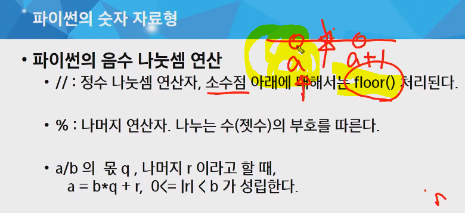

# 20200501 algo


2의 보수를 대체적으로 쓴다.

- 1의 보수 :  비트반전
- 2의 보수 :  1의 보수 + 1을 더해주는 방식.


----------

## 실수 표현 - 부동소수점(floating-point) 움직이는 소수.- 정확도가 높다.  고정소수점은 사용이 자제...(소수점아래숫자의 표현한계)


### 실수를 가지고 계산을 할 경우에 근사값의 오차를 항상 염두에 두고 프로그래밍을 해야한다.


------------

## 오후 연습문제- 암호


- 1로 끝나는 특징
- 1부터 시작하는 여섯자리씩 끊어서 암호 분석.
- 해싱 패턴으로. O가 1이된다. 딕셔너리를 이용할 경우 O(n)임. --뒤가 1로 끝나서 가능 이문제한정.


```python
p = len(bin) -1
res = [""]* p
ridx = 0
while p > 4:
    if bin[p] == '0':
        p -= 1
        continue
    chk = [0]* 4
    cnt = 5
    for i in range(4):
        while i & 1 == int(bin[p-cnt])& 1 :
            cnk[i] +=1
            cnt -= 1
            if cnt < 0:
                break
    res[ridx] = pwd[chk[0]]pwd[chk[1]]pwd[chk[2]]pwd[chk[3]]
    if res[ridx] != None:
        ridx +=1
        p -= 6
    else:
        p -=1
print(" ".join(str(res[i]) for i in range(ridx, -1,-1)))
    
```

---------

## 파이썬의 숫자 자료형


- 음수 나눗셈



부호 :  부호가 다를경우 `-`처리


# tip

