# 20200504 M:N 2

- templates custom가능.
- model @property로 views까지 확장 가능.

파이썬 코드 불러오기

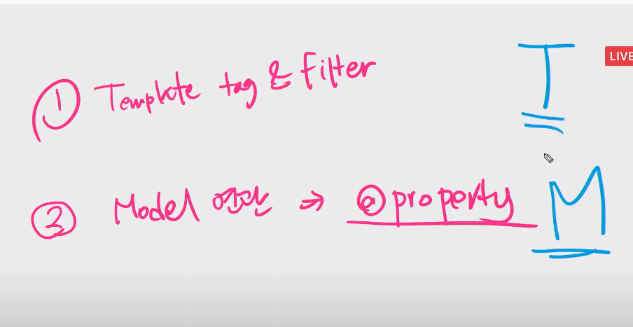

1. @property : 모델과 연관이 있을때에는 property. - views.py에서도 활용 가능.

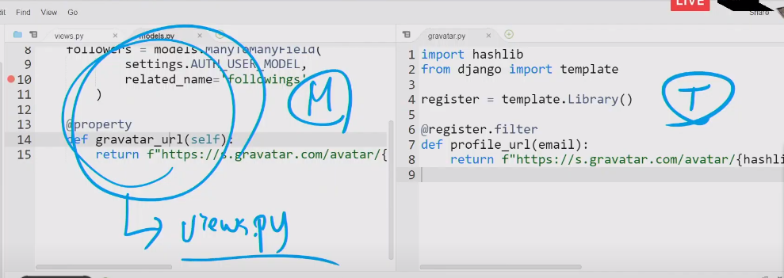

- is_authenticated : 메서드가 아닌 속성값으로 활요되어있고, views, templates에서 모두 활용 가능하다.

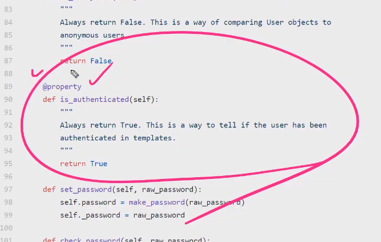

-----------

---------

# Query 개선

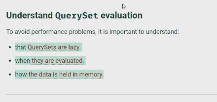

annotate : 새로운 컬럼 생성하여 속도 향상.

---

### - 정리

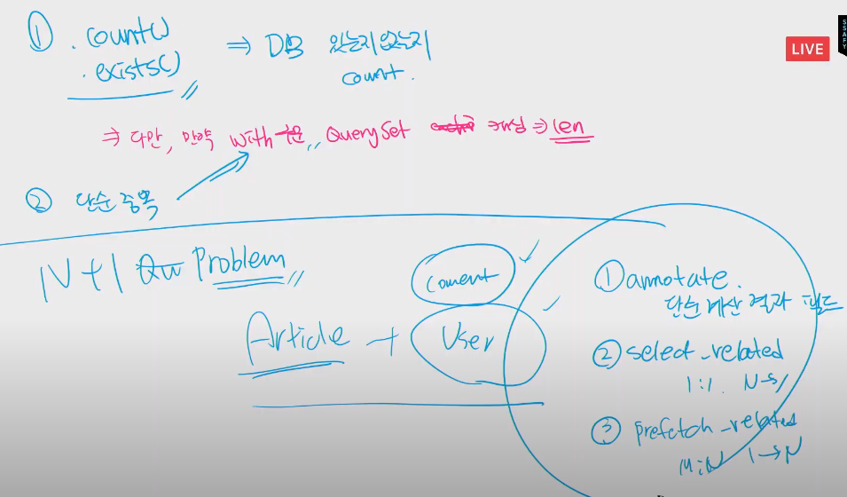

------

# 총 정리 & 복습

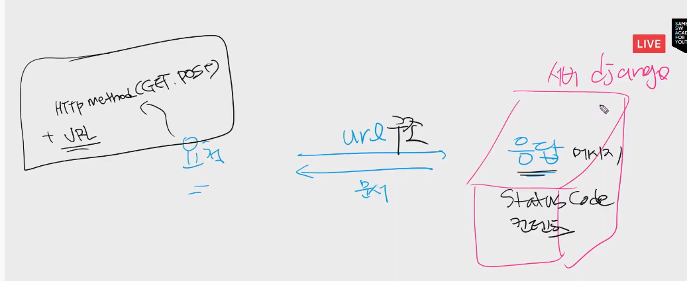

----

### MTV

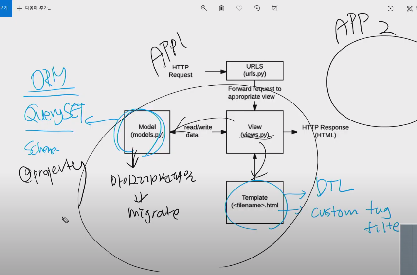

# 폴더구조 - 모듈로 관리

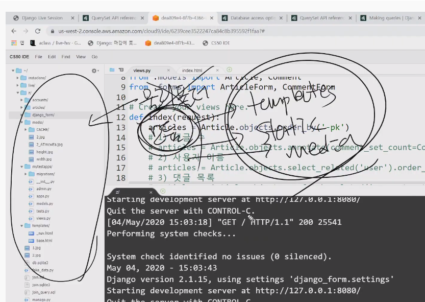

- settings.py

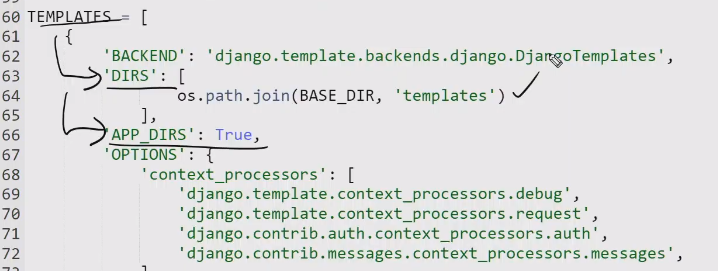

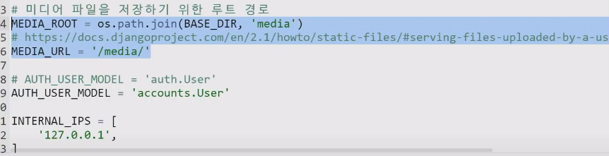

- views.py

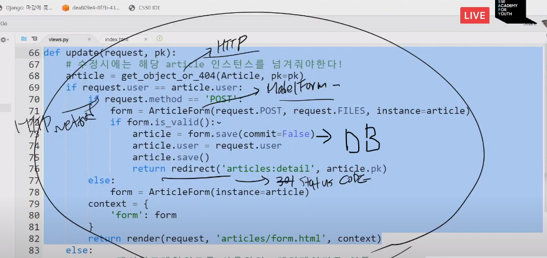

## django startproject

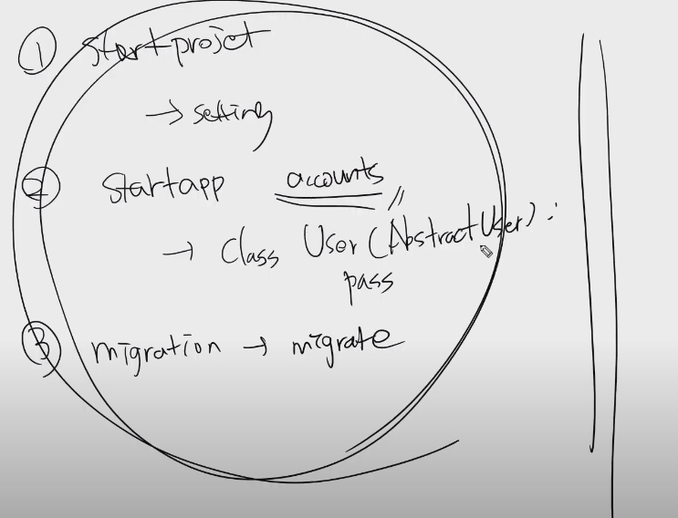

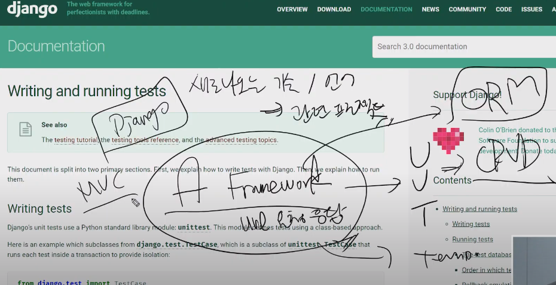

---

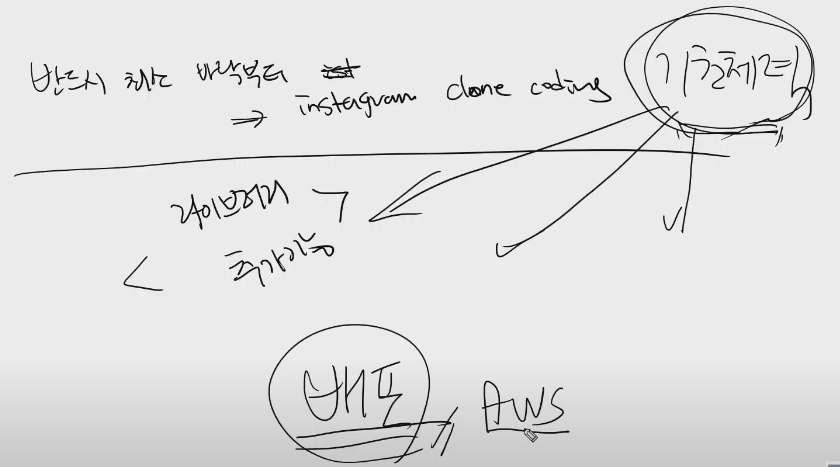

# tip

gravatar : 사진 프로필 - 슬랙에도 반영 가능(이메일이 같을 때)

파이콘

딜리버리히어로

