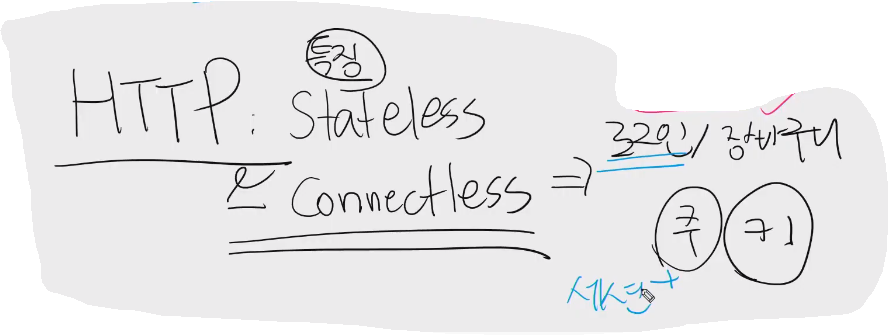

# 20200504 M:N 2

- templates custom가능.
- model @property로 views까지 확장 가능.

파이썬 코드 불러오기

1. @property : 모델과 연관이 있을때에는 property. - views.py에서도 활용 가능.

- is_authenticated : 메서드가 아닌 속성값으로 활요되어있고, views, templates에서 모두 활용 가능하다.

-----------

---------

# Query 개선

annotate : 새로운 컬럼 생성하여 속도 향상.

---

### - 정리

------

# 총 정리 & 복습

----

### MTV

# 폴더구조 - 모듈로 관리

- settings.py

- views.py

## django startproject

---

# tip

gravatar : 사진 프로필 - 슬랙에도 반영 가능(이메일이 같을 때)

파이콘

딜리버리히어로

