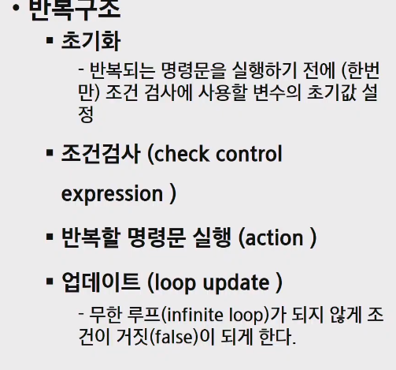
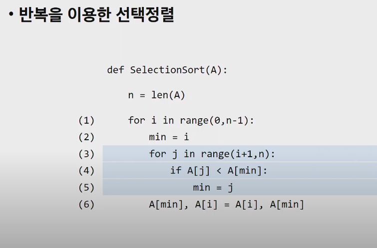
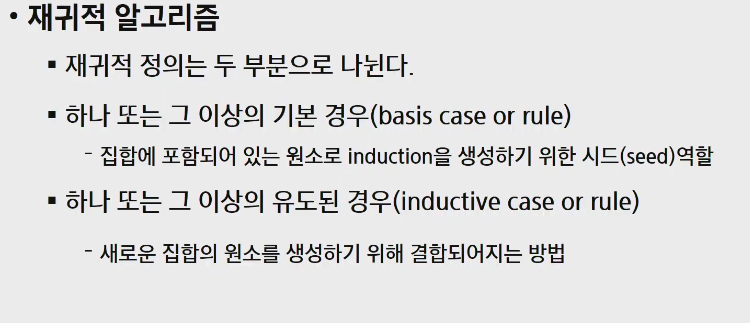
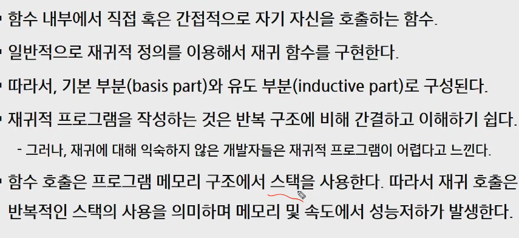
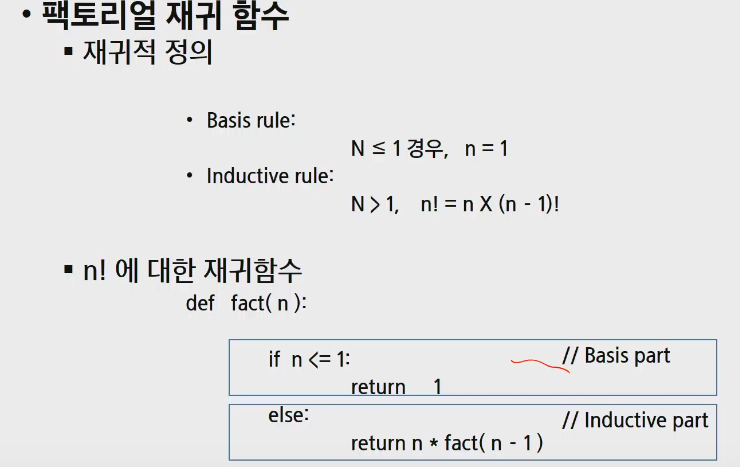
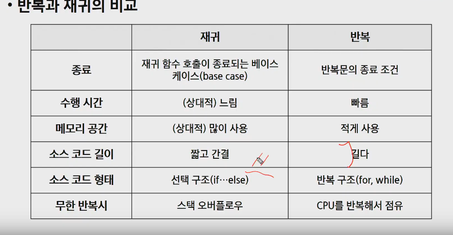
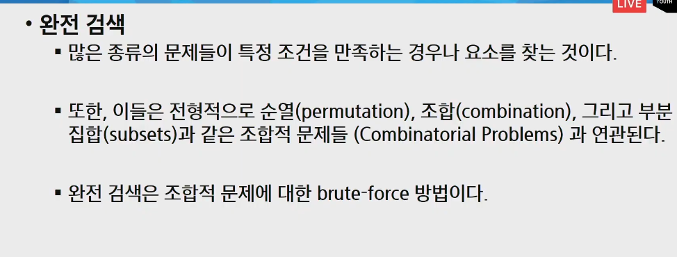
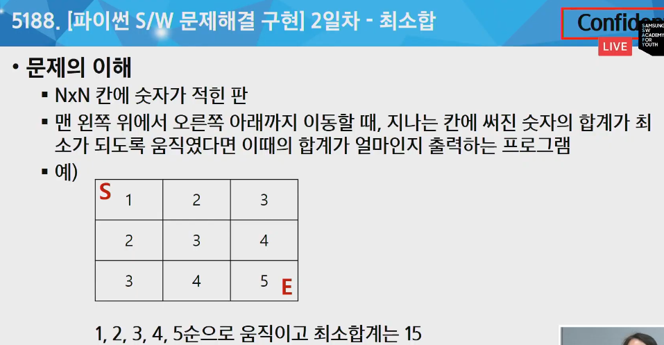

# 20200506  APS(algorithm problem solving응용) 완전검색 & 그리디

## 반복(iteration)과 재귀(recursion)

- 반복과 재귀는 유사한 작업을 수행
- 반복 초기화, 조건검사, 며령문, 업데이트(무한루프방지)



선택정렬(selection sort)



- 재귀로 선택정렬

  ```python
  베이직 : 언소티드 길이가 1인경우
  유도 : 제일 작은 값을 구해 바꾸기
  
  def recursionsort(D,s):
      n = len(D)
      if s==n-1:return
      min = s
      for i in range(s,n):
          if D[min] > D[i]:
              min = i
      D[s],D[min]=D[min],D[s]
      
      recursionsort(D, s+1)
  
  ```

  

- 재귀는 문제를 작게 쪼개서 그 해를 이용하여 문제를 푸는 방식.





- 재귀 팩토리얼 만들기.







- baby-gin game

  - 반복 - brute-force (just do it) `force`는 컴퓨터의 힘으로. 

  ```python
  
  ```

  

  - 재귀

  ```python
  
  ```

  





# tip

