# 20200511 REST API구축

- 모델: 데이터베이스 구조 
- 템플릿: 유저에게 보여주는 데이터 
- 뷰: 데이터조작

----

## API - 개발자용 데이터 표준.약속

APPLICATION PROGRAMMING INTERFACE

개발자가 쓸 수 있는 데이터 약속.

### JSON : 객체식 표기법.!! 짧다. 돈이 덜든다.

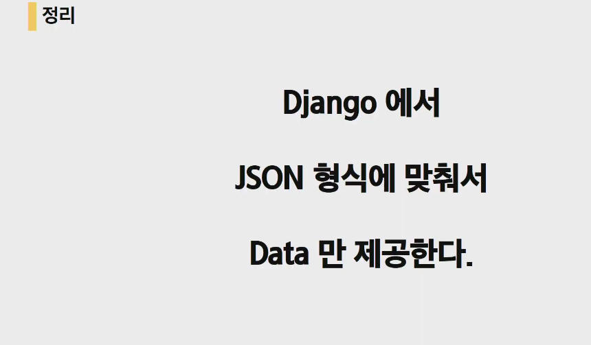

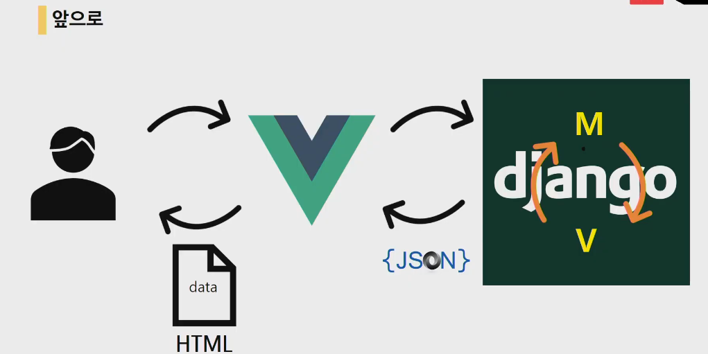


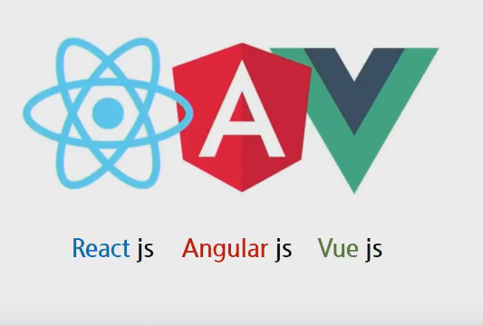


```
pip install faker
```

```
board - models.py

from django.db import models
from faker import Faker

f = Faker()
# Create your models here.
class Article(models.Model):
    title = models.CharField(max_length=100)
    content = models.TextField()
    created_at = models.DateTimeField(auto_now_add=True)
    updated_at = models.DateTimeField(auto_now=True)

    @classmethod
    def dummy(cls, n):
        for _ in range(n):
            cls.objects.create(
                title=f.name(),
                content= f.text(),
                )
                
board - urls.py
from django.urls import path
from . import views

app_name = 'board'
urlpatterns = [
    path('json1/',views.article_list_json_1),
    path('json2/',views.article_list_json_2),
    path('json3/',views.article_list_json_3),
]
```

```
board - views.py
from django.shortcuts import render
from django.http.response import JsonResponse
from .models import Article
#Nogada
def article_list_json_1(request):
    articles = Article.objects.all()

    data = []
    for article in articles:
        data.append({
            'article_id': article.id,
            'title': article.title,
            'created_at': article.created_at,
            'updated_at': article.updated_at,
        })

    return JsonResponse(data, safe=False)

```

## DRF - django rest frameword

```bash
pip install djangorestframework
```

```python
settings.py
INSTALLED_APPS = [
    'django_extensions',
    'board',
    'django.contrib.admin',
    'django.contrib.auth',
    'django.contrib.contenttypes',
    'django.contrib.sessions',
    'django.contrib.messages',
    'django.contrib.staticfiles',
    #추가하기
    'rest_framework',
]

```

```python
board - serializers.py
from rest_framework import serializers
from .models import Article

class ArticleSerializer(serializers.ModelSerializer):
    class Meta:
        model = Article
        fiels='__all__'
```

```py
board - views.py
from django.shortcuts import render
from django.views.decorators.http import require_GET
from django.http.response import JsonResponse

from rest_framework.response import Response
from rest_framework.decorators import api_views

from .models import Article
from .serializers import ArticleSerializer
#Nogada
@require_GET
def article_list_json_1(request):
    articles = Article.objects.all()

    data = []
    for article in articles:
        data.append({
            'article_id': article.id,
            'title': article.title,
            'created_at': article.created_at,
            'updated_at': article.updated_at,
        })

    return JsonResponse(data, safe=False)

# django core serializer
@require_GET
def article_list_json_2(request):
    from django.core import serializers

    articles = Article.objects.all()
    #데이타를 스트링으로 만들어줌.
    data = serializers.serialize('json', articles)

    # return JsonResponse(data)
    #TMI 정보의 필드를 지정할 수 없다.
    return HttpResponse(data, content_type='application/json')

#json을 쓰는 이유는 효율성을 높이고 !! 절약하기 위해서 한방에!! 필드지정가능.데이터검증
#modelform과 비슷하다.
# rest framework

@api_view(['GET'])
def article_list_json_3(request):
    articles = Article.objects.all()
    #many : 쿼리셋이 여러개일경우 써준다. serializer은 한개가 디폴트.
    serializer = ArticleSerializer(article, many=True)
    
    return Response(serializer.data)


```


```
board - urls.py
from django.urls import path
from . import views

app_name = 'board'
urlpatterns = [
    path('json1/',views.article_list_json_1),
    path('json2/',views.article_list_json_2),
    path('json3/',views.article_list_json_3),
]
```

-----

### DATA만 주자!!

- Django의 기본 serializer가 있지만 쓰지 말자. 복잡하다.
- 쉽고 편하게 drf를 쓰자~

----

# 오후 Zoom - DRF

#### DB분리는 왜??????????????? 좋은 유저경험을 위해.

페이지 정보가 바뀔때마다 html 파일을 통째로 갖고 오는 것보다 json 데이터 갖고 와서 그것만 반영하는 게 싸서

### 1. Money(많은 유저를 모아야 함)

### 2. UX 안좋으면 -> 유저가 떠남 -> 돈X

### - 데이터 -> 인간이 뭘 좋아할까?

### - 모바일 어플리케이션(웹)

### - churn(이탈율)

### - JS필수(Adobe flash를 대체-싸다,churn을 줄이기 위해서 !!!나온 기술

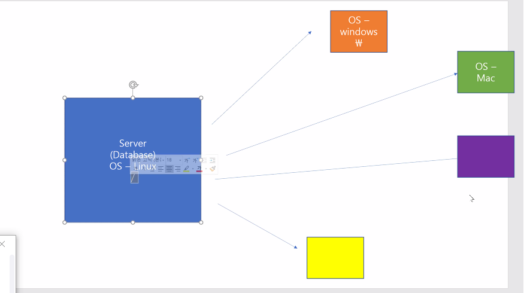

### 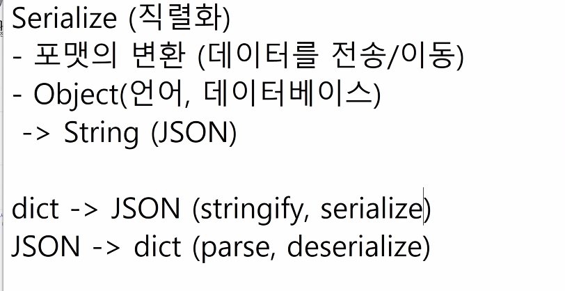

### RESTful API

>  url을 깔끔하게 정리하는 방식.(약속)
>
> 1. 동사 URL 집어 넣지 마!!!!(획일성을 위해)
>    - HTTP method활용
> 2.  목적어만 URL에 집어 넣어
>    - Resource(==data)
>    - data자체가 되는 경우가 많음.
>
> 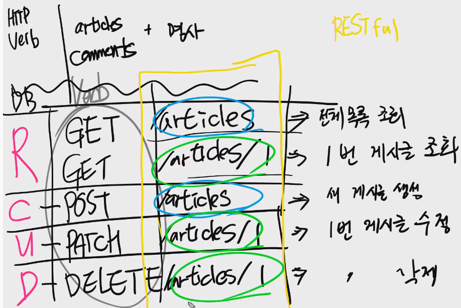

- C - POST (new ,create, write, make, render)
  - /articles/
- R - GET (index, detail, read, show)
  - index(모든정보) - GET /articles/
  - detail(하나의 정보 ) - GET /articles/<id>
- U - PUT
  - PUT /articles/<id>
- D - DELETE
  - DELETE /articles/<id>

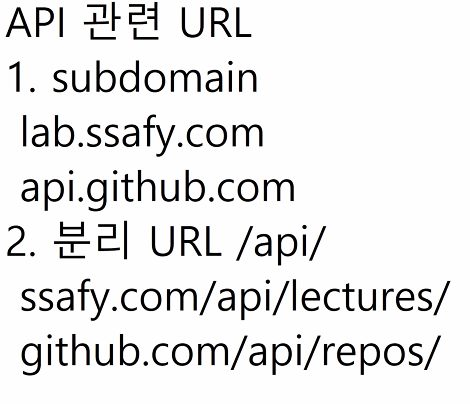

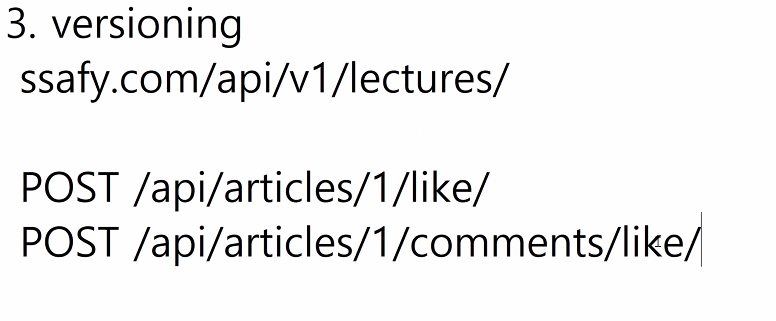

- 버저닝 - >  하위호환이 가능하게 url설정!

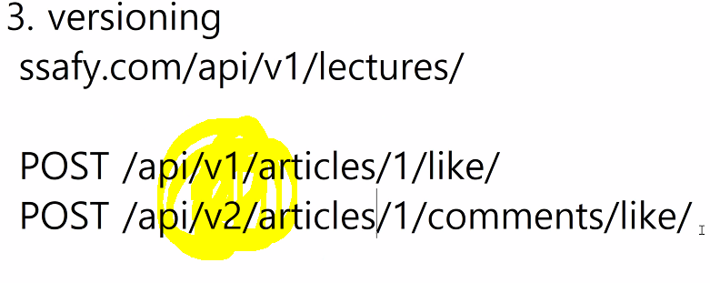

### CRUD - DRF

### batch , bulk - 한꺼번에 DB create

```
batch version - 속도가 빠르다.

models.py
from django.db import models
from faker import Faker

f = Faker('ko_KR')
# Create your models here.
class Artist(models.Model):
    name = models.CharField(max_length=20)

    #Article.dummy(2)
    @classmethod
    def dummy(cls,number):
        for n in range(number):
            Artist.objects.create(
                name=f.name(),

                )

    # Artist.objects.bulk.create()
    @classmethod
    def dummy(cls, n):
    batch_size = n//10
    objs = (cls(title=f.name(), content=f.text()) for i in range(n))
    while True:
    batch = list(islice(objs, batch_size))
    if not batch:
    break
    cls.objects.bulk_create(batch, batch_size)


```

자료의 직렬적 구조!! ACID

- Disk는 해왕성과 같다. 따라서 많이 이용하면 비용이 많이 든다.

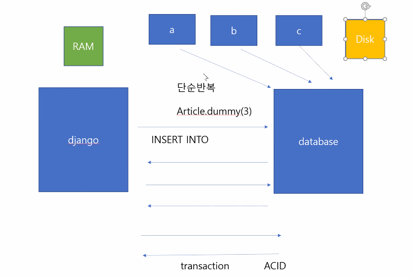

### decorator - assertionerror 방지.

``` @api_view(['GET'])
@api_view(['GET'])

```

----

# 오후 API 구축하기.

### 요청은 URL로 보낸다.


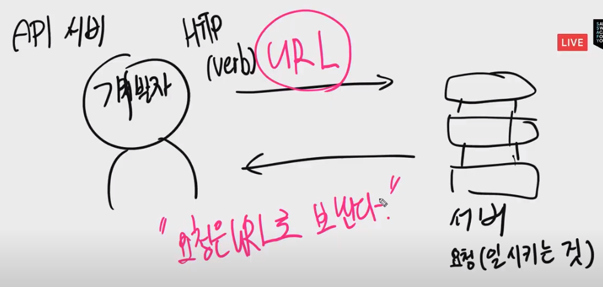

### Documentation(문서화) - 개발자를 위한 내마음 설명서


XML : 1996 W3C에서 발표한 약속. HTML 키값이 반영이 안됨. 길이가 길다.(닫는테그)

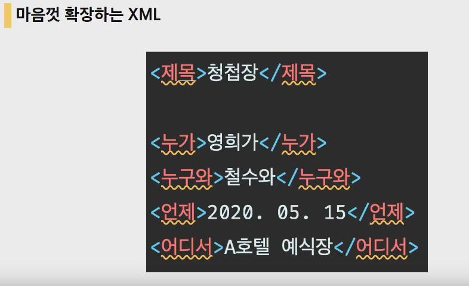


----


### drf-yasg

> open API

https://github.com/axnsan12/drf-yasg

```
pip install drf-yasg
```

```python
서브문지기에서
INSTALLED_APPS = [
    'django_extensions',
    'rest_framework',
    'drf_yasg',
    'django.contrib.admin',
    'django.contrib.auth',
    'django.contrib.contenttypes',
    'django.contrib.sessions',
    'django.contrib.messages',
    'django.contrib.staticfiles',
    'musics',
]
```

```
urls.py
수정하기.
from rest_framework import permissions
from drf_yasg.views import get_schema_view
from drf_yasg import openapi

schema_view = get_schema_view(
   openapi.Info(
      title="Musics API",
      default_version='v1',
      description="TEST Musics API",
    #   terms_of_service="https://www.google.com/policies/terms/",
    #   contact=openapi.Contact(email="contact@snippets.local"),
    #   license=openapi.License(name="BSD License"),
   ),
)

urlpatterns = [
   url(r'^swagger(?P<format>\.json|\.yaml)$', schema_view.without_ui(cache_timeout=0), name='schema-json'),
   url(r'^swagger/$', schema_view.with_ui('swagger', cache_timeout=0), name='schema-swagger-ui'),
   url(r'^redoc/$', schema_view.with_ui('redoc', cache_timeout=0), name='schema-redoc'),
   ...
]
- 수정 전.
...
from rest_framework import permissions
from drf_yasg.views import get_schema_view
from drf_yasg import openapi

...
#설정
schema_view = get_schema_view(
   openapi.Info(
      title="Snippets API",
      default_version='v1',
      description="Test description",
      terms_of_service="https://www.google.com/policies/terms/",
      contact=openapi.Contact(email="contact@snippets.local"),
      license=openapi.License(name="BSD License"),
   ),
   public=True,
   permission_classes=(permissions.AllowAny,),
)

urlpatterns = [
   url(r'^swagger(?P<format>\.json|\.yaml)$', schema_view.without_ui(cache_timeout=0), name='schema-json'),
   url(r'^swagger/$', schema_view.with_ui('swagger', cache_timeout=0), name='schema-swagger-ui'),
   url(r'^redoc/$', schema_view.with_ui('redoc', cache_timeout=0), name='schema-redoc'),
   ...
]
```

```python
urls.py
from rest_framework import permissions
from drf_yasg.views import get_schema_view
from drf_yasg import openapi

schema_view = get_schema_view(
   openapi.Info(
      title="Musics API",
      default_version='v1',
      description="TEST Musics API",
    #   terms_of_service="https://www.google.com/policies/terms/",
    #   contact=openapi.Contact(email="contact@snippets.local"),
    #   license=openapi.License(name="BSD License"),
   ),
)
from django.urls import path
from . import views

app_name='musics'
# /api/v1/
# GET,POST,PUT,DELETE /musics/<id>
urlpatterns = [
    path('swagger/',schema_view.with_ui('swagger')),
    path('redocs/',schema_view.with_ui('redoc')),
]

```


# tip

RESTful API: https://meetup.toast.com/posts/92

https://app.swaggerhub.com/apis-docs/Promptech/public-mask-info/20200307-oas3#/v1/get_storesByAddr_json
https://app.swaggerhub.com/apis-docs/Promptech/public-mask-info/20200307-oas3#/

https://lab.ssafy.com/03/seoul01/api_crud