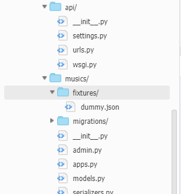
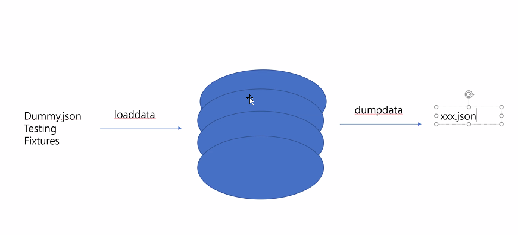
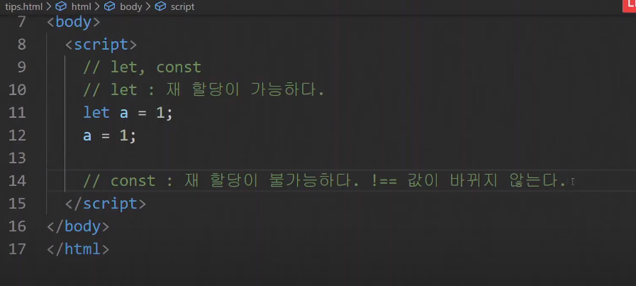
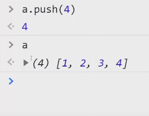

# 20200512

## JS  + 브라우저(크롬)


----

## dummy(더미)데이터 넣기.

앱 안에 넣기.




```bash
python manage.py loaddata [json]


~/online-lecture/0511/api/ (master) $ python manage.py loaddata dummy.json
Installed 14 object(s) from 1 fixture(s)
~/online-lecture/0511/api/ (master) $ python manage.py migrate
Operations to perform:
  Apply all migrations: admin, auth, contenttypes, musics, sessions
Running migrations:
  No migrations to apply.


```

- fixtures :  testing을 할 때 직렬화된 임의의 데이터.



- 덤핑데이터 만들기

```bash
~/online-lecture/0511/api/ (master) $ python manage.py dumpdata 앱이름.모델이름

~/online-lecture/0511/api/ (master) $ python manage.py dumpdata musics.artist
[{"model": "musics.artist", "pk": 1, "fields": {"name": "Coldplay"}}, {"model": "musics.artist", "pk": 2, "fields": {"name": "Maroon5"}}, {"model": "musics.artist", "pk": 3, "fields": {"name": "\uae40\uc11c\uc5f0"}}, {"model": "musics.artist", "pk": 4, "fields": {"name": "\uc7a5\uc9c0\uc601"}}, {"model": "musics.artist", "pk": 5, "fields": {"name": "\uac15\uc740\uc11c"}}]

~/online-lecture/0511/api/ (master) $ python manage.py dumpdata musics > dump.json
#예쁘게 indent 하기.
~/online-lecture/0511/api/ (master) $ python manage.py dumpdata musics --indent 2 > dump2.json


```

1. amind 에서 데이터 입력하고
2. dumpdata 
3. dataformat확인
4. 데이터주입
5. dummydata 적용 하는 형식으로 진행

```python
views.py

def artists(request):
    artists = Artist.objects.all()
    serializer = ArtistSerializer(artists, many=True)
    #직렬화된 데이터를 넣어서 주기(json)=>serializer이용.
    return Response(serializer.data)
```

serializer

```python
class Meta:
    model = Music
    #튜플로 쓰기. 공식문서 list도 가능.
    fields = ('id','artist_id')
    

class ArtistDetailSerializer(ArtistSerializer):
    music_set = serializers.SlugRelatedField(
        many=True,
        read_only=True,
        slug_field='title'
    )
    # music_set = MusicSerializer(many=True)
    music_count = serializers.ReadOnlyField(source='music_set.count')
# 싱글 튜플일 경우 마지막에 `,`를 추가하기!!
    class Meta(ArtistSerializer.Meta):
        fields = ArtistSerializer.Meta.fields + ('music_count',) + ('music_set',) 
```

# DB VS PYTHON 계산 비교 -DB로 주로 하기

```PYTHON
musics_count = serializers.ReadOnlyField(source='music_set.count')

music_count = serializers.IntegerField(source='music_set.count', read_only=True)

sefializers.SerializerMethodField() 
=> 연산이 필요할 때 쓴다.

```

--------------

## 오후 JS






## const : 재할당이 불가능하다. 값은 변한다.

- lowcamelcase

  ```
  addOneToNumber
  ```

### ES : 규칙


### DOM : document object model

