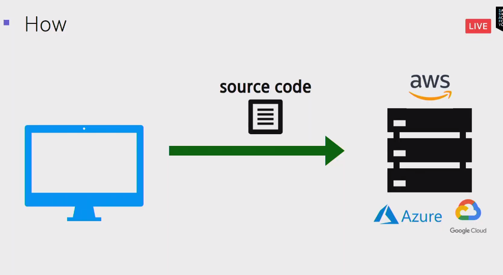
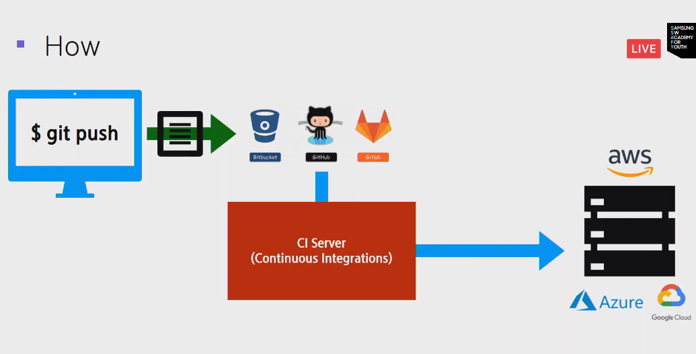
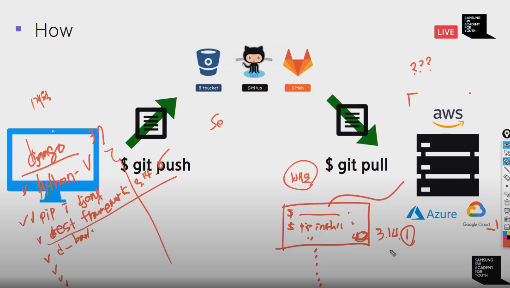
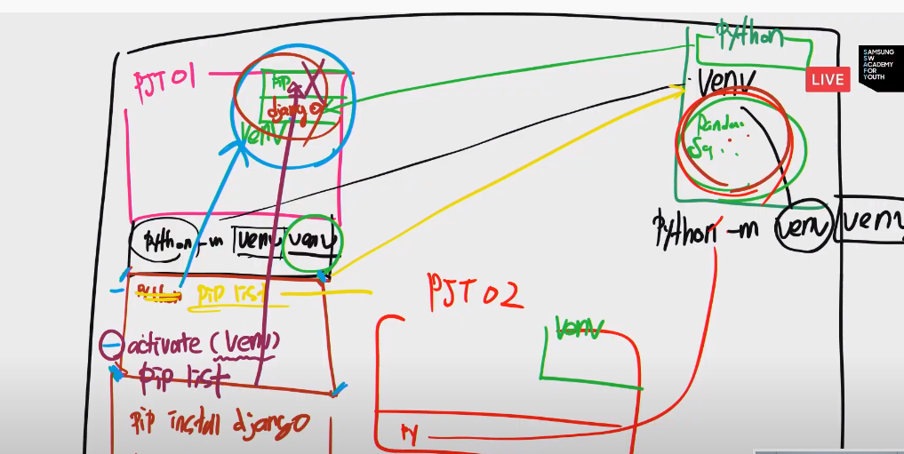
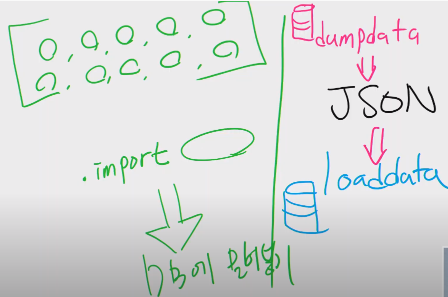
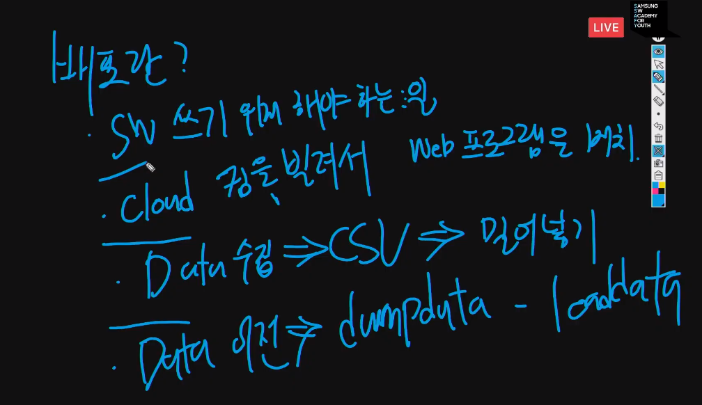
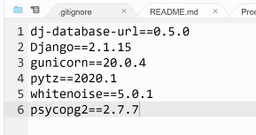
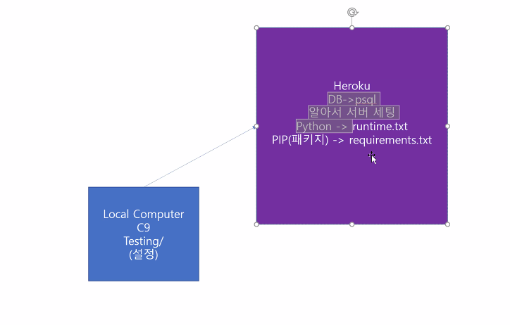

# 20200513 PJT DB

## 배포 software deployment

Real artists ship


- 테스트 : TDD(test driven development) - 테스트 주도 개발




데브옵스

- 자동화 파이프라인 설정.

  > ex ) 지속적인 통합.
  >
  > push를 할 경우 ciserver에서 코드를 테스트, 검사하여 주서버에 반영까지 해준다.



- version이슈
- package 이슈가 존재한다.




```
pip freeze > requirements.txt

pip install -r package

```

- 독립공간 만들어 분리하기. 가상환경만들기.

```
#pure한 파이썬 만들기.
python -m venv venv(dir)
#pointer돌려주기.- 터미널 탭 단위.
source venv/Scripts/activate(window)
source venv/bin/activate(linuxe)

# vscode python collect activate
#가상환경 참초.- 너와나의 파이썬 깔끔한 파이썬이 된다.
(venv) ~/my_pjt $pip list
#1.requirements.txt만들기
pip freeze > requirements.txt
#2. gitignore만들기.
touch .gitignore
#를 .gitignore에 venv/ 추가하기. 
```





---

서버 스케일 다루기


-----

dump data






-------------

# HEROKU



```
heroku create [app_name]
gir remote -v(자동생성)


git push heroku master
python manage.py check --deploy
```

#### Install the Heroku CLI

Download and install the [Heroku CLI](https://devcenter.heroku.com/articles/heroku-command-line).

If you haven't already, log in to your Heroku account and follow the prompts to create a new SSH public key.

```
$ heroku login
```

#### Create a new Git repository

Initialize a git repository in a new or existing directory

```
$ cd my-project/
$ git init
$ heroku git:remote -a djangovuepjt
```

#### Deploy your application

Commit your code to the repository and deploy it to Heroku using Git.

```
$ git add .
$ git commit -am "make it better"
$ git push heroku master
```

------

#### Existing Git repository

For existing repositories, simply add the `heroku` remote

```
$ heroku git:remote -a djangovuepjt
```





# tip

https://github.com/nvbn/thefuck

heroku 배포하기(deploy)

https://egg-money.tistory.com/115

fuck : wrong commande edit !!!!잘못된 명령어 고치게 해줌.

https://aws.amazon.com/ko/events/summits/online/korea/