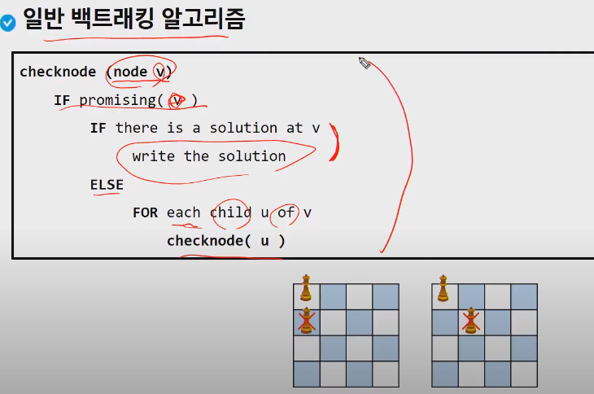
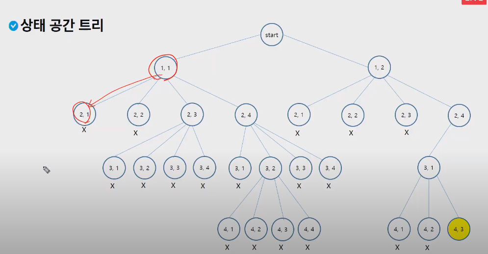
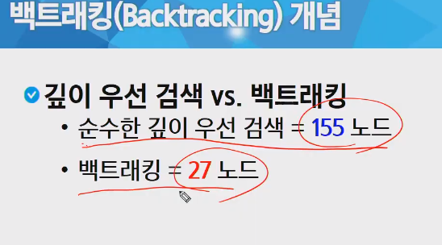
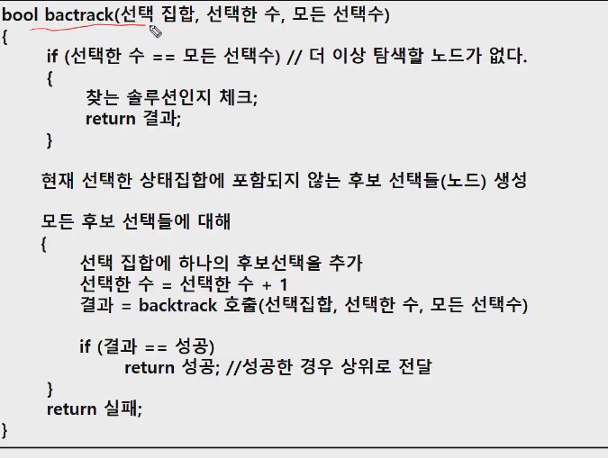
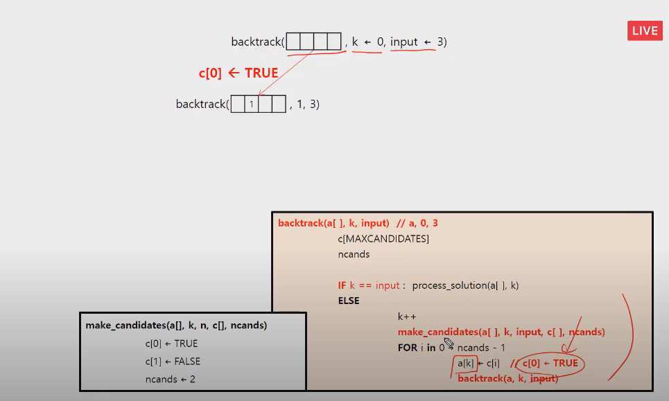
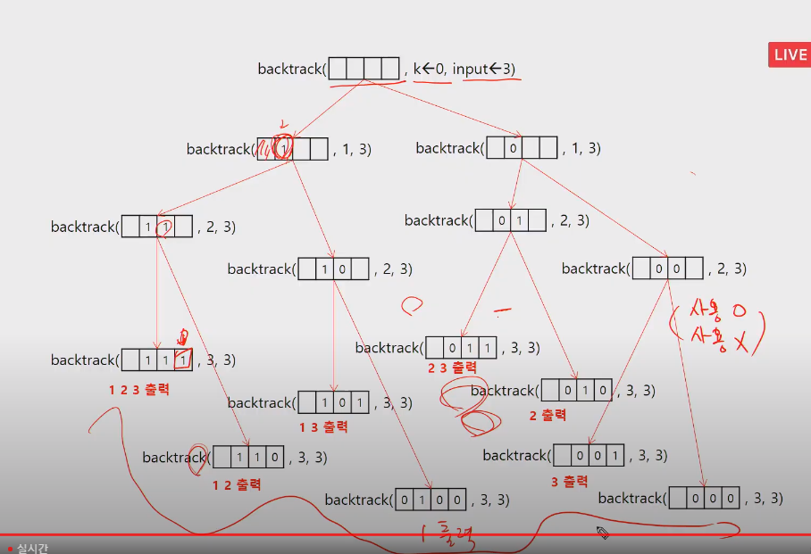
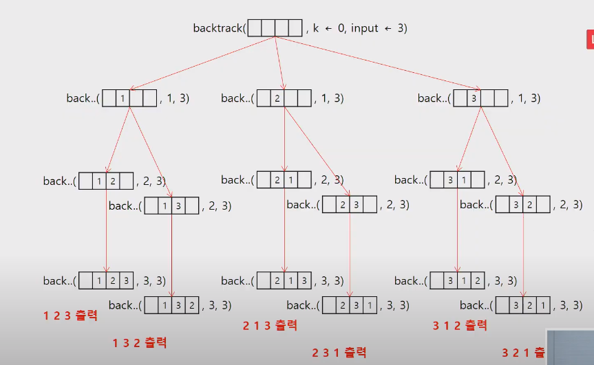

# 20200515 Backtracking백트래킹

> - 모든 후보를 검사하지 않는다.
>
> 상태공간트리를 깊이우선탐색(dfs)하는 방법 +  정답으로 갈 것 같지 않으면 더이상 깊이우선탐색을 중단(prunning:가지치기)

> 불피요한 경로를 조기에 차단하여 회수를 줄인다.

- 백트래킹 절차

1. 상태 공간 트리의 깊이우선 검색을 실시

2. 각 노드가 유망한지 점검(가지치기)

3. 그 노드가 유망하지 않으면 그노드의 부모 노드로 돌아가서 검색을 계속한다.

   ```python
   # 퀸 문제
   
   
   def backtrack(idx):
       global N
       global cnt
       # 최종상태인지 확인하고, 최종상태이면 해
       if idx == N:
           # 다 찾았음, 해 마지막 노드 행 leaf node : 목표탐색의 마지막 구간.
           cnt += 1
           return
       # 해당 상태에서 선택할 수 있는 후보군 생성
       # 노드가 유망한지 확인 : 유망한 열, 상향대각, 하향대각
       for i in range(N):
           # if 열이 유망하고 대각들이 유망
           if not col[i] and not dia_1[idx+i] and not dia_2[N+i-idx-1]:
               # 모든 후보군에 대해서 다음상태 실행
               col[i] = 1
               dia_1[idx+i] = 1
               dia_2[N+i-idx-1] = 1
               backtrack(idx+1)
               col[i] = 0
               dia_1[idx+i] = 0
               dia_2[N+i-idx-1] = 0
   
   
   N = 4
   # 각 행에는 1개의 퀸만 올 수 있음
   # 열의 사용여부를 판단하는 리스트
   col = [0]*N
   # 대각선 유망성을 판단할 리스트
   # 대각선의 개수 : N*2 -1
   dia_cnt = N*2 - 1
   # 상향 : 같은 대각선의 i, j의 합이 같음.(r_c)
   # 하향 : 같은 대각선의 i,j 의 차가 같음. N-(r-c)-1 == N+c-r-1
   dia_1 = [0]*dia_cnt
   dia_2 = [0]*dia_cnt
   cnt = 0
   print(cnt)
   
   ```

   



- state space tree 상태 공간 트리 에서 목표탐색

  

- leaf node : 목표탐색의 마지막 구간.

  

- 백트래킹을 이용한 퀸 문제 탐색

  









----

## 오후 순열 구하기perm



```python
def backtrack(result, selected, idx, N):
    if idx == N :
        print(result)
        return
    #사용 가능한 선택지 후보군에 대하여 다음단계로 진행
    # sdlected [0]*N
    # result [0]*N
    for i in range(N):
        if not selected[i]:
            selected[i]=1
            result[idx]=i
            backtrack(result, selected, idx+1, N)
            selected[i] = 0
            
N = 5
backtrack([0]*N, [0]*N, 0, N)
    
```

----

## sum of subset

```
def backtrack(arr, idx, selected, sum_num):
    global targetsum_num
    if sum_num > targetsum_num:
        return

    if idx == len(arr):
        # 총합이 10인 경우에만 , 출력
        if sum_num == targetsum_num:
            for i in range(len(arr)):
                if selected[i]:
                    print(arr[i], end=" ")
            print()
        return

    selected[idx] = 1
    backtrack(arr, idx+1, selected, sum_num+arr[idx])

    selected[idx] = 0
    backtrack(arr, idx+1, selected, sum_num)


arr = [1, 2, 3, 4, 5, 6, 7, 8, 9, 10]
arr_len = len(arr)
targetsum_num = 10
backtrack(arr, 0, [0]*arr_len, 0)def backtrack(arr, idx, N, selected, sum_num):
    if sum_num > 10:
        return

    if idx == N:
        # 총합이 10인 경우에만 , 출력
        if sum_num == 10:
            print(arr)
        return

    selected[idx] = 1
    sum_num+=arr[idx]
    backtrack(arr, idx+1, selected, sum_num)
    selected[idx] = 0
    sum_num -= arr[idx]
```

### 

```

```

