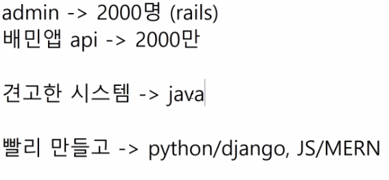
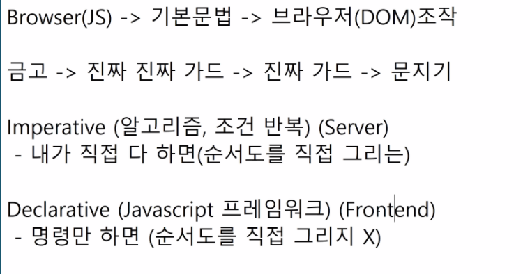
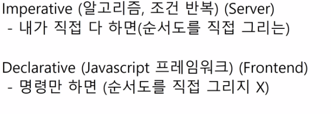
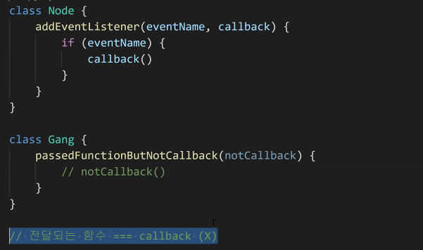
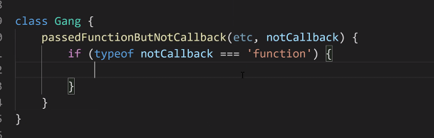

# 20200518 JS심화

- js는 인자개수를 신경쓰지 않는 쿨한 친구.

---

## 오후 zoom

####  ELK 셋팅

> *ELK* Stack이란 무엇인가요? *ELK* Stack은 널리 알려진 세 개의 오픈 소스 프로젝트인 E=Elasticsearch(Lucene 기반), L=Logstash, K=Kibana

#### 협업필터링 (세상간단한 추천 시스템)

#### *GTD*(Getting Things Done)

#### Trello

todolist

page load가 없어야한다. - js를 통해 브라우저 조작, document를 바꾸는 것.

----

### this: == self...

> 안되는 부분을 기억하면서...

#### eventListener

- 상황발생(event) -> 변화(listner)

### Callback function

- a함수가 b함수를 인자로 받아서 a함수 내에서 b함수를 실행하면 콜백, 실행 안하면 X 
- 전달되는 함수 === callback(X) 그러나 인정하고 가도 된다. 대체로 넘겨주는 이유는 불리기 위해서이므로....

- functkon chk...아주 드물게...

