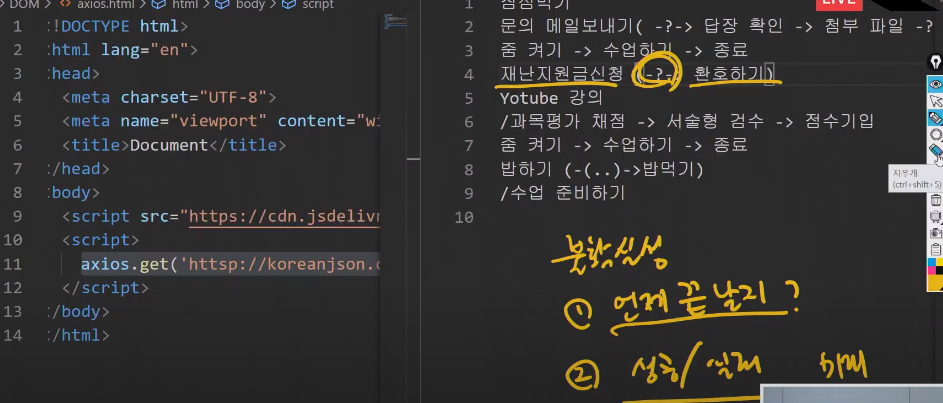
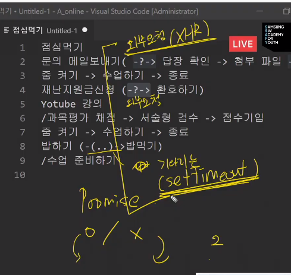

# 20200519 JS 심화 2 - 비동기처리

싱글쓰레드

- axios

- 한명이 일해야 하기 때문에 기다리는 행위는 할 수 없다. why? 브라우저가 뻗어서
- 고로 nonblocking하게 소스를 짜야 한다. 
- `axios`를 사용한다.
- `promise` : 미래의 제어

> 성공했을 때 어떤 일을 한다. : `.then(콜백함수)` 
>
> 실패했을 때 어떤 일을 한다. : `.catch(콜백함수)`