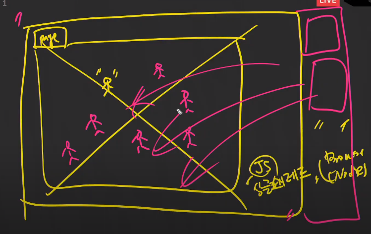

# 20200519 JS 심화 2 - 비동기처리

싱글쓰레드



- axios


- 한명이 일해야 하기 때문에 기다리는 행위는 할 수 없다. why? 브라우저가 뻗어서
- 고로 nonblocking하게 소스를 짜야 한다. 
- `axios`를 사용한다.
- `promise` : 미래의 제어(비동기 함수 내에서 동기적인 처리를 가능하게 한다. 콜백헬을 탈출하자!) : 콜백 함수를 쓰지 않고 순서를 제어할 수 있게 한다.

> 성공했을 때 어떤 일을 한다. : `.then(콜백함수)` 
>
> 실패했을 때 어떤 일을 한다. : `.catch(콜백함수)`

----

# 오후 Zoom nosql rdbms

- nosql  : 주 데이터는 아니고 크리에이트만 사용이 많을 경우....쓴다.

  ## 토스toss

  

- 각각의 서비스의 특성에 맞는 여러 종류의 DB를 사용하고 있다.

### 스크립트 부분의 작동을 수행하는 것은 브라우저

> <scrips> : Javascript (library)->browser(요청) XHR(xmlhttprequest)
>
> axios : XHR을 활용한 HTTP request 라이브러리
>
> XHR : 비동기 함수.


- 코드의 순서가 실행 순서랑 항상 동일하지 않다.


- 화살표 함수 인자가 하나일때, 리턴행위가 한 줄일 때. 소괄호 ,중괄호 생략가능.

  >  이벤트리스너일 때 쓰지 않는다.(예전코드와 하위호환을 위해서 지양한다.)
  >
  > this를 풀어서 쓰는 함수가 화살표 함수이기에.

- `this` : 불린쪽을 의미한다.

> this 대신 event.currentTarget을 사용하자.

- 에러를 잘 내뱉지 않는 js
- TypeScript : 빡세게 만든 js. 스트릭트(엄격)하게 쓸 수 있는..트랜스파일러도 있다. js를 typescript로 바꿔주는 툴....

### DOG, CAT IMAGE 불러오기

```html
<!DOCTYPE html>
<html lang="ko">
  <head>
    <meta charset="UTF-8" />
    <meta name="viewport" content="width=device-width, initial-scale=1.0" />
    <meta http-equiv="X-UA-Compatible" content="ie=edge" />
    <link
      rel="stylesheet"
      href="https://stackpath.bootstrapcdn.com/bootstrap/4.4.1/css/bootstrap.min.css"
      integrity="sha384-Vkoo8x4CGsO3+Hhxv8T/Q5PaXtkKtu6ug5TOeNV6gBiFeWPGFN9MuhOf23Q9Ifjh"
      crossorigin="anonymous"
    />
    <title>exercise</title>
  </head>
  <body>
    <h1>Dog Image(s)</h1>
    <hr />

    <div class="container">
      <h2>강아지</h2>
      <div class="row">
        <div class="dogs"></div>
        <div class="cats"></div>
        <button id="dog">강아지</button>
      </div>
    </div>
    <script
      src="https://code.jquery.com/jquery-3.4.1.slim.min.js"
      integrity="sha384-J6qa4849blE2+poT4WnyKhv5vZF5SrPo0iEjwBvKU7imGFAV0wwj1yYfoRSJoZ+n"
      crossorigin="anonymous"
    ></script>
    <script
      src="https://cdn.jsdelivr.net/npm/popper.js@1.16.0/dist/umd/popper.min.js"
      integrity="sha384-Q6E9RHvbIyZFJoft+2mJbHaEWldlvI9IOYy5n3zV9zzTtmI3UksdQRVvoxMfooAo"
      crossorigin="anonymous"
    ></script>
    <script
      src="https://stackpath.bootstrapcdn.com/bootstrap/4.4.1/js/bootstrap.min.js"
      integrity="sha384-wfSDF2E50Y2D1uUdj0O3uMBJnjuUD4Ih7YwaYd1iqfktj0Uod8GCExl3Og8ifwB6"
      crossorigin="anonymous"
    ></script>
    <script src="https://cdn.jsdelivr.net/npm/axios/dist/axios.min.js"></script>
    <script>
      // 여기에 코드를 작성하시오.
      const url = "https://dog.ceo/api/breeds/image/random";
      const caturl = "https://api.thecatapi.com/v1/images/search";
      // const axios = require("axios").default;
      // const res = axios.get(url)
      //비동기의 동기식 처리를 가능하게 하자. : promise-> then...

      // 0. 버튼을 클릭했을 때 addEventListener
      const dogButton = document.querySelector("#dog");
      dogButton.addEventListener("click", function (event) {
        getImage(event);
        getCatImage(event);
      });
      // 1. axios를 사용하여 dog.ceo 서버에 데이터를 요청한다.
      const getImage = function () {
        axios.get(url).then(
          //img_url 확인.
          (response) => {
            const imgURL = response.data.message;
            // 2. 받은 데이터를 가지고 createElement(dom node를 하나 생성한다.(img))
            const dogImage = document.createElement("img");
            dogImage.src = imgURL;
            dogImage.className = "col-4";
            // 3. setAttribute(src, image_url)
            document.querySelector(".dogs").appendChild(dogImage);
          }
        );
      };

      //cat
      const getCatImage = function () {
        axios.get(caturl).then(
          //img_url 확인.
          (response) => {
            const catimgURL = response.data[0].url;
            console.log(response.data[0].url);
            // 2. 받은 데이터를 가지고 createElement(dom node를 하나 생성한다.(img))
            const catImage = document.createElement("img");
            catImage.src = catimgURL;
            catImage.className = "col-4";
            // 3. setAttribute(src, image_url)
            document.querySelector(".cats").appendChild(catImage);
          }
        );
      };
      //this 예시 불린쪽을 지칭한다. 수동적임. 불리는 사람에 의해 출신이 결정된다.
    </script>
  </body>
</html>

```


-----

# 오후 Vue(틀. 일)

- 명령형 프로그래밍 vs 수동형 프로그래밍

  


```bash
pip install django==2.1.15
pip install art
```


reload없이 해보기. 비동기식 처리 해보기.

1. input#userInput의 value값을 /art/pong 으로 보낸다.


2. pong이 받아서 다시 JSON으로 응답을 보낸다.


3. 응답 JSON의 내용을 div#resultArea에 뿌린다.(표시)

```pyt
from art import *

views.py

from django.shortcuts import render
from django.http import JsonResponse

def ping(request):
	return render(request, 'art/pong.html')
def pong(request):
	user_input = request.GET.get(inputText)
	art_text = art.text2art(user_input)
	data = {
		'success':True,
		'user_input':user_input,
	}
	return JsonResponse(data)
```


```html


<script>
//1. input#userInput의 value값을 /art/pong 으로 보낸다.

const userInput = document.querySelector('#userInput')
//change 는 포커스 아웃 혹은 엔터를 쳤을 때 catch
userInput.addEventlistner('change',function(event) {
    const inputText = userInput.value
    //2.value 값을 AJAX 요청으로 '/art/pong'으로 보낸다.
    axios.get('art/pong/',{
        params: {
            inputText: inputText,
        }
    })
    
   	//3. pong이 받아서 다시 JSON으로 응답을 보낸다.
    .then(function (res) {
         //4. 응답 JSON의 내용을 div#resultArea에 뿌린다.(표시)
        const resultArea = document.querySelector('#resultArea)
        resultArea.innerText = res.data.content
        })
})


</script>
```

1. art2art 예쁘게 쓰기.

2. `<pre>`태그로 쓰기


    </pre>

3. 브라우저 설정 고정폭 글꼴 콘솔라스 로 바꾸기.

4. 'change' 를 'input' 으로 바꾸기(서버 과부하가 생길 수 있음.but 실시간)


# tips

장병규 쿠팡

엔지니어 중심으로 서비스를 만드냐 아니냐 + 고객 사용성 고려

기업의 흥망성쇠

codepen : 코드 무료 쉐어...

