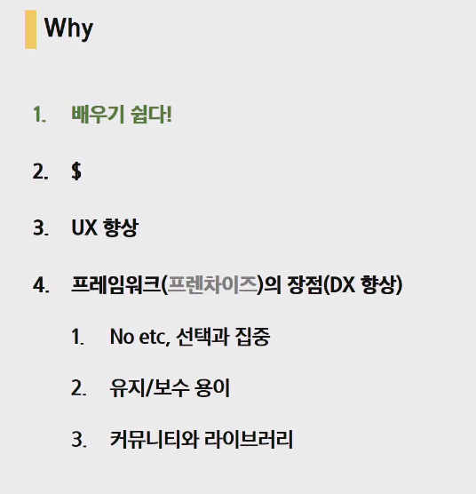
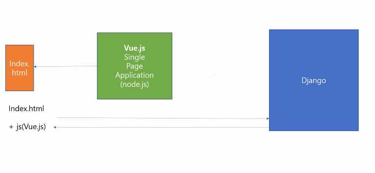
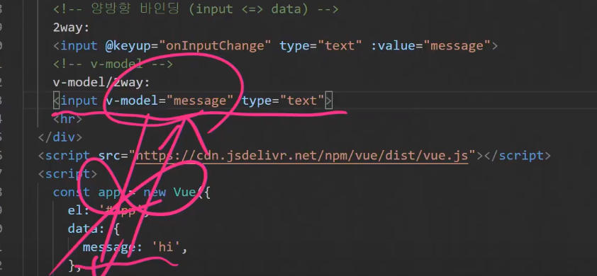

# 20200525 Vue.js

# evan you 

> angular사용, 앵귤러에서 무거운 개념들을 다 덜어내자.


### What

1. Front-End(Client-side)

> 사용자와 대면해서 

2. SPA(Single Page Application)

>페이지 리로드 없이 구성.
>
>단점 : 첫 회에 많은 데이터양을 받아야 하므로 로딩속도가 오래 걸린다.
>
>

3. Client Side Rendering

>1. 서버는 던진다.
>2. 받는다
>3. 만든다.(브라우저가 만든다.)

<기존> - 서버가 일한다.

>

<달라진 것> - 클라이언트가 일한다.(클라이언트 단에서 html을 만든다.) - js뭉탱이를 던진다.


4. MVVM패턴(Model View ViewModel)

>모델은 오브젝트
>
> ViewModel : 중개자의 역할.
>
>뷰는 html
>
>
>
>

5. vanilajs(순정형 js : 코드중복이 많다. 딱 하면 척!이 안일어난다.) VS Reactive(반응형의)/Declarative(선언형의)

> - Vue vs React
>
> 
>
> Reactive(반응형의):facebook이 만든 프레임워크
>
> 
>
> 
>
> Declarative(선언형의)
>
> CODE - Head First Vues.js
>
> ```js
> const initObj= {
>     el: '#app',
>     data: {
>         username:'Unknown'
>         },
>         methods: {
>             onInputChange: function (event){
>             this.username = event.target.value
> }
> }
> }
> 
> 	const app = new Vue(initObj)
> ```
>
> 

## Why

데이터 요청이 적다 - > 패킷을 덜쓰고 -> 데이터를 덜쓰고->핸드폰 데이터 용량을 덜쓰고...

=> 몰라 받아 = > 네가 알아서 해 = > 서버 측 리소스를 덜쓰고...

==> 돈을 덜쓴다.




---

## zoom




한 페이지에서 계속 새롭게 랜더링 하기 위해 뷰를 이용한다.


----

- v-model : input, select, textarea(사용자의 입력값을 받는다.)



- v-show VS v-if

  > v-show : 렌더링 cost가 자주 바뀔 때 유리하다. 렌더링 코스트(toggle)가 적다. html에 값은 이미 받아왔다.
  >
  > false일 때 diplay:none;으로 DOM에 존재.
  >
  > v-if : 로딩 코스트가 적다(초기 렌더링). 값이 바뀌면 다시 받아와야한다.
  >
  > false일 때 <--! !--> 주석처리 되어 아예 존재하지 않는다. 만약 값이 바뀌면 다시 렌더링.

- lodash `_`

```html
https://cdnjs.cloudflare.com/ajax/libs/lodash.js/4.17.15/lodash.min.js
<script src="https://cdnjs.cloudflare.com/ajax/libs/lodash.js/4.17.15/lodash.min.js" integrity="sha256-VeNaFBVDhoX3H+gJ37DpT/nTuZTdjYro9yBruHjVmoQ=" crossorigin="anonymous"></script>
<script src="https://cdnjs.cloudflare.com/ajax/libs/lodash.js/4.17.15/lodash.min.js"></script>
<script>
    allNumbers:_.range(1,46)
    getLuckySic(){
        this.myNumbers = _.sampleSize(this.allNumbers,6)
    }
</script>
```

- sort() : string연산. 후 정렬. 원본데이터를 바꾸고, 리턴값있음.

```html
this.myNumbers.sort((a,b)=> a - b)//str 과 str 숫자 연산은 정수로 리턴.콜백함수를 넣어줌으로써 정수리턴소트 가능하게 한다.
```

----

# Zoom

Access to XMLHttpRequest at 'https://dhlottery.co.kr/common.do?method=getLottoNumber&drwNo=912' from origin 'null' has been blocked by CORS policy: No 'Access-Control-Allow-Origin' header is present on the requested resource.


