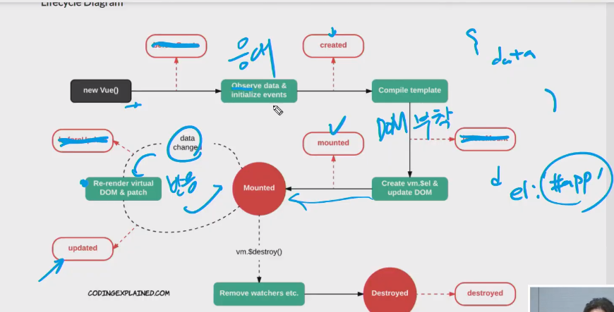
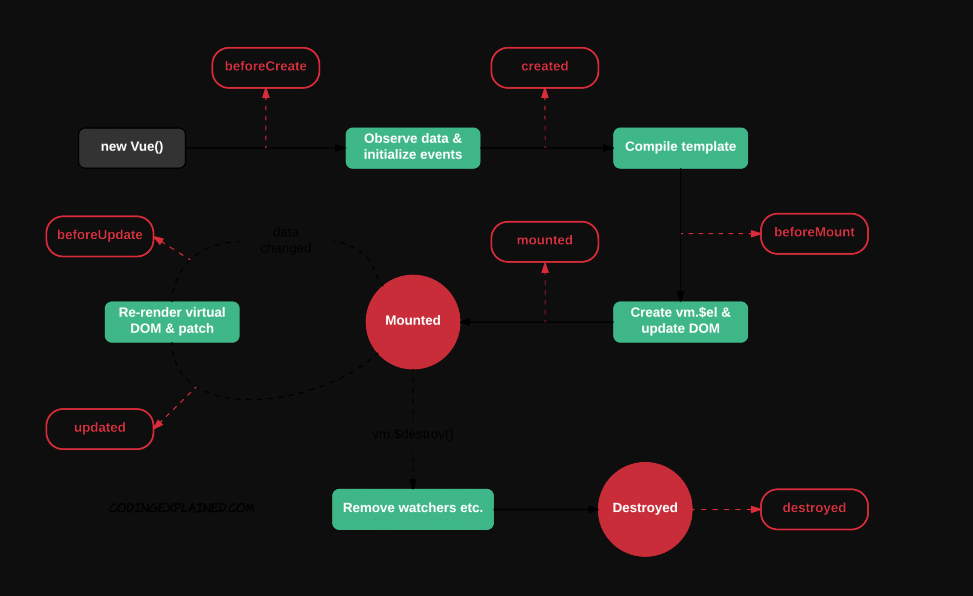
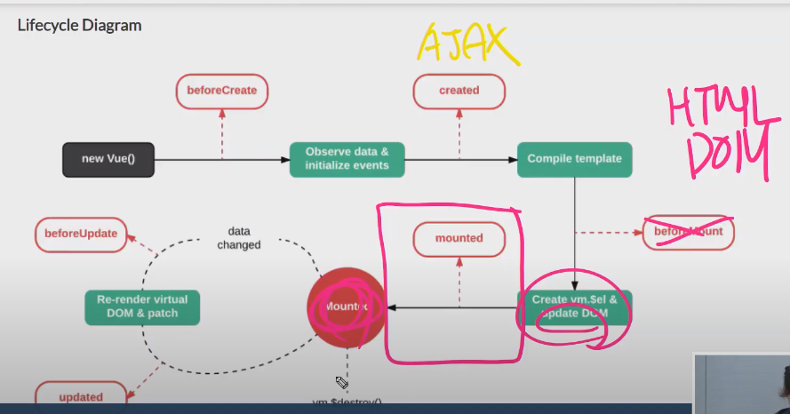
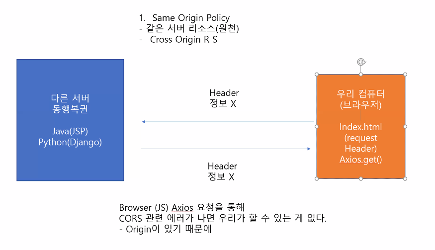

# 20200526 Vue.js + app

- jsonplaceholder

> 더미데이터.

- measurethat.net

  > 메모리 정보까지 벤치마크 해주는 사이트.

- callback함수는 `=>`화살표 함수를 이용하자.

## lifecycle hook

> Declarative : 선언형
>
> - 유산슬을 만들어줘(대신해서 절차를 수행 -> 프레임워크가 수행한다.)
> - 추상적이다.
> - Vue.js에게 맡기는 식... 변화시키는 주체는 뷰js가 된다. 
>   - 데이터의 변화에 맞춰 템플릿(UI)를 변경시킨다.
>   - UI 단계(Hook) 생명주기에서 control을 한다.
>   - lifecycle hook을 언제 걸 지를 내가 결정해줘야 한다.
> - v-model...
>
> 서버사이드 렌더링이면 필요없는데
> 클라이언트 렌더링이라서
>
> Imperative(명령형)
>
> - 직접 요리(언제, 무엇을)
> - 절차적
> - Vanila JS(DOM, eventlistner)

- 데이터 요청(응애) -> 부착(마운트)  -> 반응(리렌더링)





> - 기존 : created시점에 추천한다.
> - 초기화 시 자동으로 실행되면 좋겠다 싶은 함수를 created:에 넣는다.
> - 초기화 이후 AJAX요청을 보내기 좋은 HOOK지점 : created
>
> ```html
> created: function(){
> 	초기화 되어야 하는 데이터를 넣는다.
> 	this.getPhotos()
> }
> ```

### scrollmonitor : Vue와는 상관이 없다. : division

> ```html
> const bottomSensor = document.querySelector('#bottomSensor')
> const watcher = scrollMonitor.create(bottomSenser)
> //watcher가 화면에 들어오면 , cb하겠다.
> watcher.enterViewport(()=>{
> 	app.getPhotos()
> 	console.log('___________BOTTOM___________')
> })
> ```

### scrollmonitor : Vue에 녹여내서 컴포넌트 사용시 용이하게 하기

-> lifecycle hook을 고려해야한다.

- created 시점 : html에 관련된 어떠한 것도 제대로 작동하지 않는다.



```html
created: function(){
	초기화 되어야 하는 데이터를 넣는다.
	//this.getPhotos()
    const bottomSensor = document.querySelector('#bottomSensor')
	const watcher = scrollMonitor.create(bottomSenser)
	//watcher가 화면에 들어오면 , cb하겠다.
	watcher.enterViewport(()=>{    
	this.getPhotos()    																	console.log('___________BOTTOM___________')})
}
```

- HTML이 Vue 인스턴스와 연결된 순간부터 Life cycle hook의 영향을 받는다.(mounted after)

```html

```


------

## zoom




-----

# 오후 live

- mounted: DOM 과 Veu 인스턴스가 연동이 완료되고 난 이후에 실행할 일들.

```html
mounted: function(){
	console.log('DOM에 부착되었다.')
	const bottomSensor = document.querySelector('#bottomSensor')
	const watcher = scrollMonitor.create(bottomSenser)
	//watcher가 화면에 들어오면 , cb하겠다.
	watcher.enterViewport(()=>{    
	this.getPhotos()    																	console.log('___________BOTTOM___________')})
}
```

- 가시성을 위하여.  
- methods에 정의 후 mounted에서 부른다.

```html
methods:{
	addScrollWatcher: function(){
	const bottomSensor = document.querySelector('#bottomSensor')
	const watcher = scrollMonitor.create(bottomSenser)
	//watcher가 화면에 들어오면 , cb하겠다.
	watcher.enterViewport(()=>{    
	setTimeout((-) => {
		this.getPhotos()    															, 500)
		})
	},
	scrollToTop: function(){
		scroll(0,0)
}
}


mounted: function(){
	this.addScrollWatcher()
}
//updated: data({}) 가 바뀌고 나서, 화면이 다시 랜더된 이후,          
updated: function(){
	const bottomSensor = document.querySelector('#bottomSensor')
	const watcher = scrollMonitor.create(bottomSenser)
	if (watcher.isFullyInViewport) {
		this.getPhotos()
	}
}
	
```

## computed: Data - Read 

> Data 를 Create Update Delete 하지 않고  Read(return) 하고 새로운 것을 리턴하고 싶을 때 쓴다.
>
> - 캐싱 VS 메소드
>
> 함수지만 실제로는 값처럼 쓰인다. 그러므로 네이밍을 동사가 아닌 명사형으로 짓는다.

```html
computed: {
	reversedMessage:function() {
	return this.message.message
}
}
```


# tips

- jsonplaceholder

> 더미데이터.

- measurethat.net

  > 메모리 정보까지 벤치마크 해주는 사이트.

- scrollmonitor cdn

  > 스크롤이 어디에 닿았는가를 추정.
  >
  > cdn.js추가.