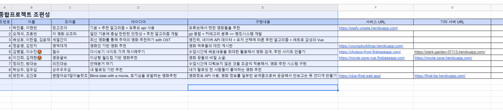
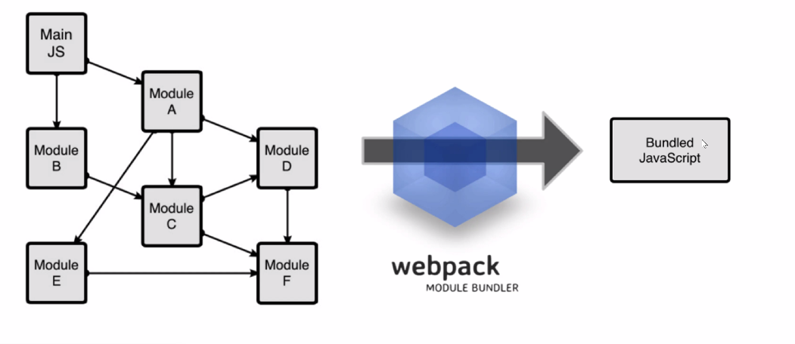
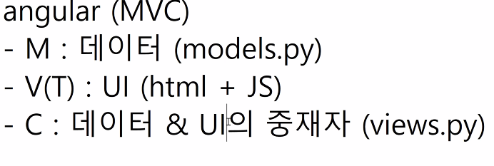
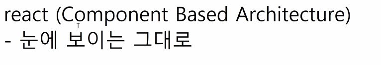

# 20200527 vue cli

- node : 환경이다.

```
npm install -g @vue/cli

vue create first_vuecli
default
npm -> yarn으로 대체 가능.
npm run serve
npm run build
```


- .vue file 구성.

  - <template>
    
    </template>

  - <script>
    </script>
    
- <style>
    
    </style>


```
<template>
  <div id="app">
    
    <HelloWorld msg="Welcome to Your Vue.js App"/>
  </div>
</template>

<script>
import HelloWorld from './components/HelloWorld.vue'

export default {
  name: 'App',
  components: {
    HelloWorld
  }
}
</script>

<style>
#app {
  font-family: Avenir, Helvetica, Arial, sans-serif;
  -webkit-font-smoothing: antialiased;
  -moz-osx-font-smoothing: grayscale;
  text-align: center;
  color: #2c3e50;
  margin-top: 60px;
}
</style>

```

- App.vue

```html
<template>
  <div id="app">
    // 3. component를 쓴다.
    <MyComponent></MyComponent>
    
    <HelloWorld msg="Welcome to Your Vue.js App" />
  </div>
</template>

<script>
 // 1. import 꺼내온다.
import HelloWorld from "./components/HelloWorld.vue";
import MyComponent from "./components/MyComponent.vue";
export default {
  name: "App",
  components: {
    // 2. component에 등록한다.
    HelloWorld,
    MyComponent
  }
};
</script>

<style>
</style>
```

- component는 하나의 element만을 사용한다.

-----

## Zoom



- webpack : 번들링(하나의 파일)



- 모듈 == UI component 


### angular vs react





## SFC(single file component)

> 하나의 파일이 컴포넌트다.

### Vue CLI -> SFC Vue App 생성 흐름.

1. 컴포넌트 생성(.vue), export
2. 불러온다 -import
3. 등록한다 components등록
4. 사용한다. <SFCname>

---

### Router

> `a`역할을 하지만 새로고침을 하지 않는!!!!!!!!! 내부적으로 새로고침을 하지 않게 만든 기능.
>
> url을 바꾸고 새로고침을 하지 않는 기능.

```
vue add router

index.js
import About from "../views/About.vue";
Vue.use(VueRouter);

const routes = [
  {
    path: "/",
    name: "Home",
    component: Home,
  },
  {
    path: "/about",
    name: "About",
    component: About,
  },
];
```

```vue
App.vue

<template>
  <div id="app">
    <div id="nav">
      <router-link to="/">Home</router-link> |
      <router-link to="/about">About</router-link>
    </div>
    <hr />
    여기에 컴포넌트 렌더링 == block body
    <router-view />
    <hr />
  </div>
</template>


```

- url, router, ping,pong

```
<template>
  <div>
      <h1>Hello, {{ name }}</h1>
  </div>
</template>

<script>
export default {
    name: 'HelloName',
    data: function() {
        return {
            name: this.$route.params.name,
        }
    }
}
</script>

<template>
  <div>
      <h1>Ping</h1>
      <input @keyup.enter="sendToPong" v-model="inputText" type="text">
  </div>
</template>

<script>
export default {
    name: 'Ping',
    data: function() {
        return {
            inputText: '',
        }
    },
    methods: {
        sendToPong: function() {
            // $routeR
            // Vue 에서의 redirect
            // this.$router.push(`/pong?message=${this.inputText}`)
            this.$router.push({ name: 'Pong', query: { message: this.inputText } })
        }
    }
}
</script>


<template>
  <div>
    <h1>Pong</h1>
    <h2>{{ messageFromPing }}</h2>
  </div>
</template>

<script>
export default {
    name: 'Pong',
    data: function() {
      return {
        messageFromPing: this.$route.query.message,
      }
    }
}
</script>
```


---

## Component 간의 data share

- 이후에..