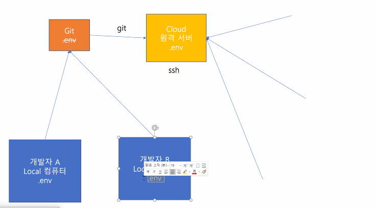

# 20200601 vue.js props-emit

- 자유롭기에 구조화를 더 지키자.

``` 
vue create props-emit
vue add router : url과 component를 매핑하게해준다.(페이지렌더링이 일어나지 않는다.)
자유롭기에 구조화를 더 지키자.
npm run serve
```

### 핵심은 component

> 하나의 컴포넌트는 하나의 인스턴스.!!!!!!!!!!!!

- `import` a `from`b
- export
- data를 함수로.!!!!!!!!

```
import axios from 'axios'

export default

data: function(){
return {
	message:'hi',
	posts:[]
}
}
```

----

# Zoom


- data 양방향이 가능하지만 단방향을 지향해야합니다

- payload : 가장 핵심적인 데이터를 의미한다.알짜배기 데이터

  ```
  name:"checked"
  type:"$emit"
  source:"<TodoList>"
  payload:Array[1]
  0:Object
  content:"java"
  id:1
  isCompleted:true
  ```

  

---

## data 의 flow


```
npm i axios
```


- emit으로 올려받고
- props로 내려받기

```
"input"
$emit('', inputdata)

props
```

- component 별로 역할이 나눠져 있는 구성.
- data의 흐름을 확실히 할 수 있다.


---

# Zoom

- server 배포 시 



- `.env.local`

  ```
  VUE_APP_YOUTUBE_API_KEY=
  ```

  


# tips

