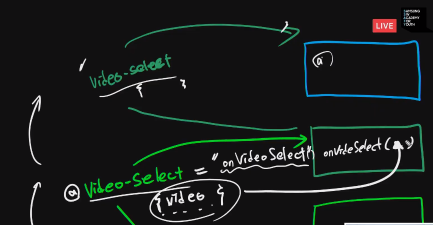

# 20200602 vue + video - youtube

- 사용자 화면


- 우리가 만들어야 할 App 구조


### key값 보안 - `.env.local`

```
const API_KEY = process.env.VUE_APP_YOUTUBE_API_KEY;
```


### vue loader 

> scoped를 주면 따로 속성자를 선택하지 않아도 된다. 하지만 클래스 속성으로 속성자를 주는 것이 성능 상 우월하기에 클래스를 지정하여 선택자를 쓰는 것이 좋다.

```css
<style lang="stylus" scoped>
div.search-bar {

}
</style>
```


- methods 이름이 중복되어도 상관없다. 분리, 독립된 컴포넌트.
-  컴포넌트 간은 느슨한 연결이다.
- 각각 독립된 스코프를 가지고 있으므로 상관없다.

### 선택된 video를 videodetail에 전달하기

- videolistitem - select -> emit videio list -> emit app -> props videodetail!! -> videodetail play




> 이벤트 리스너의 동작과정과 유사하다.
>
> 


# tips

vue 스타일 가이드

https://kr.vuejs.org/v2/style-guide/index.html

vue loader 뷰로더

https://vue-loader-v14.vuejs.org/kr/