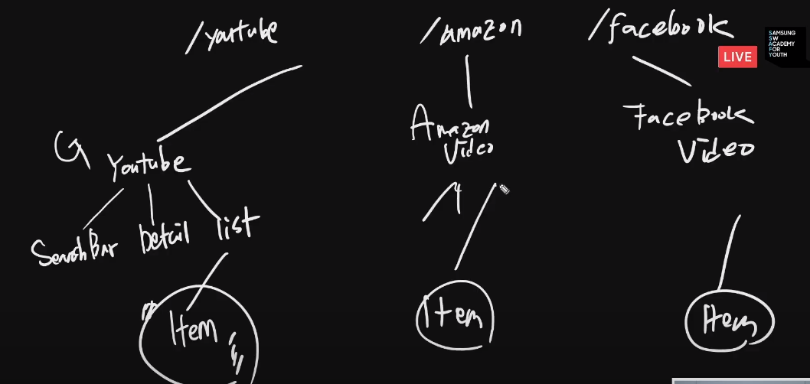

# 20200602 vue + video - youtube

- 사용자 화면


- 우리가 만들어야 할 App 구조


### key값 보안 - `.env.local`

```
const API_KEY = process.env.VUE_APP_YOUTUBE_API_KEY;
```


### vue loader 

> scoped를 주면 따로 속성자를 선택하지 않아도 된다. 하지만 클래스 속성으로 속성자를 주는 것이 성능 상 우월하기에 클래스를 지정하여 선택자를 쓰는 것이 좋다.

```css
<style lang="stylus" scoped>
div.search-bar {

}
</style>
```


- methods 이름이 중복되어도 상관없다. 분리, 독립된 컴포넌트.
-  컴포넌트 간은 느슨한 연결이다.
- 각각 독립된 스코프를 가지고 있으므로 상관없다.

### 선택된 video를 videodetail에 전달하기

- videolistitem - select -> emit videio list -> emit app -> props videodetail!! -> videodetail play


> 이벤트 리스너의 동작과정과 유사하다.
>
> 


----

# Zoom


### SPA의 핵심

- UI를 기준으로 각각의 컴포넌트를 구성요소로 한다.

- data는 단방향으로!!


```bash
vue ui
vue 프로젝트 매니저 띄우기.
```

- v-html : cross site scripting문제

  > 사용자가 입력한 대로 사이트를 동작시키는 입력값을 받을 수 있는 위험.

  ```
  <template>
    <div>
      <li>
        <span v-html="video.snippet.title"></span>
        
      </li>
    </div>
  </template>
  
  <script>
  export default {
    name: "VidioListItem",
    props: {
      video: Object,
    },
  };
  </script>
  
  <style></style>
  
  ```

  ### flux pattern - vuex

- 수직적인 구조를 해결하기 위해 만들어졌다.


----

## 오후 수업

> 이 구조여야만 하나?? component 구조의 궁금증.
>
> 비디오 리스트 아이템의 존재 이유는?


### 확장성 측면은?




- bootstrap4 embeds

```html
<div class="embed-responsive embed-responsive-16by9">
  <iframe class="embed-responsive-item" src="https://www.youtube.com/embed/zpOULjyy-n8?rel=0" allowfullscreen></iframe>
</div>
```

---

## ZOOM

- Firebase : 많은 기능들이 모듈, 구글 애널리틱스와 합쳐짐. 모바일 앱을 만들 경우 좋다.

### 배포  - Netlify

```
npm run build


 DONE  Build complete. The dist directory is ready to be deployed.
 INFO  Check out deployment instructions at https://cli.vuejs.org/guide/deployment.html
      

dist > 배포 
```


- 무조건 보안은 화이트리스팅!!!


#### 뒤로가기 : router를 통해 history를 저장하여 가능.

> 


### github single page

- index.html
- dist 내 파일들을 루트에 노출시키면 된다.

레포 눌렀을 때 첫 페이지에서 설명? 쓰는 곳에 주소 써놓으면 깨알같이 편해용
웹사이트


# tips

vue 스타일 가이드

https://kr.vuejs.org/v2/style-guide/index.html

vue loader 뷰로더

https://vue-loader-v14.vuejs.org/kr/


https://zzulu.github.io/drf/