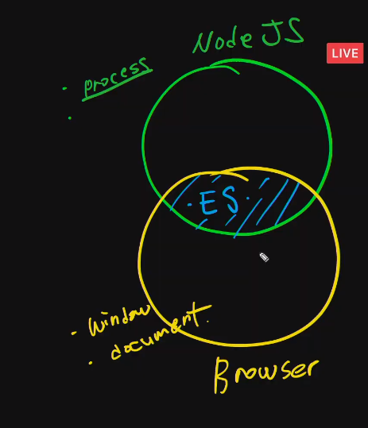
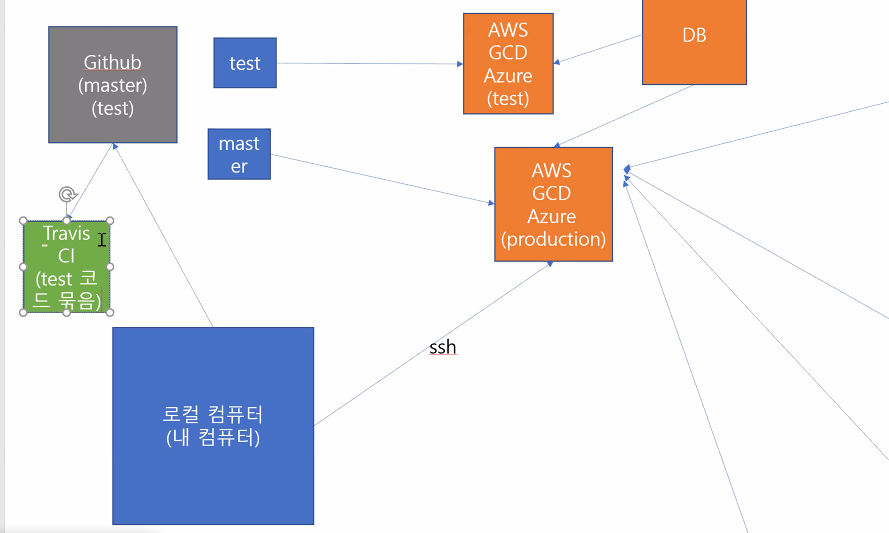

# 20200603 PJT 6 vue deploy - Netlify

- node modules 삭제

- 복붙

- 노드모듈 설치 : 핵심 package.json, package-lock.json 파일 , main dependency를 설치.

  ```
  npm i
  == pip install -r .... 와 같은 동작.
  ```

- git

```
git config --local user.neme dmdekf
git config --local user email dmdekf@gmail.com

```

- babel 

> 컴파일러를 통해 이전버전과 호환 가능하게 만들어준다.
>
> 

- webpack

>  파일들을 묶어준다.

## ES6+

- js는 물고기.

- node 는 환경이다- > 

  - 터미널에서 js를 실행했을 때 는 터미널에서 가능.

    ```
    console.log(global)
    
    peach@peach MINGW64 /d/Git/online-lecture/0603 (master)
    $ node ES_arrayHelperMethods.js
    Object [global] {
      global: [Circular],
      clearInterval: [Function: clearInterval],
      clearTimeout: [Function: clearTimeout],
      setInterval: [Function: setInterval],
      setTimeout: [Function: setTimeout] {
        [Symbol(nodejs.util.promisify.custom)]: [Function]
      },
      queueMicrotask: [Function: queueMicrotask],
      clearImmediate: [Function: clearImmediate],
      setImmediate: [Function: setImmediate] {
        [Symbol(nodejs.util.promisify.custom)]: [Function]
      }
    }
    [ 2, 3, 4 ]
    [ 1, 3, 5 ]
    3
    ```

    

  -  html문서 안의 script태그 안 src에서 js파일을 적용시킬 때는 웹 브라우져에서 실행. .

```bash
console.log(global);

//map
const arr1 = [1, 2, 3];

const newArr1 = arr1.map((num) => num + 1);
arr1.map(function (num) {
  return num + 1;
});

console.log(newArr1);

//forEach
// const url = ['http://...', 'www...', 'http://....']
// urls forEach(url => {
//     axios.get(url)
//         .then().catch()
// })

//filter
const arr2 = [1, 2, 3, 4, 5];
const newArr2 = arr2.filter((num) => num % 2);
console.log(newArr2);

//find - break
const arr3 = [1, 2, 3, 4, 5];
const number = arr3.find((num) => num === 3);
console.log(number);

//some
//요소들 중 하나라도 조건을 만족하면 true 아니면 false(or로 이어진 것과 동일하다)
const arr4 = [10, 20, 30];
const isBiggerThan20 = arr4.some((num) => num > 20);

//every
//요소 모두가 조건 만족하면 true (and로 엮은것과 동일)
const arr5 = [10, 20, 30];
const allBiggerThan5 = arr5.every((num) => num > 5);
console.log(allBiggerThan5);


```

```node
$ node ES_arrayHelperMethods.js
Object [global] {
  global: [Circular],
  clearInterval: [Function: clearInterval],
  clearTimeout: [Function: clearTimeout],
  setInterval: [Function: setInterval],
  setTimeout: [Function: setTimeout] {
    [Symbol(nodejs.util.promisify.custom)]: [Function]
  },
  queueMicrotask: [Function: queueMicrotask],
  clearImmediate: [Function: clearImmediate],
  setImmediate: [Function: setImmediate] {
    [Symbol(nodejs.util.promisify.custom)]: [Function]
  }
}
[ 2, 3, 4 ]
[ 1, 3, 5 ]
3
true
```

---

### Node JS vs Browser---[ES]



### ObjectLiteral

```
const name = "yj";

const obj1 = {
  name: name,
  sayHello: function () {
    return `HI my name is ${this.name}`;
  },
};
//ES6 부터 오브젝트 key, value가 같을 경우 축약가능.
const obj2 = {
  name,
  sayHello: function () {
    return `HI my name is ${this.name}`;
  },
};

console.log(name, obj1, obj2);
```


```bash
$ node objectLiteral.js
yj { name: 'yj', sayHello: [Function: sayHello] } { name: 'yj', sayHello: [Function: sayHello] }       

```

### de structure

```
// ES6+, de structuring.(비구조, 비구조화)
//data structure => Object, Array
// 비구조화 => Object, Array 를 해체한다.
const student = {
  name: "ssafy",
  course: "ssafy 3rd",
  email: "ssafy@email",
  phone: "010000",
};

//1.
// let name = s.name;
// let email = s.email;

//2. key 와 변수명이 같아야 한다.
//ES+6

// let { name } = student;
// console.log(name);
//3. key 와 변수명이 같아야 한다.
let { name, email, phone } = student;

console.log(name, email);

//실전
function getStudentInfostructure(student) {
  console.log(`Hi my name is ${student.name}, email is ${student.email}`);
}
getStudentInfostructure(student);

function getStudentInfodestructure({ name, course, email, phone }) {
  console.log(`Hi my name is ${name}, email is ${email}`);
}

getStudentInfodestructure(student);

//Why?
function saveStudent(name, course, email, phone) {}

```

```bash
$ node destructuring.js
ssafy ssafy@email
Hi my name is ssafy, email is ssafy@email
Hi my name is ssafy, email is ssafy@email

```

## PJT6

router

movie - 

- 영화가져오기 (20)
- 영화 정보 상세보기
- 모달-상세정보

videoview

- search
- videoitem
- videodetail


- Modal - Live demo

  > target="#exampleModal" == id="exampleModal"

```
<!-- Button trigger modal -->
<button type="button" class="btn btn-primary" data-toggle="modal" data-target="#exampleModal">
  Launch demo modal
</button>

<!-- Modal -->
<div class="modal fade" id="exampleModal" tabindex="-1" role="dialog" aria-labelledby="exampleModalLabel" aria-hidden="true">
  <div class="modal-dialog" role="document">
    <div class="modal-content">
      <div class="modal-header">
        <h5 class="modal-title" id="exampleModalLabel">Modal title</h5>
        <button type="button" class="close" data-dismiss="modal" aria-label="Close">
          <span aria-hidden="true">&times;</span>
        </button>
      </div>
      <div class="modal-body">
        ...
      </div>
      <div class="modal-footer">
        <button type="button" class="btn btn-secondary" data-dismiss="modal">Close</button>
        <button type="button" class="btn btn-primary">Save changes</button>
      </div>
    </div>
  </div>
</div>
```

----

## CI(continues integration - test 자동화)/CD(continues deploy배포자동화)

- CI(continues integration - test 자동화) : testcode가 잘 작동되는지

- CD(continues deploy배포자동화)
- github actions `ci.yml`파일로 정의.




# tips

부스트캠프

connetct- foundation github 가보기.

guybin son : 깃허브 삼성 개발자...

https://github.com/Gyubin